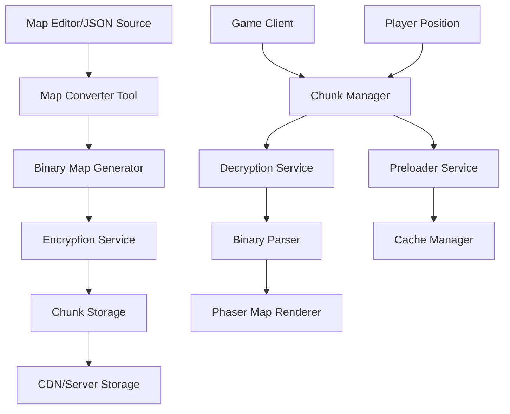
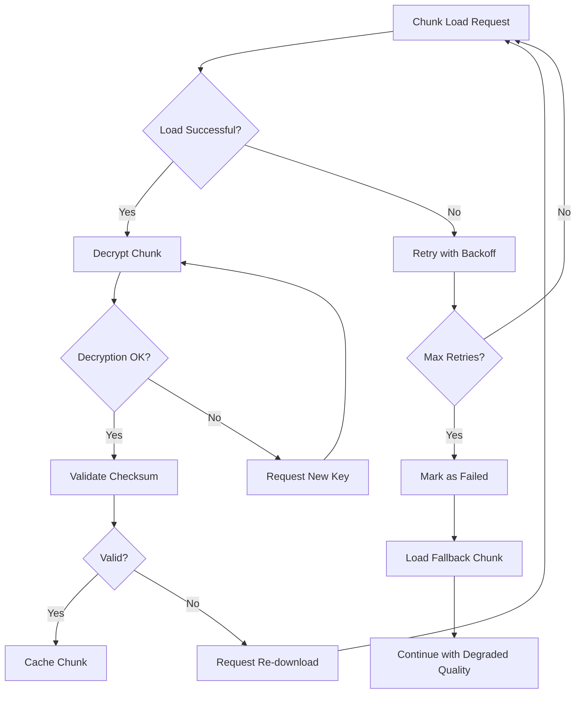

# Design Document

## Overview

The map optimization system will transform the current 100MB finalmap.png into a secure, efficient chunked image format with dynamic loading. Since the current system uses a single large PNG without tileset rendering, this optimization will focus on splitting the image into encrypted chunks, implementing dynamic loading based on player position, and maintaining the existing simple image-based rendering approach.

## Architecture

### High-Level Architecture



### System Components

1. **Server-Side Components**
   - Map Converter Tool
   - Binary Map Generator
   - Encryption Service
   - Chunk Storage System
   - Authentication Service

2. **Client-Side Components**
   - Chunk Manager
   - Decryption Service
   - Binary Parser
   - Cache Manager
   - Preloader Service

## Components and Interfaces

### 1. Chunked Image Format

The system will split the large PNG into smaller encrypted image chunks:

```typescript
interface ChunkedMapHeader {
  version: number;           // Format version
  chunkSize: number;         // Size of each chunk (e.g., 1024x1024)
  totalWidth: number;        // Total map width in pixels
  totalHeight: number;       // Total map height in pixels
  chunksX: number;          // Number of chunks horizontally
  chunksY: number;          // Number of chunks vertically
  imageFormat: string;      // Image format (webp, png, jpg)
  compressionQuality: number; // Image compression quality
  encryptionType: number;   // Encryption algorithm used
  checksum: number;         // Data integrity checksum
}

interface ImageChunk {
  id: string;               // Unique chunk identifier (e.g., "2_3")
  x: number;                // Chunk X coordinate in grid
  y: number;                // Chunk Y coordinate in grid
  pixelX: number;           // Actual pixel X position in full map
  pixelY: number;           // Actual pixel Y position in full map
  width: number;            // Chunk width in pixels
  height: number;           // Chunk height in pixels
  imageData: Uint8Array;    // Encrypted image data
  collisionData?: Uint8Array; // Optional collision data for this chunk
  entityData?: ChunkEntity[]; // NPCs, buildings in this chunk
  compressed: boolean;      // Whether image data is compressed
  size: number;            // Uncompressed size
}

interface ChunkEntity {
  type: string;            // Entity type (npc, building, etc.)
  x: number;               // X position within chunk
  y: number;               // Y position within chunk
  globalX: number;         // Global X position on full map
  globalY: number;         // Global Y position on full map
  properties: Record<string, any>; // Entity properties
}
```

### 2. Phaser-Compatible Chunk Manager

```typescript
interface PhaserChunkManager {
  // Core chunk operations
  loadImageChunk(chunkId: string): Promise<ImageChunk>;
  unloadImageChunk(chunkId: string): void;
  getImageChunk(chunkId: string): ImageChunk | null;
  
  // Phaser integration
  createPhaserImage(scene: Phaser.Scene, chunk: ImageChunk): Phaser.GameObjects.Image;
  addChunkToScene(scene: Phaser.Scene, chunk: ImageChunk): void;
  removeChunkFromScene(scene: Phaser.Scene, chunkId: string): void;
  
  // Position-based operations
  getChunksInRadius(centerX: number, centerY: number, radius: number): string[];
  getVisibleChunks(cameraX: number, cameraY: number, viewWidth: number, viewHeight: number): string[];
  
  // Phaser texture management
  registerChunkTexture(scene: Phaser.Scene, chunk: ImageChunk): string;
  unregisterChunkTexture(scene: Phaser.Scene, chunkId: string): void;
  
  // Seamless rendering using Phaser Container
  createChunkContainer(scene: Phaser.Scene): Phaser.GameObjects.Container;
  updateChunkContainer(container: Phaser.GameObjects.Container, visibleChunks: ImageChunk[]): void;
  
  // Cache management
  getCacheSize(): number;
  clearCache(): void;
  setMaxCacheSize(size: number): void;
}
```

### 3. Encryption Service

```typescript
interface EncryptionService {
  // Client-side decryption
  decryptChunk(encryptedData: Uint8Array, chunkId: string): Promise<Uint8Array>;
  
  // Key management
  requestEncryptionKey(): Promise<string>;
  validateKey(key: string): boolean;
  
  // Server-side encryption (for build tools)
  encryptChunk(chunkData: Uint8Array, chunkId: string): Promise<Uint8Array>;
}
```

### 4. Image Chunk Parser

```typescript
interface ImageChunkParser {
  // Parsing operations
  parseHeader(data: Uint8Array): ChunkedMapHeader;
  parseImageChunk(data: Uint8Array): ImageChunk;
  
  // Image processing
  decodeImageData(encryptedData: Uint8Array): Promise<HTMLImageElement>;
  createImageBitmap(imageData: Uint8Array): Promise<ImageBitmap>;
  
  // Validation
  validateChunk(chunk: ImageChunk): boolean;
  verifyChecksum(data: Uint8Array, expectedChecksum: number): boolean;
  
  // Conversion utilities
  chunkToBlob(chunk: ImageChunk): Blob;
  blobToImageElement(blob: Blob): Promise<HTMLImageElement>;
}
```

## Data Models

### Map Storage Structure

```
/maps/
├── metadata.json         # Map metadata and header (small file)
├── chunks/
│   ├── 0_0.webp         # Encrypted image chunk files
│   ├── 0_1.webp
│   ├── 1_0.webp
│   └── ...
└── collision/
    ├── collisions.json   # Existing collision data (unchanged)
    └── chunk_entities.json # Entity positions per chunk
```

### Memory Management

```typescript
interface ImageChunkCache {
  maxSize: number;         // Maximum cache size in MB
  currentSize: number;     // Current cache usage
  chunks: Map<string, CachedImageChunk>;
  textures: Map<string, Phaser.Textures.Texture>; // Phaser texture cache
  lruOrder: string[];      // Least recently used order
}

interface CachedImageChunk {
  data: ImageChunk;
  imageElement?: HTMLImageElement;
  texture?: Phaser.Textures.Texture;
  lastAccessed: number;
  size: number;
  priority: ChunkPriority;
}

enum ChunkPriority {
  CRITICAL = 0,    // Currently visible
  HIGH = 1,        // Adjacent to visible
  MEDIUM = 2,      // In preload radius
  LOW = 3          // Background preload
}
```

## Error Handling

### Chunk Loading Failures

1. **Network Errors**: Implement exponential backoff retry mechanism
2. **Decryption Failures**: Request new encryption key and retry
3. **Corruption Detection**: Use checksums to detect and handle corrupted chunks
4. **Fallback Strategy**: Load essential chunks only if multiple failures occur

### Error Recovery Flow



## Testing Strategy

### Unit Testing
- Binary format parsing and generation
- Encryption/decryption operations
- Chunk cache management
- Collision detection across chunk boundaries

### Integration Testing
- End-to-end chunk loading pipeline
- Map rendering with chunked data
- Player movement across chunk boundaries
- Memory usage under various scenarios

### Performance Testing
- Loading time comparisons (current vs. optimized)
- Memory usage profiling
- Network bandwidth utilization
- Frame rate impact during chunk transitions

### Security Testing
- Encryption key security
- Resistance to reverse engineering
- Data integrity verification
- Authentication bypass attempts

## Phaser Integration Strategy

### Approach 1: Container-Based (Recommended)
- Replace single `GameObjects.Image` with `GameObjects.Container`
- Add individual `GameObjects.Image` for each visible chunk
- Maintain existing MapManager interface
- Seamless integration with current camera/physics systems

### Approach 2: Dynamic Texture Composition
- Create a large canvas that stitches visible chunks
- Update single Phaser texture dynamically
- Minimal changes to existing code
- Higher memory usage but simpler integration

### Approach 3: Hybrid Approach
- Use Container for visible chunks
- Fall back to single texture for buildings/interiors
- Best of both worlds but more complex

## Implementation Phases

### Phase 1: Phaser Integration Foundation
- Create Phaser-compatible chunk container system
- Implement chunk-to-texture conversion
- Modify MapManager to use container instead of single image
- Ensure camera and physics systems work unchanged

### Phase 2: Dynamic Loading with Phaser
- Implement chunk loading that integrates with Phaser's loader
- Add/remove GameObjects.Image instances dynamically
- Maintain smooth rendering during chunk transitions
- Optimize Phaser texture cache usage

### Phase 3: Security & Performance
- Add encryption while maintaining Phaser compatibility
- Optimize chunk loading performance
- Implement fallback mechanisms
- Add comprehensive testing with Phaser systems

## Security Considerations

### Encryption Strategy
- Use AES-256 encryption for chunk data
- Generate unique keys per game session
- Implement key rotation mechanism
- Obfuscate encryption keys in client code

### Anti-Tampering Measures
- Checksum validation for all chunks
- Server-side chunk validation
- Client authentication for chunk requests
- Rate limiting to prevent bulk downloading

### Key Management
- Session-based encryption keys
- Server-side key generation and validation
- Automatic key refresh on suspicious activity
- Fallback mechanisms for key failures

## Performance Optimizations

### Loading Optimizations
- Parallel image chunk loading
- Predictive preloading based on player movement direction
- WebP format for better compression than PNG
- CDN distribution for global performance
- Progressive image loading (low-res first, then high-res)

### Memory Optimizations
- LRU cache eviction for image chunks
- Chunk priority system based on distance from player
- Lazy loading of non-visible chunks
- Automatic texture cleanup in Phaser
- Image bitmap pooling for frequent allocations

### Rendering Optimizations
- Seamless chunk boundaries using canvas stitching
- Level-of-detail for distant chunks (lower resolution)
- Occlusion culling for off-screen chunks
- Efficient Phaser texture management
- Canvas-based rendering for smooth transitions