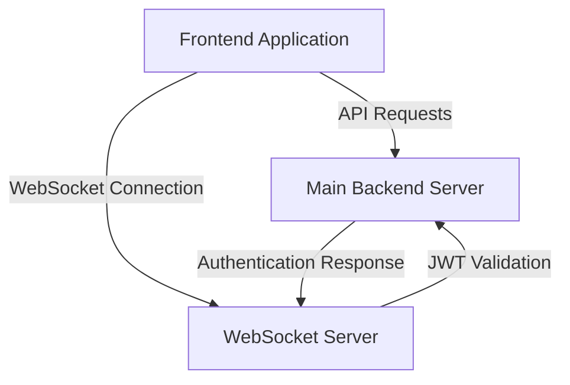

# Design Document

## Overview

This design document outlines the architecture and implementation details for ensuring proper communication between the frontend application, the main backend server (Deno Deploy), and the WebSocket server (Azure) in the Dhaniverse application. The goal is to establish a reliable and secure communication flow between all components.

## Architecture

The Dhaniverse application consists of three main components:

1. **Frontend Application**: A Vite-based React application deployed on Vercel
2. **Main Backend Server**: A Deno-based API server deployed on Deno Deploy (dhaniverseapi.deno.dev)
3. **WebSocket Server**: A dedicated Deno-based WebSocket server deployed on Azure (dhaniverse-ws)



## Components and Interfaces

### Frontend Application

The frontend application needs to communicate with both the main backend server for API requests and the WebSocket server for real-time updates.

**API Client Interface**:
```typescript
interface ApiClient {
  baseUrl: string;
  authToken: string | null;
  
  // Authentication methods
  login(credentials: LoginCredentials): Promise<User>;
  logout(): Promise<void>;
  
  // API methods
  get<T>(endpoint: string): Promise<T>;
  post<T>(endpoint: string, data: any): Promise<T>;
  put<T>(endpoint: string, data: any): Promise<T>;
  delete<T>(endpoint: string): Promise<T>;
}
```

**WebSocket Client Interface**:
```typescript
interface WebSocketClient {
  url: string;
  socket: WebSocket | null;
  connected: boolean;
  
  // Connection methods
  connect(token: string, gameUsername: string): Promise<void>;
  disconnect(): void;
  
  // Message methods
  sendUpdate(x: number, y: number, animation?: string): void;
  sendChat(message: string): void;
  
  // Event handlers
  onConnect: (id: string) => void;
  onDisconnect: () => void;
  onPlayers: (players: PlayerData[]) => void;
  onPlayerJoined: (player: PlayerData) => void;
  onPlayerUpdate: (player: PlayerData) => void;
  onPlayerDisconnect: (id: string, username: string) => void;
  onChat: (id: string, username: string, message: string) => void;
  onError: (error: string, message: string) => void;
}
```

### Main Backend Server

The main backend server handles API requests from the frontend and provides authentication services for the WebSocket server.

**Authentication Controller Interface**:
```typescript
interface AuthController {
  login(credentials: LoginCredentials): Promise<{ token: string, user: User }>;
  register(userData: RegisterData): Promise<{ token: string, user: User }>;
  validateToken(token: string): Promise<{ valid: boolean, userId?: string }>;
}
```

### WebSocket Server

The WebSocket server handles real-time communication between clients and validates authentication tokens with the main backend server.

**WebSocket Server Interface**:
```typescript
interface WebSocketServer {
  connections: Map<string, Connection>;
  userConnections: Map<string, string>;
  
  // Connection handling
  handleConnection(socket: WebSocket, request: Request): void;
  handleDisconnect(connectionId: string): void;
  
  // Message handling
  handleAuthentication(connection: Connection, message: AuthMessage): Promise<void>;
  handlePositionUpdate(connection: Connection, message: UpdateMessage): void;
  handleChatMessage(connection: Connection, message: ChatMessage): void;
  
  // Broadcasting
  broadcast(message: any): void;
  broadcastToOthers(senderId: string, message: any): void;
}
```

## Data Models

### User Model

```typescript
interface User {
  id: string;
  username: string;
  email: string;
  createdAt: Date;
  updatedAt: Date;
}
```

### Player Data Model

```typescript
interface PlayerData {
  id: string;
  username: string;
  x: number;
  y: number;
  animation?: string;
}
```

### Connection Model

```typescript
interface Connection {
  id: string;
  username: string;
  socket: WebSocket;
  lastActivity: number;
  authenticated: boolean;
  position: { x: number; y: number };
  animation?: string;
}
```

### Message Models

```typescript
interface AuthMessage {
  type: "authenticate";
  token: string;
  gameUsername: string;
}

interface UpdateMessage {
  type: "update";
  x: number;
  y: number;
  animation?: string;
}

interface ChatMessage {
  type: "chat";
  message: string;
}

type ClientMessage = AuthMessage | UpdateMessage | ChatMessage;
```

## Environment Configuration

### Frontend Environment Configuration

The frontend application needs to be configured with the appropriate URLs for both the main backend server and the WebSocket server based on the environment.

**Development Environment**:
```
VITE_API_URL=http://localhost:8000
VITE_WS_URL=ws://localhost:8001
```

**Production Environment**:
```
VITE_API_URL=https://dhaniverseapi.deno.dev
VITE_WS_URL=wss://dhaniverse-ws.azurewebsites.net
```

### Main Backend Server Environment Configuration

The main backend server needs to be configured with the appropriate JWT secret and CORS settings.

**Development Environment**:
```
PORT=8000
DENO_ENV=development
JWT_SECRET=your_jwt_secret_here
ALLOWED_ORIGINS=http://localhost:3000,http://localhost:5173,http://localhost:4173
```

**Production Environment**:
```
PORT=8000
DENO_ENV=production
JWT_SECRET=your_production_jwt_secret_here
ALLOWED_ORIGINS=https://dhaniverse.vercel.app
```

### WebSocket Server Environment Configuration

The WebSocket server needs to be configured with the appropriate JWT secret, CORS settings, and main backend server URL.

**Development Environment**:
```
PORT=8001
DENO_ENV=development
SERVER_DOMAIN=localhost
JWT_SECRET=your_jwt_secret_here
ALLOWED_ORIGINS=http://localhost:3000,http://localhost:5173,http://localhost:4173
AUTH_SERVER_URL=http://localhost:8000
```

**Production Environment**:
```
PORT=8001
DENO_ENV=production
SERVER_DOMAIN=dhaniverse-ws.azurewebsites.net
JWT_SECRET=your_production_jwt_secret_here
ALLOWED_ORIGINS=https://dhaniverse.vercel.app
AUTH_SERVER_URL=https://dhaniverseapi.deno.dev
```

## Error Handling

### Frontend Error Handling

The frontend application should handle errors from both the API client and the WebSocket client.

**API Client Error Handling**:
```typescript
try {
  const data = await apiClient.get('/some-endpoint');
  // Handle successful response
} catch (error) {
  if (error.status === 401) {
    // Handle unauthorized error
    redirectToLogin();
  } else if (error.status === 404) {
    // Handle not found error
    showNotFoundMessage();
  } else {
    // Handle other errors
    showErrorMessage(error.message);
  }
}
```

**WebSocket Client Error Handling**:
```typescript
wsClient.onError = (error, message) => {
  if (error === 'authentication_failed') {
    // Handle authentication error
    redirectToLogin();
  } else if (error === 'not_authenticated') {
    // Handle not authenticated error
    wsClient.connect(authToken, username);
  } else {
    // Handle other errors
    showErrorMessage(message);
  }
};
```

### Main Backend Server Error Handling

The main backend server should handle errors from API requests and database operations.

```typescript
try {
  // Perform database operation
} catch (error) {
  console.error('Database error:', error);
  ctx.response.status = 500;
  ctx.response.body = { error: 'Internal server error' };
}
```

### WebSocket Server Error Handling

The WebSocket server should handle errors from WebSocket connections and authentication.

```typescript
try {
  // Perform authentication
} catch (error) {
  console.error(`Authentication error: ${error}`);
  connection.socket.send(JSON.stringify({
    type: 'error',
    error: 'authentication_failed',
    message: 'Authentication failed',
  }));
}
```

## Testing Strategy

### Frontend Testing

1. **Unit Tests**: Test individual components and functions
2. **Integration Tests**: Test the interaction between components
3. **End-to-End Tests**: Test the entire application flow

### Main Backend Server Testing

1. **Unit Tests**: Test individual controllers and services
2. **Integration Tests**: Test the interaction between controllers and services
3. **API Tests**: Test the API endpoints

### WebSocket Server Testing

1. **Unit Tests**: Test individual handlers and functions
2. **Integration Tests**: Test the interaction between handlers
3. **WebSocket Tests**: Test the WebSocket connection and message handling

## Deployment Strategy

### Frontend Deployment

The frontend application is deployed to Vercel using GitHub Actions.

### Main Backend Server Deployment

The main backend server is deployed to Deno Deploy using GitHub Actions.

### WebSocket Server Deployment

The WebSocket server is deployed to Azure using GitHub Actions.

## Implementation Plan

1. Update the ServerApp.ts file to implement the WebSocket server
2. Update the environment configuration files for all components
3. Update the deployment workflows for all components
4. Test the communication between all components