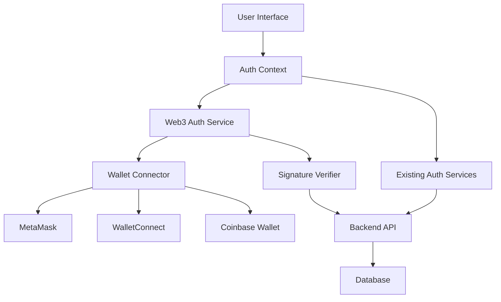
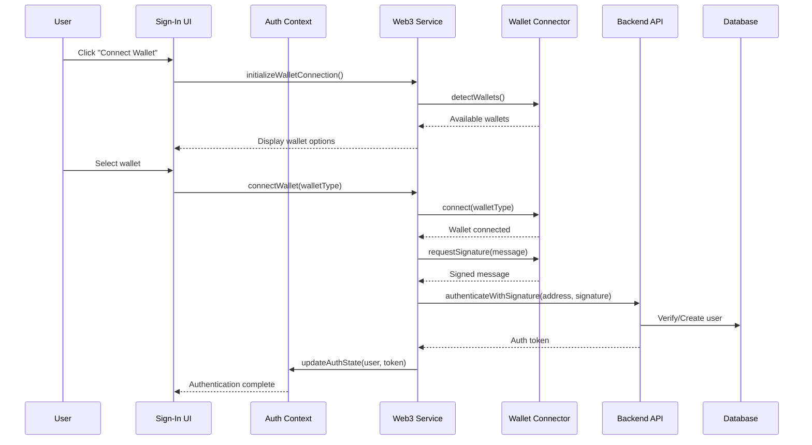

# Web3 Authentication Design Document

## Overview

This design document outlines the integration of Web3 authentication into the existing Dhaniverse game application. The solution will extend the current authentication system (which supports email/password and Google OAuth) to include Web3 wallet-based authentication. The design leverages popular Web3 libraries and follows established patterns for wallet connection and signature-based authentication.

The Web3 authentication will coexist with existing authentication methods, allowing users to choose their preferred sign-in option. The system will handle multiple wallet providers (MetaMask, WalletConnect, Coinbase Wallet, etc.) through a unified interface.

## Architecture

### High-Level Architecture



### Component Interaction Flow



## Components and Interfaces

### 1. Web3 Authentication Service

**Purpose**: Core service for handling Web3 authentication logic

**Interface**:
```typescript
interface IWeb3AuthService {
  // Wallet connection
  detectWallets(): Promise<WalletInfo[]>;
  connectWallet(walletType: WalletType): Promise<WalletConnection>;
  disconnectWallet(): Promise<void>;
  
  // Authentication
  signAuthenticationMessage(address: string): Promise<string>;
  authenticateWithSignature(address: string, signature: string): Promise<AuthResult>;
  
  // Session management
  restoreSession(): Promise<boolean>;
  clearSession(): Promise<void>;
  
  // Event handling
  onAccountChange(callback: (accounts: string[]) => void): void;
  onChainChange(callback: (chainId: string) => void): void;
  onDisconnect(callback: () => void): void;
}
```

### 2. Wallet Connector

**Purpose**: Abstraction layer for different wallet providers

**Interface**:
```typescript
interface IWalletConnector {
  connect(): Promise<WalletConnection>;
  disconnect(): Promise<void>;
  signMessage(message: string): Promise<string>;
  getAccounts(): Promise<string[]>;
  isConnected(): boolean;
  getWalletInfo(): WalletInfo;
}

interface WalletConnection {
  address: string;
  chainId: string;
  walletType: WalletType;
}

interface WalletInfo {
  name: string;
  type: WalletType;
  icon: string;
  installed: boolean;
  downloadUrl?: string;
}
```

### 3. Web3 Sign-In Component

**Purpose**: UI component for Web3 authentication

**Interface**:
```typescript
interface Web3SignInProps {
  onSuccess: (authResult: AuthResult) => void;
  onError: (error: string) => void;
  disabled?: boolean;
}
```

### 4. Enhanced Auth Context

**Purpose**: Extended authentication context to support Web3

**Additional Methods**:
```typescript
interface AuthContextType {
  // ... existing methods
  signInWithWeb3: (walletType: WalletType) => Promise<AuthResult>;
  connectWallet: (walletType: WalletType) => Promise<WalletConnection>;
  disconnectWallet: () => Promise<void>;
  walletConnection: WalletConnection | null;
  availableWallets: WalletInfo[];
}
```

## Data Models

### User Model Extension

```typescript
interface User {
  id: string;
  email?: string; // Optional for Web3-only users
  gameUsername: string;
  walletAddress?: string; // New field for Web3 users
  authMethod: 'email' | 'google' | 'web3'; // Track auth method
  createdAt: Date;
  updatedAt: Date;
}
```

### Web3 Authentication Models

```typescript
interface Web3AuthRequest {
  walletAddress: string;
  signature: string;
  message: string;
  timestamp: number;
}

interface AuthResult {
  success: boolean;
  user?: User;
  token?: string;
  isNewUser?: boolean;
  error?: string;
}

enum WalletType {
  METAMASK = 'metamask',
  WALLET_CONNECT = 'walletconnect',
  COINBASE = 'coinbase',
  INJECTED = 'injected'
}
```

### Session Storage Models

```typescript
interface Web3Session {
  walletAddress: string;
  walletType: WalletType;
  chainId: string;
  connectedAt: number;
  lastActivity: number;
}
```

## Error Handling

### Error Categories

1. **Wallet Connection Errors**
   - Wallet not installed
   - User rejected connection
   - Network connectivity issues
   - Unsupported wallet

2. **Authentication Errors**
   - Signature verification failed
   - Message signing rejected
   - Invalid wallet address format
   - Authentication timeout

3. **Session Management Errors**
   - Session expired
   - Wallet disconnected
   - Account switched
   - Chain switched

### Error Handling Strategy

```typescript
class Web3ErrorHandler {
  static handleWalletError(error: any): string {
    if (error.code === 4001) {
      return "Connection rejected by user. Please try again.";
    }
    if (error.code === -32002) {
      return "Wallet connection request pending. Please check your wallet.";
    }
    if (error.message?.includes('not installed')) {
      return "Wallet not detected. Please install the wallet extension.";
    }
    return "Failed to connect wallet. Please try again.";
  }

  static handleSignatureError(error: any): string {
    if (error.code === 4001) {
      return "Signature rejected by user. Please sign the message to authenticate.";
    }
    return "Failed to sign authentication message. Please try again.";
  }
}
```

## Testing Strategy

### Unit Tests

1. **Web3AuthService Tests**
   - Wallet detection functionality
   - Connection establishment
   - Message signing
   - Authentication flow
   - Error handling scenarios

2. **WalletConnector Tests**
   - Individual wallet connector implementations
   - Connection state management
   - Event handling
   - Error scenarios

3. **Component Tests**
   - Web3SignInButton rendering
   - User interaction handling
   - Error state display
   - Loading states

### Integration Tests

1. **Authentication Flow Tests**
   - Complete Web3 sign-in process
   - Session restoration
   - Wallet switching scenarios
   - Multi-auth method coexistence

2. **Backend Integration Tests**
   - Signature verification
   - User creation/retrieval
   - Token generation
   - Database operations

### End-to-End Tests

1. **User Journey Tests**
   - First-time Web3 user registration
   - Returning user authentication
   - Wallet switching during session
   - Sign-out and reconnection

2. **Cross-Browser Tests**
   - Different wallet extensions
   - Browser compatibility
   - Mobile wallet apps (future consideration)

## Security Considerations

### Message Signing Security

- Use standardized message format with timestamp
- Include domain and nonce to prevent replay attacks
- Implement message expiration (5-minute window)
- Validate signature on both client and server

### Session Security

- Store minimal wallet information in localStorage
- Implement session timeout (24 hours)
- Clear sensitive data on sign-out
- Validate wallet connection on each request

### Backend Security

- Verify signature authenticity server-side
- Rate limit authentication attempts
- Log authentication events for monitoring
- Implement CORS properly for Web3 requests

## Implementation Dependencies

### Required Libraries

```json
{
  "dependencies": {
    "ethers": "^6.8.0",
    "@walletconnect/web3-provider": "^1.8.0",
    "@coinbase/wallet-sdk": "^3.7.0",
    "web3": "^4.2.0"
  }
}
```

### Browser Requirements

- Modern browsers with Web3 support
- Wallet extensions installed
- JavaScript enabled
- LocalStorage available

## Migration Strategy

### Phase 1: Core Implementation
- Implement Web3AuthService
- Create wallet connectors for MetaMask
- Add Web3SignInButton component
- Extend AuthContext

### Phase 2: Enhanced Support
- Add WalletConnect support
- Implement Coinbase Wallet connector
- Add session restoration
- Implement error handling

### Phase 3: Polish & Testing
- Comprehensive testing
- Error message improvements
- Performance optimizations
- Documentation updates

## Future Considerations

### Multi-Chain Support
- Support for different blockchain networks
- Chain switching functionality
- Network-specific features

### Advanced Features
- ENS name resolution
- Wallet balance display
- Transaction history integration
- NFT-based authentication

### Mobile Support
- Mobile wallet integration
- Deep linking support
- Progressive Web App features