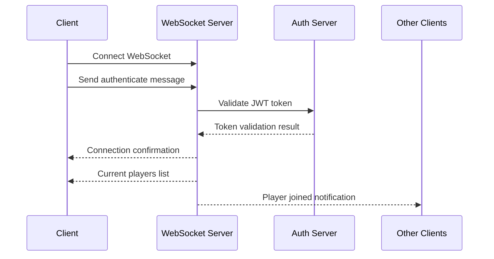

# WebSocket API Reference

## Table of Contents

- [Overview](#overview)
- [Connection Information](#connection-information)
- [Connection Flow](#connection-flow)
- [Message Types](#message-types)
- [Client-to-Server Messages](#client-to-server-messages)
- [Server-to-Client Messages](#server-to-client-messages)
- [Error Handling](#error-handling)
- [Connection Management](#connection-management)
- [Rate Limiting](#rate-limiting)
- [Security Considerations](#security-considerations)

## Overview

The Dhaniverse WebSocket server provides real-time multiplayer functionality, enabling players to see each other's movements, chat, and receive live game updates. The server is built with Deno and handles authentication, position updates, and chat messaging.

## Connection Information

- **URL**: `ws://localhost:8000` (development) or `wss://your-domain.com` (production)
- **Protocol**: WebSocket
- **Authentication**: JWT token-based
- **Port**: 8000 (configurable via environment)

## Connection Flow

1. Establish WebSocket connection
2. Send authentication message with JWT token
3. Receive connection confirmation
4. Begin sending/receiving game messages

## Message Types

All messages are JSON-formatted strings with a `type` field indicating the message category.

## Client-to-Server Messages

### Authentication Message

Must be sent immediately after connection to authenticate the user.

**Message Type**: `authenticate`

**Format**:
```json
{
    "type": "authenticate",
    "token": "jwt_token_from_auth_server",
    "gameUsername": "player_username"
}
```

**Parameters**:
- `token`: JWT token obtained from the game server authentication
- `gameUsername`: Player's display name in the game

**Response**: Connection confirmation or error message

### Position Update Message

Updates the player's position and animation state.

**Message Type**: `update`

**Format**:
```json
{
    "type": "update",
    "x": 400,
    "y": 300,
    "animation": "walking"
}
```

**Parameters**:
- `x`: Player's X coordinate
- `y`: Player's Y coordinate  
- `animation`: Current animation state (optional)

**Rate Limiting**: Maximum 5 updates per second per connection

### Chat Message

Sends a chat message to all connected players.

**Message Type**: `chat`

**Format**:
```json
{
    "type": "chat",
    "message": "Hello everyone!"
}
```

**Parameters**:
- `message`: Text message (max 500 characters)

**Rate Limiting**: Maximum 1 message per 500ms per connection

### Ping Message

Keeps the connection alive and measures latency.

**Message Type**: `ping`

**Format**:
```json
{
    "type": "ping"
}
```

**Response**: Server responds with `pong` message

## Server-to-Client Messages

### Connection Confirmation

Sent after successful authentication.

**Message Type**: `connect`

**Format**:
```json
{
    "type": "connect",
    "id": "connection_uuid"
}
```

**Parameters**:
- `id`: Unique connection identifier

### Players List

Sent after authentication, contains all currently connected players.

**Message Type**: `players`

**Format**:
```json
{
    "type": "players",
    "players": [
        {
            "id": "connection_uuid",
            "username": "player1",
            "x": 400,
            "y": 300,
            "animation": "idle"
        },
        {
            "id": "connection_uuid_2",
            "username": "player2", 
            "x": 500,
            "y": 400,
            "animation": "walking"
        }
    ]
}
```

### Player Joined

Notifies when a new player connects.

**Message Type**: `playerJoined`

**Format**:
```json
{
    "type": "playerJoined",
    "player": {
        "id": "connection_uuid",
        "username": "newplayer",
        "x": 400,
        "y": 300
    }
}
```

### Player Update

Notifies when an existing player moves or changes animation.

**Message Type**: `playerUpdate`

**Format**:
```json
{
    "type": "playerUpdate",
    "player": {
        "id": "connection_uuid",
        "username": "player1",
        "x": 450,
        "y": 320,
        "animation": "running"
    }
}
```

### Player Disconnect

Notifies when a player disconnects.

**Message Type**: `playerDisconnect`

**Format**:
```json
{
    "type": "playerDisconnect",
    "id": "connection_uuid",
    "username": "player1"
}
```

### Chat Message Broadcast

Broadcasts chat messages to all connected players.

**Message Type**: `chat`

**Format**:
```json
{
    "type": "chat",
    "id": "message_uuid",
    "username": "player1",
    "message": "Hello everyone!"
}
```

### Chat Acknowledgment

Confirms message receipt to the sender.

**Message Type**: `chatAck`

**Format**:
```json
{
    "type": "chatAck",
    "id": "message_uuid",
    "message": "Hello everyone!"
}
```

### Online Users Count

Broadcasts the current number of authenticated users.

**Message Type**: `onlineUsersCount`

**Format**:
```json
{
    "type": "onlineUsersCount",
    "count": 15
}
```

### Pong Response

Response to client ping messages.

**Message Type**: `pong`

**Format**:
```json
{
    "type": "pong"
}
```

### Error Messages

Sent when client requests fail or are invalid.

**Message Type**: `error`

**Format**:
```json
{
    "type": "error",
    "error": "error_code",
    "message": "Human readable error message"
}
```

**Common Error Codes**:
- `authentication_failed`: Invalid or expired token
- `not_authenticated`: Action requires authentication
- `rate_limited`: Too many requests
- `chat_error`: Chat message processing failed

## Connection Management

### Authentication Flow



### Rate Limiting

The server implements rate limiting to prevent spam and abuse:

- **Position Updates**: 5 per second (200ms minimum interval)
- **Chat Messages**: 1 per 500ms
- **Authentication Attempts**: 1 per 2 seconds per connection

### Connection Cleanup

- **Inactive Connections**: Closed after 3 minutes of inactivity
- **Ping Interval**: Server sends ping every 45 seconds if no recent activity
- **Duplicate Connections**: New connections replace existing ones for the same user

## HTTP Endpoints

The WebSocket server also provides HTTP endpoints for monitoring:

### GET /health

Health check endpoint.

**Response**:
```json
{
    "status": "ok",
    "connections": 15,
    "uptime": 3600
}
```

### GET /info

Server information endpoint.

**Response**:
```json
{
    "status": "ok",
    "connections": 15,
    "environment": "development"
}
```

### GET /online

Current online users count.

**Response**:
```json
{
    "status": "ok",
    "onlineUsers": 12,
    "timestamp": 1640995200000
}
```

## Client Implementation Examples

### JavaScript WebSocket Client

```javascript
class GameWebSocket {
    constructor(serverUrl, authToken) {
        this.serverUrl = serverUrl;
        this.authToken = authToken;
        this.socket = null;
        this.authenticated = false;
    }

    connect() {
        this.socket = new WebSocket(this.serverUrl);
        
        this.socket.onopen = () => {
            console.log('WebSocket connected');
            this.authenticate();
        };

        this.socket.onmessage = (event) => {
            const message = JSON.parse(event.data);
            this.handleMessage(message);
        };

        this.socket.onclose = () => {
            console.log('WebSocket disconnected');
            this.authenticated = false;
        };

        this.socket.onerror = (error) => {
            console.error('WebSocket error:', error);
        };
    }

    authenticate() {
        this.send({
            type: 'authenticate',
            token: this.authToken,
            gameUsername: 'PlayerName'
        });
    }

    updatePosition(x, y, animation) {
        if (this.authenticated) {
            this.send({
                type: 'update',
                x: x,
                y: y,
                animation: animation
            });
        }
    }

    sendChat(message) {
        if (this.authenticated) {
            this.send({
                type: 'chat',
                message: message
            });
        }
    }

    send(message) {
        if (this.socket && this.socket.readyState === WebSocket.OPEN) {
            this.socket.send(JSON.stringify(message));
        }
    }

    handleMessage(message) {
        switch (message.type) {
            case 'connect':
                this.authenticated = true;
                console.log('Authenticated with ID:', message.id);
                break;
                
            case 'players':
                console.log('Current players:', message.players);
                break;
                
            case 'playerJoined':
                console.log('Player joined:', message.player);
                break;
                
            case 'playerUpdate':
                console.log('Player moved:', message.player);
                break;
                
            case 'playerDisconnect':
                console.log('Player left:', message.username);
                break;
                
            case 'chat':
                console.log(`${message.username}: ${message.message}`);
                break;
                
            case 'error':
                console.error('Server error:', message.message);
                break;
        }
    }
}

// Usage
const gameWS = new GameWebSocket('ws://localhost:8000', jwtToken);
gameWS.connect();
```

### React Hook Example

```typescript
import { useEffect, useRef, useState } from 'react';

interface Player {
    id: string;
    username: string;
    x: number;
    y: number;
    animation?: string;
}

export function useGameWebSocket(serverUrl: string, authToken: string) {
    const [connected, setConnected] = useState(false);
    const [players, setPlayers] = useState<Player[]>([]);
    const [messages, setMessages] = useState<Array<{username: string, message: string}>>([]);
    const socketRef = useRef<WebSocket | null>(null);

    useEffect(() => {
        if (!authToken) return;

        const socket = new WebSocket(serverUrl);
        socketRef.current = socket;

        socket.onopen = () => {
            socket.send(JSON.stringify({
                type: 'authenticate',
                token: authToken,
                gameUsername: 'Player'
            }));
        };

        socket.onmessage = (event) => {
            const message = JSON.parse(event.data);
            
            switch (message.type) {
                case 'connect':
                    setConnected(true);
                    break;
                    
                case 'players':
                    setPlayers(message.players);
                    break;
                    
                case 'playerJoined':
                    setPlayers(prev => [...prev, message.player]);
                    break;
                    
                case 'playerUpdate':
                    setPlayers(prev => prev.map(p => 
                        p.id === message.player.id ? message.player : p
                    ));
                    break;
                    
                case 'playerDisconnect':
                    setPlayers(prev => prev.filter(p => p.id !== message.id));
                    break;
                    
                case 'chat':
                    setMessages(prev => [...prev, {
                        username: message.username,
                        message: message.message
                    }]);
                    break;
            }
        };

        socket.onclose = () => {
            setConnected(false);
        };

        return () => {
            socket.close();
        };
    }, [serverUrl, authToken]);

    const updatePosition = (x: number, y: number, animation?: string) => {
        if (socketRef.current && connected) {
            socketRef.current.send(JSON.stringify({
                type: 'update',
                x, y, animation
            }));
        }
    };

    const sendChat = (message: string) => {
        if (socketRef.current && connected) {
            socketRef.current.send(JSON.stringify({
                type: 'chat',
                message
            }));
        }
    };

    return {
        connected,
        players,
        messages,
        updatePosition,
        sendChat
    };
}
```

## Error Handling

### Connection Errors

- **Network Issues**: Implement reconnection logic with exponential backoff
- **Authentication Failures**: Refresh JWT token and retry
- **Rate Limiting**: Implement client-side rate limiting to prevent server rejection

### Message Validation

- Validate message format before sending
- Handle malformed messages gracefully
- Implement timeout for server responses

## Security Considerations

- **JWT Validation**: All messages require valid authentication
- **Rate Limiting**: Prevents spam and abuse
- **Input Sanitization**: Chat messages are sanitized and length-limited
- **Connection Limits**: Maximum connections per IP address
- **CORS**: Proper CORS configuration for web clients

## Performance Optimization

- **Message Batching**: Position updates are batched to reduce network traffic
- **Selective Broadcasting**: Only relevant updates are sent to each client
- **Connection Pooling**: Efficient connection management
- **Memory Management**: Regular cleanup of inactive connections

## Monitoring and Debugging

### Connection Statistics

The server logs connection statistics including:
- Total connections
- Authenticated users
- Message rates
- Error rates

### Debug Logging

Enable debug logging with environment variable:
```bash
FASTMCP_LOG_LEVEL=DEBUG
```

### Health Monitoring

Monitor server health using the HTTP endpoints:
- `/health` - Basic health check
- `/online` - Current user count
- `/info` - Server information## 
Related Documentation

- [Game Server API](./game-server.md) - REST API endpoints and authentication
- [Frontend APIs](./frontend-apis.md) - Frontend WebSocket integration
- [Game Engine](../components/game-engine.md) - Real-time game systems
- [System Architecture](../architecture/system-architecture.md#real-time-communication-flow) - WebSocket architecture

## External Resources

- [WebSocket API Documentation](https://developer.mozilla.org/en-US/docs/Web/API/WebSocket)
- [Deno WebSocket](https://deno.land/manual/runtime/web_platform_apis#websockets)
- [Real-time Communication Patterns](https://web.dev/websockets-basics/)

---

**Navigation**: [← Game Server API](./game-server.md) | [API Index](./index.md) | [Frontend APIs →](./frontend-apis.md)