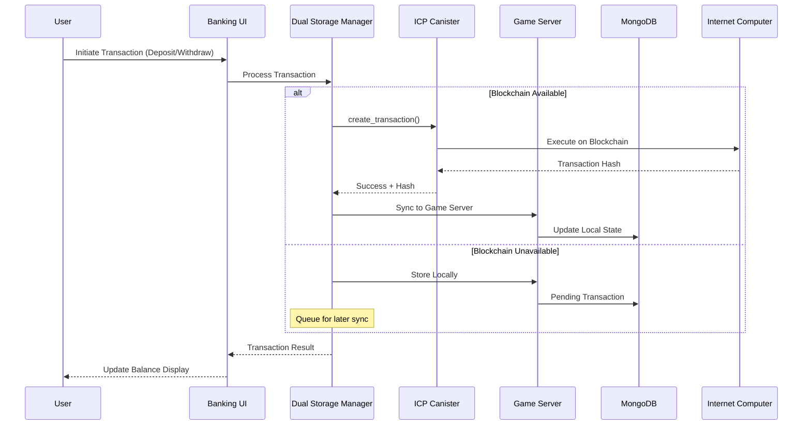
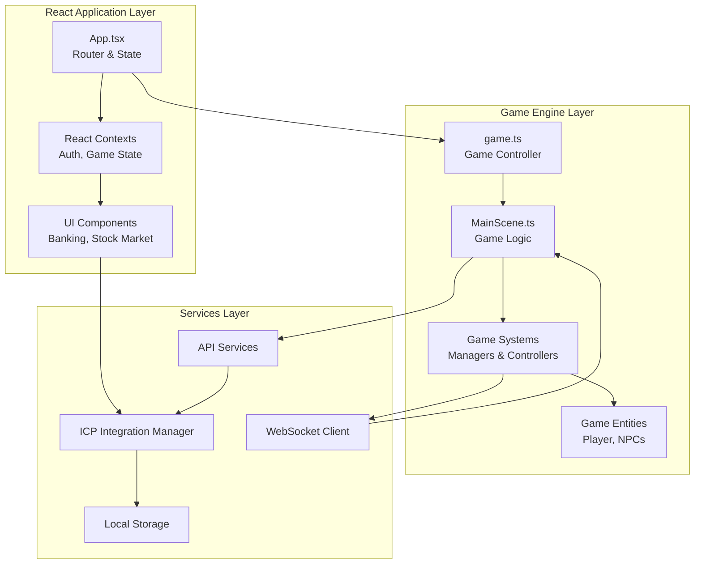
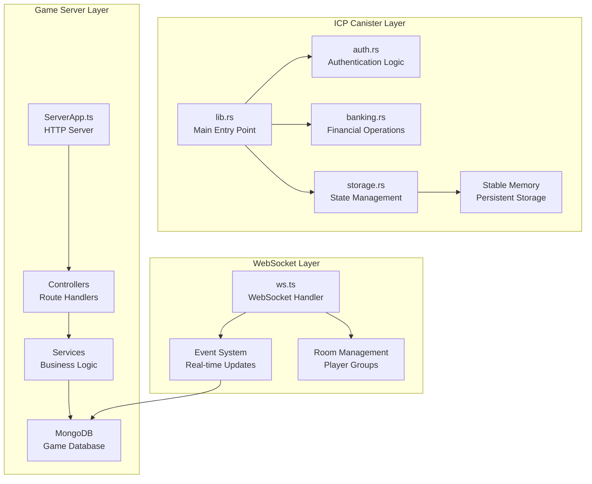
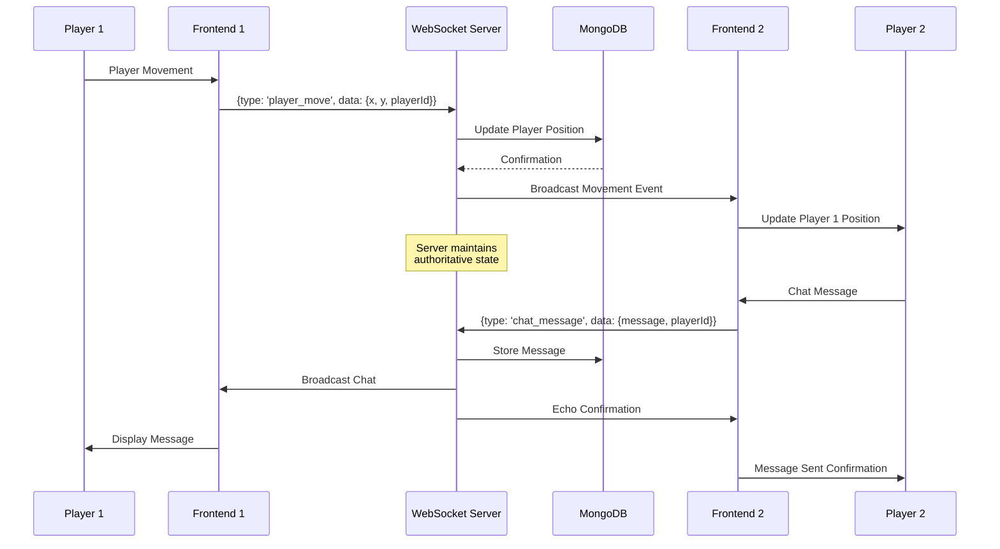

# Data Flow Architecture

## Overview

The Dhaniverse platform implements a sophisticated data flow architecture that manages information exchange between the React frontend, Phaser.js game engine, Deno game servers, WebSocket services, and the ICP canister backend. This document details how data flows through the system for various operations including authentication, gaming, financial transactions, and real-time multiplayer interactions.

## Primary Data Flow Patterns

### 1. User Authentication Flow

### 2. Game State Synchronization Flow

### 3. Financial Transaction Flow

## Component-Specific Data Flows

### Frontend Data Flow

### Backend Data Flow

## Real-Time Data Synchronization

### WebSocket Event Flow

### Game State Persistence Flow

## API Data Flow Specifications

### REST API Data Flow

### ICP Canister API Flow

## Data Transformation Layers

### Frontend Data Transformation

### Backend Data Processing

## Error Handling and Recovery

### Error Propagation Flow

### Dual Storage Synchronization

## Performance Optimization Patterns

### Caching Strategy

### Data Loading Patterns

## Security Data Flow

### Authentication Data Protection

### Data Privacy Flow

This comprehensive data flow architecture ensures efficient, secure, and reliable data movement throughout the Dhaniverse platform while maintaining performance and scalability requirements.