# Security Architecture

## Overview

The Dhaniverse platform implements a comprehensive security architecture that protects user assets, data, and interactions across all system components. This multi-layered security approach combines Web3 authentication, blockchain security, traditional web security practices, and game-specific security measures to create a robust and trustworthy gaming environment.

## Security Principles

### Core Security Principles

1. **Zero Trust Architecture**: Never trust, always verify
2. **Defense in Depth**: Multiple security layers
3. **Principle of Least Privilege**: Minimal access rights
4. **Fail Secure**: Secure defaults and graceful degradation
5. **Transparency**: Open security practices and audit trails

### Security Domains

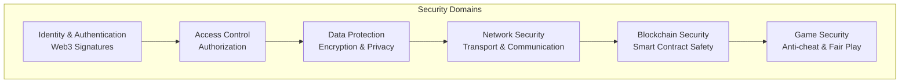

## Authentication Architecture

### Web3 Authentication Flow

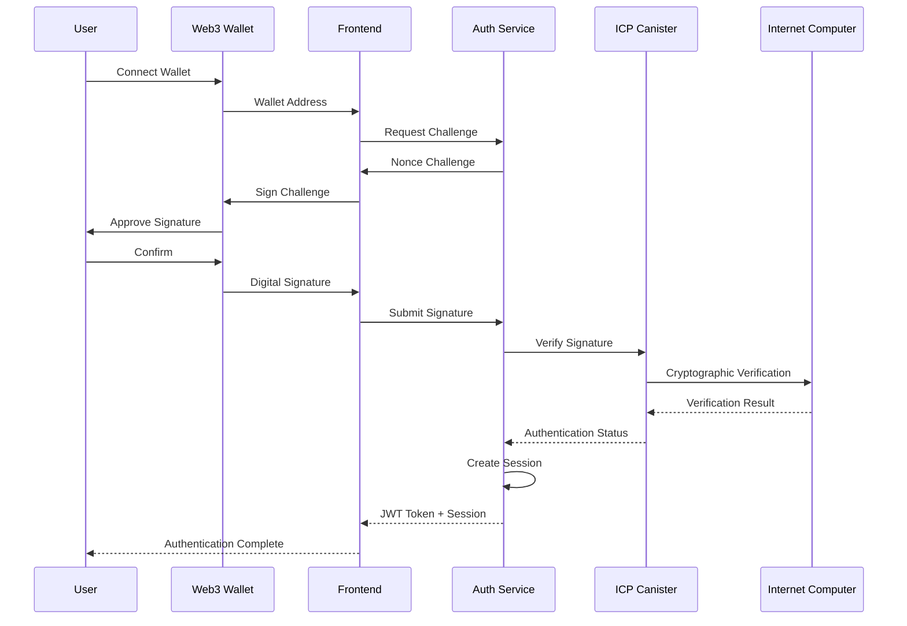

### Multi-Factor Authentication

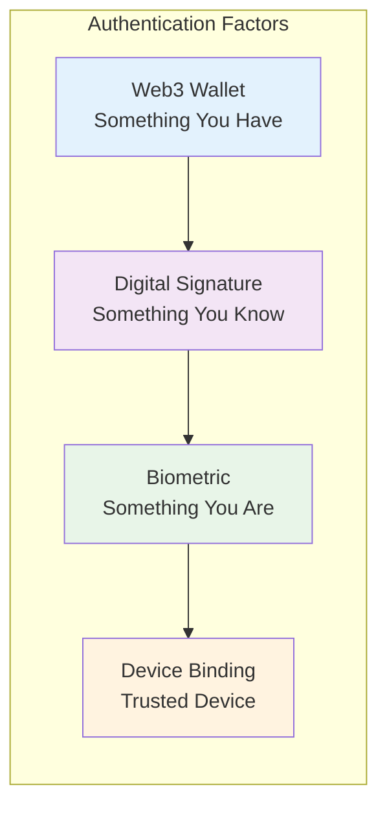

### Session Management

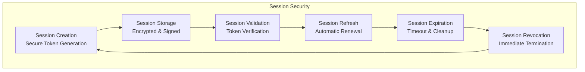

## Authorization and Access Control

### Role-Based Access Control (RBAC)

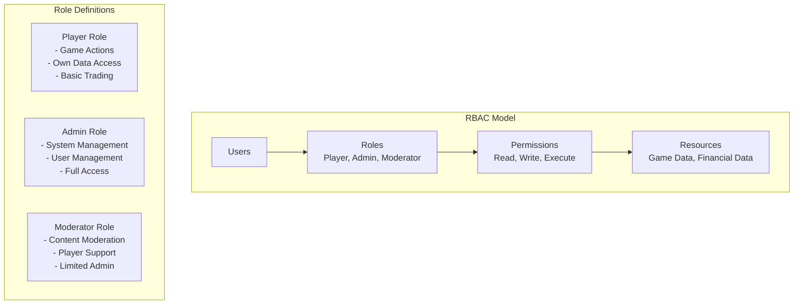

### Permission Matrix

| Resource | Player | Moderator | Admin |
|----------|--------|-----------|-------|
| Own Game Data | Read/Write | Read | Read/Write |
| Other Player Data | None | Read | Read/Write |
| Financial Transactions | Own Only | View | All |
| System Configuration | None | None | Full |
| User Management | None | Limited | Full |
| Game Content | Play | Moderate | Manage |

### Access Control Implementation

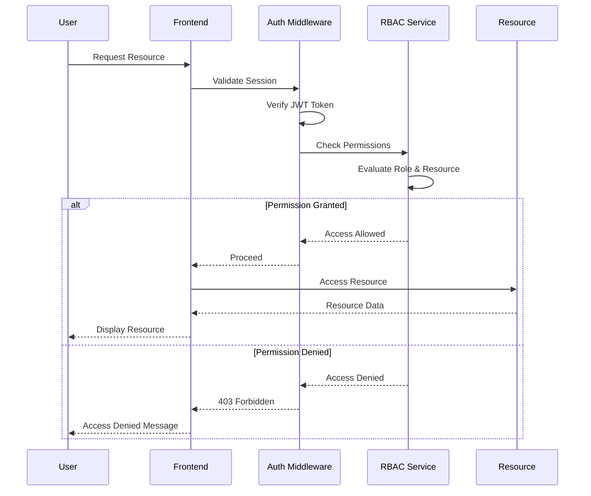

## Data Protection and Encryption

### Encryption Strategy

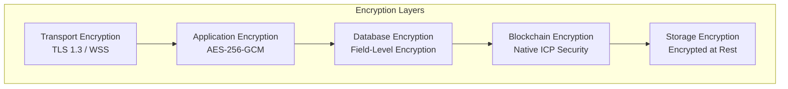

### Data Classification and Protection

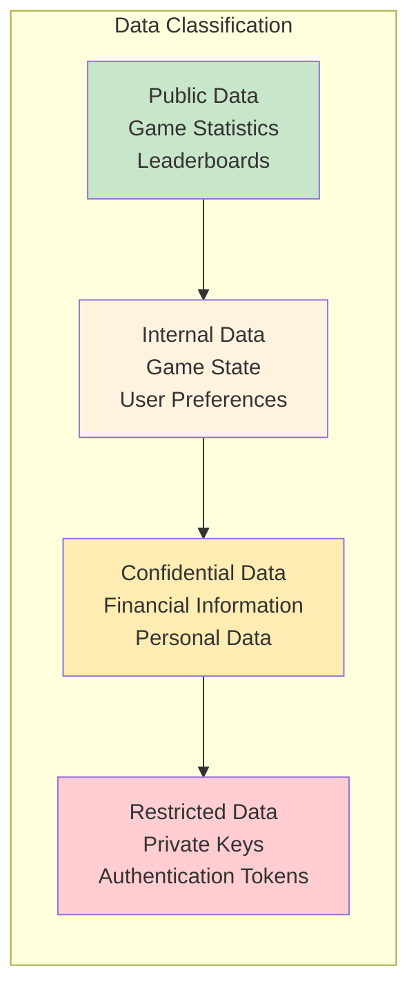

### Key Management

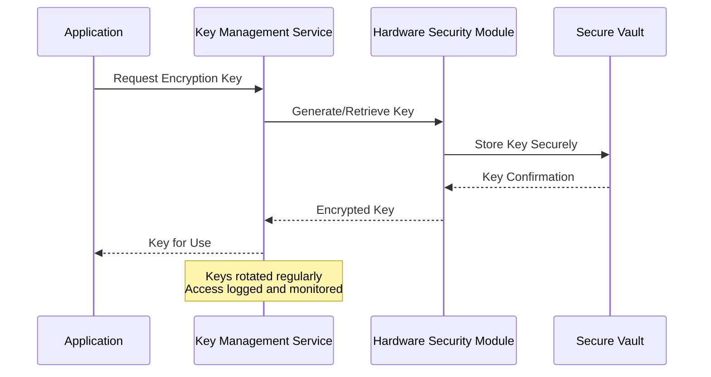

## Network Security

### Transport Security

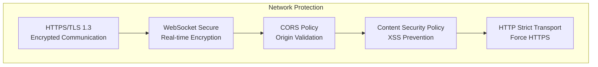

### API Security

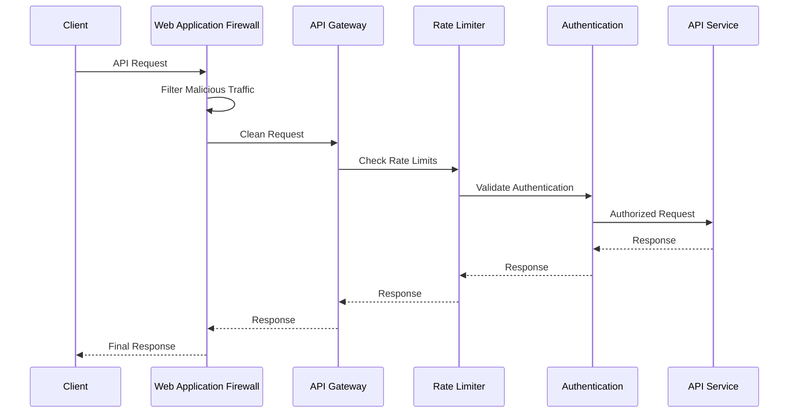

### DDoS Protection

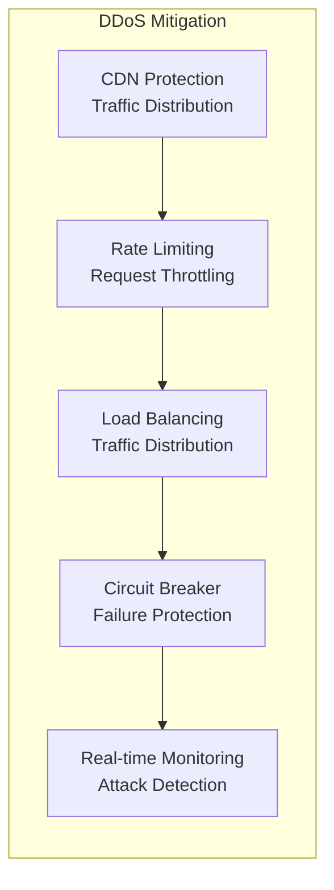

## Blockchain Security

### ICP Canister Security

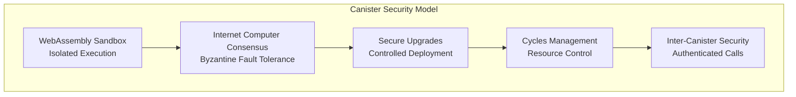

### Smart Contract Security Practices

```rust
// Example: Secure state management in Rust canister
use ic_stable_structures::{StableBTreeMap, Memory, DefaultMemoryImpl};

// Secure state with proper access controls
thread_local! {
    static USER_BALANCES: RefCell<StableBTreeMap<String, u64, Memory>> = 
        RefCell::new(StableBTreeMap::init(DefaultMemoryImpl::default()));
}

#[ic_cdk::update]
async fn transfer_funds(to: String, amount: u64) -> Result<(), String> {
    // Verify caller authentication
    let caller = ic_cdk::caller();
    if caller == Principal::anonymous() {
        return Err("Anonymous calls not allowed".to_string());
    }
    
    // Input validation
    if amount == 0 {
        return Err("Amount must be greater than zero".to_string());
    }
    
    // Check balance with overflow protection
    let caller_str = caller.to_string();
    let current_balance = get_balance(&caller_str)?;
    
    if current_balance < amount {
        return Err("Insufficient balance".to_string());
    }
    
    // Atomic transaction
    USER_BALANCES.with(|balances| {
        let mut balances = balances.borrow_mut();
        
        // Deduct from sender
        balances.insert(caller_str.clone(), current_balance - amount);
        
        // Add to recipient
        let recipient_balance = balances.get(&to).unwrap_or(0);
        balances.insert(to, recipient_balance + amount);
    });
    
    Ok(())
}
```

### Cryptographic Security

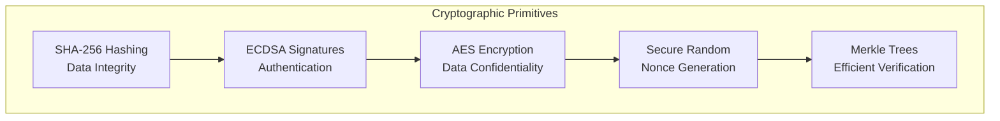

## Game Security

### Anti-Cheat Measures

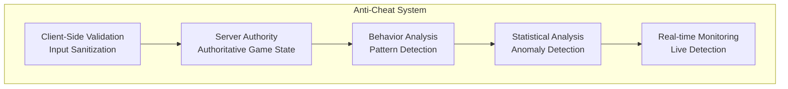

### Fair Play Enforcement

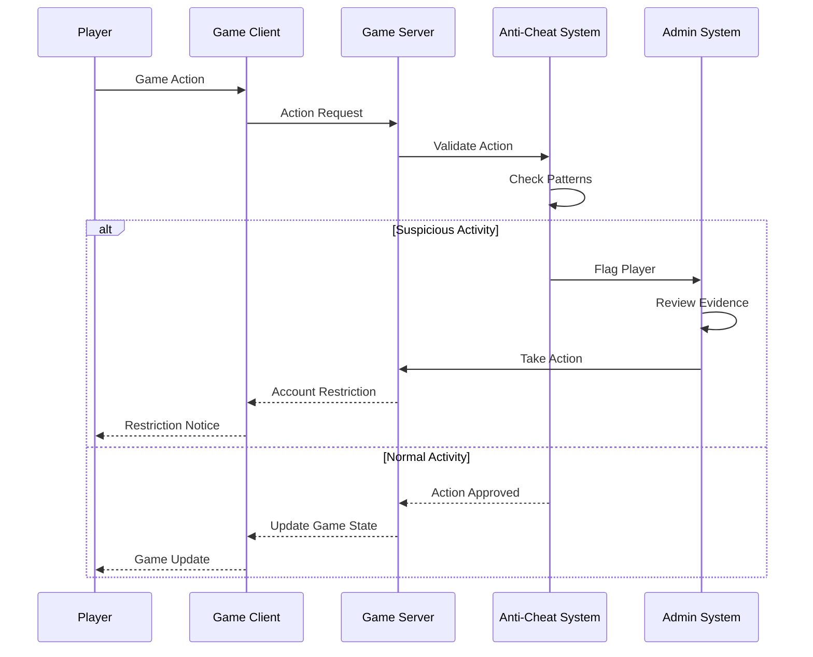

### Economic Security

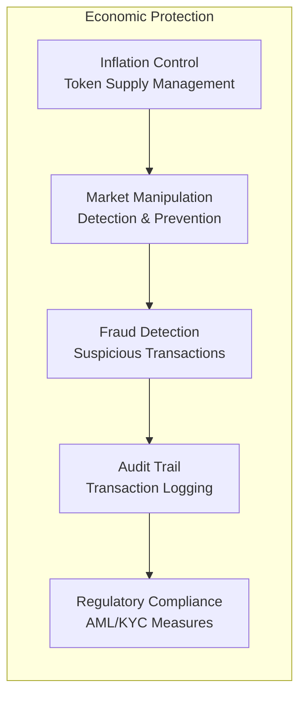

## Security Monitoring and Incident Response

### Security Monitoring Architecture

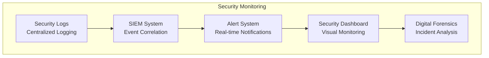

### Incident Response Process

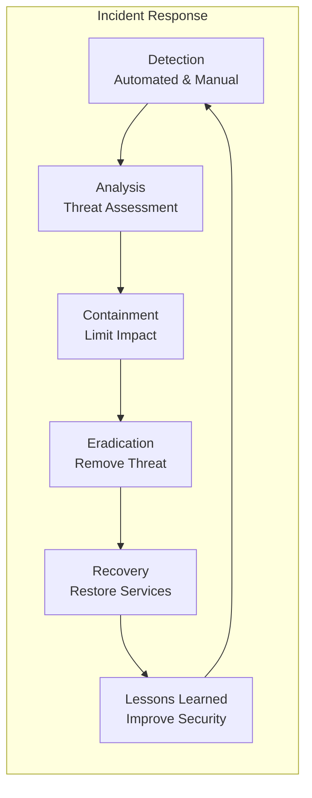

## Security Compliance and Auditing

### Compliance Framework

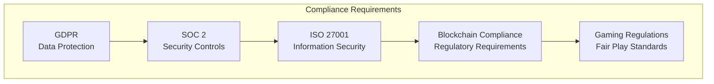

### Security Audit Process

```mermaid
sequenceDiagram
    participant AUDITOR as Security Auditor
    participant SYSTEM as System
    participant LOGS as Audit Logs
    participant REPORT as Audit Report
    participant MGMT as Management
    
    AUDITOR->>SYSTEM: Security Assessment
    SYSTEM->>LOGS: Generate Audit Trail
    LOGS-->>AUDITOR: Security Evidence
    AUDITOR->>AUDITOR: Analyze Findings
    AUDITOR->>REPORT: Document Results
    REPORT->>MGMT: Security Recommendations
    MGMT->>SYSTEM: Implement Improvements
```

## Security Best Practices

### Development Security

1. **Secure Coding Practices**
   - Input validation and sanitization
   - Output encoding
   - Error handling without information disclosure
   - Secure defaults

2. **Code Review Process**
   - Mandatory security reviews
   - Automated security scanning
   - Peer review requirements
   - Security-focused testing

3. **Dependency Management**
   - Regular dependency updates
   - Vulnerability scanning
   - License compliance
   - Supply chain security

### Operational Security

1. **Infrastructure Security**
   - Regular security updates
   - Network segmentation
   - Access control
   - Monitoring and logging

2. **Backup and Recovery**
   - Regular encrypted backups
   - Disaster recovery testing
   - Business continuity planning
   - Data retention policies

3. **Security Training**
   - Regular security awareness training
   - Phishing simulation
   - Incident response training
   - Security culture development

This comprehensive security architecture ensures that the Dhaniverse platform maintains the highest standards of security across all components while providing a seamless and trustworthy user experience.