# System Architecture

## Table of Contents

- [Overview](#overview)
- [High-Level Architecture](#high-level-architecture)
- [Component Architecture](#component-architecture)
  - [Frontend Architecture](#frontend-architecture)
  - [Backend Architecture](#backend-architecture)
- [Data Flow Architecture](#data-flow-architecture)
  - [Primary Data Flow](#primary-data-flow)
  - [Real-time Communication Flow](#real-time-communication-flow)
- [Security Architecture](#security-architecture)
  - [Authentication Flow](#authentication-flow)
  - [Security Layers](#security-layers)
- [Deployment Architecture](#deployment-architecture)
  - [Development Environment](#development-environment)
  - [Production Environment](#production-environment)
- [Performance Considerations](#performance-considerations)
  - [Scalability Design](#scalability-design)
  - [Optimization Strategies](#optimization-strategies)
- [Technology Stack Summary](#technology-stack-summary)
- [Integration Points](#integration-points)

## Overview

Dhaniverse is a comprehensive Web3 gaming platform that combines traditional gaming mechanics with blockchain technology. The system is built on a distributed architecture that includes an Internet Computer Protocol (ICP) canister backend, multiple game servers, a React-based frontend, and various supporting services.

## High-Level Architecture

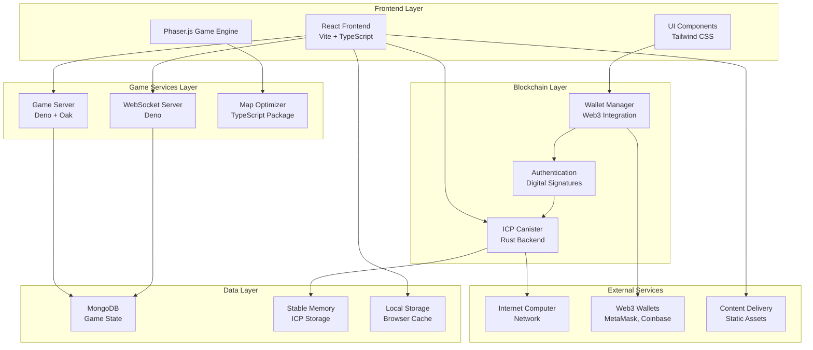

## Component Architecture

### Frontend Architecture

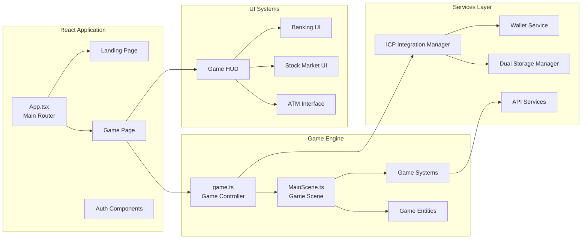

### Backend Architecture

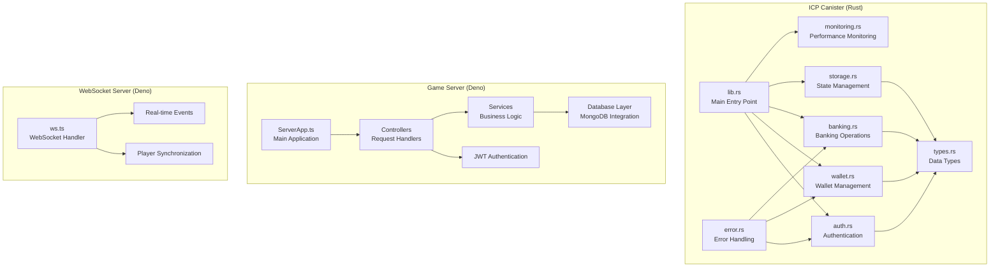

## Data Flow Architecture

### Primary Data Flow

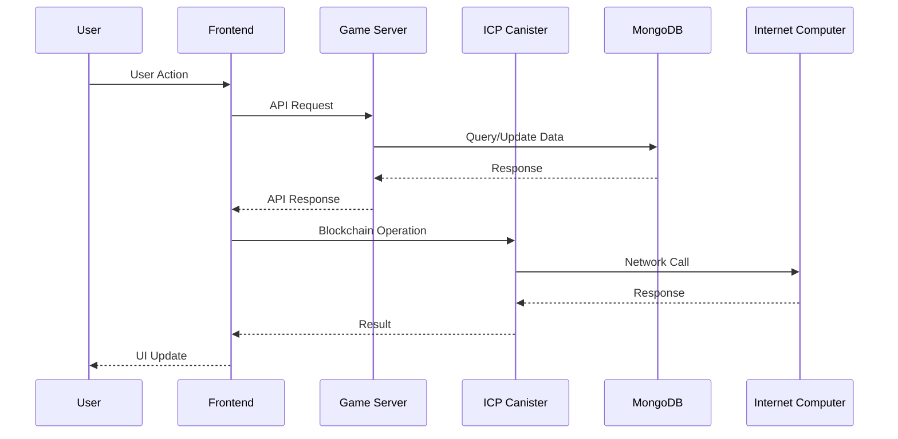

### Real-time Communication Flow

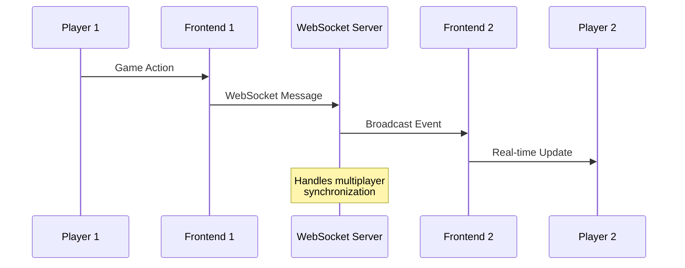

## Security Architecture

### Authentication Flow

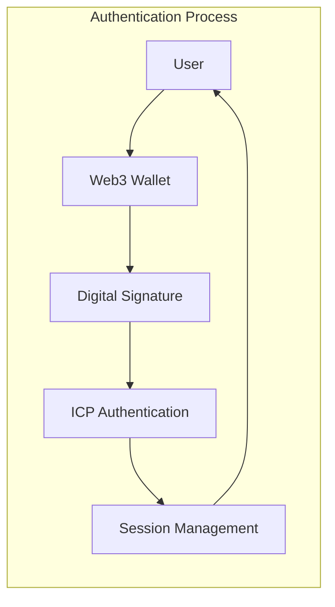

### Security Layers

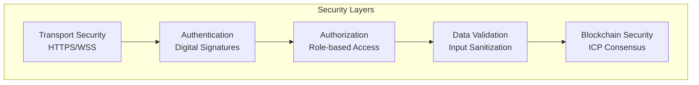

## Deployment Architecture

### Development Environment

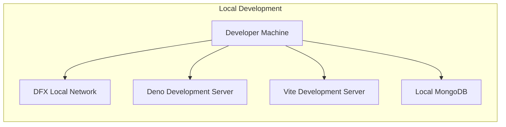

### Production Environment

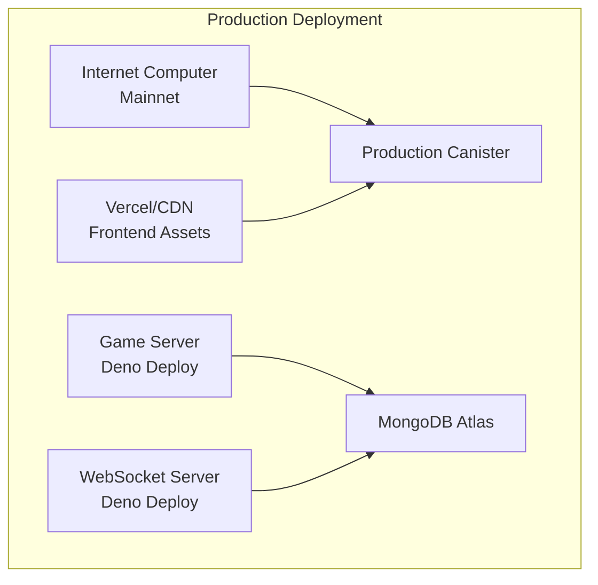

## Performance Considerations

### Scalability Design

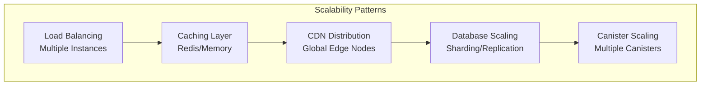

### Optimization Strategies

1. **Frontend Optimization**
   - Code splitting and lazy loading
   - Asset optimization and compression
   - Browser caching strategies
   - Progressive loading for game assets

2. **Backend Optimization**
   - Database query optimization
   - Connection pooling
   - Caching frequently accessed data
   - Efficient memory management in Rust

3. **Network Optimization**
   - WebSocket connection management
   - Batch API requests where possible
   - Compression for data transfer
   - CDN utilization for static assets

## Technology Stack Summary

### Frontend Technologies
- **React 19.1.0**: UI framework
- **TypeScript 5.8.3**: Type safety
- **Vite 6.2.0**: Build tool and development server
- **Phaser.js 3.88.2**: Game engine
- **Tailwind CSS 3.4.11**: Styling framework
- **Framer Motion 12.23.7**: Animations

### Backend Technologies
- **Rust**: ICP canister development
- **Deno**: Server runtime
- **Oak**: Web framework for Deno
- **MongoDB**: Database
- **Internet Computer Protocol**: Blockchain platform

### Web3 Technologies
- **@dfinity/agent 3.0.2**: ICP integration
- **@dfinity/auth-client 3.0.2**: Authentication
- **Ethers.js 6.15.0**: Ethereum integration
- **@coinbase/wallet-sdk 4.3.7**: Coinbase Wallet
- **@walletconnect/ethereum-provider 2.16.1**: WalletConnect

### Development Tools
- **DFX**: ICP development framework
- **Cargo**: Rust package manager
- **npm/pnpm**: JavaScript package management
- **Vercel**: Frontend deployment
- **Deno Deploy**: Server deployment

## Integration Points

### External Service Integration

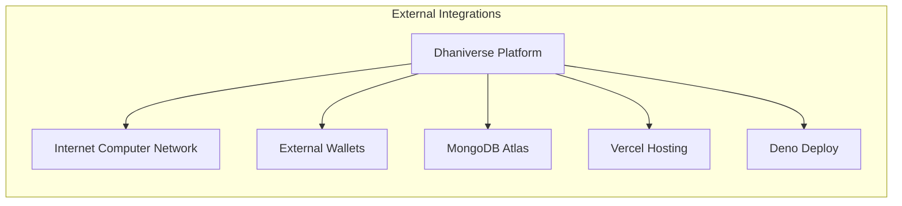

### API Integration Architecture

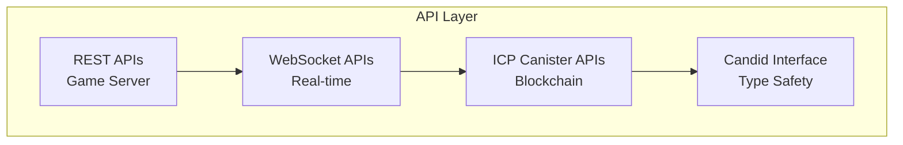

This architecture provides a robust, scalable foundation for the Dhaniverse Web3 gaming platform, ensuring security, performance, and maintainability across all system components.

## Related Documentation

- [Data Flow Architecture](./data-flow.md) - Detailed data flow patterns and communication
- [Security Architecture](./security-architecture.md) - Security measures and authentication
- [Technology Stack](./technology-stack.md) - Technology choices and rationale
- [ICP Canister API](../api/icp-canister.md) - Blockchain backend API reference
- [Game Server API](../api/game-server.md) - Game server endpoints and integration
- [Component Documentation](../components/) - Individual component details

---

**Navigation**: [← Architecture Index](./index.md) | [Main Documentation](../README.md) | [Data Flow →](./data-flow.md)