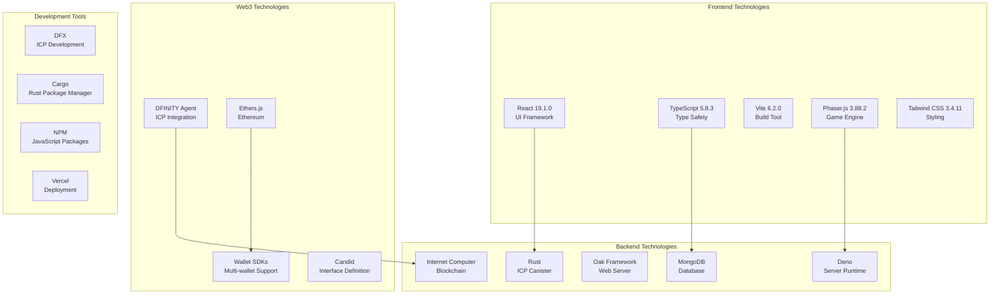

# Technology Stack

## Overview

The Dhaniverse platform is built using a carefully selected technology stack that combines cutting-edge Web3 technologies with proven development frameworks. This document provides a comprehensive overview of all technologies used, their versions, purposes, and the rationale behind each choice.

## Technology Architecture Overview



## Frontend Technology Stack

### Core Frontend Framework

#### React 19.1.0
**Purpose**: Primary UI framework for building the user interface
**Rationale**: 
- Latest React version with improved performance and concurrent features
- Excellent ecosystem and community support
- Strong TypeScript integration
- Efficient state management and component lifecycle
- Server-side rendering capabilities for better SEO

```typescript
// Example React component with modern features
import React, { useState, useEffect, Suspense } from 'react';
import { ErrorBoundary } from 'react-error-boundary';

const GameComponent: React.FC = () => {
  const [gameState, setGameState] = useState<GameState | null>(null);
  
  return (
    <ErrorBoundary fallback={<ErrorFallback />}>
      <Suspense fallback={<LoadingSpinner />}>
        <GameInterface gameState={gameState} />
      </Suspense>
    </ErrorBoundary>
  );
};
```

#### TypeScript 5.8.3
**Purpose**: Static type checking and enhanced developer experience
**Rationale**:
- Compile-time error detection
- Better IDE support with autocomplete and refactoring
- Improved code maintainability and documentation
- Strong integration with React and other libraries
- Enhanced team collaboration through type contracts

```typescript
// Type-safe API interfaces
interface PlayerState {
  id: string;
  username: string;
  position: { x: number; y: number };
  balance: {
    rupees: number;
    tokens: number;
  };
  achievements: Achievement[];
}

interface GameAPI {
  updatePlayerPosition(playerId: string, position: Position): Promise<void>;
  getPlayerBalance(playerId: string): Promise<Balance>;
  executeTransaction(transaction: Transaction): Promise<TransactionResult>;
}
```

### Build Tools and Development

#### Vite 6.2.0
**Purpose**: Fast build tool and development server
**Rationale**:
- Lightning-fast hot module replacement (HMR)
- Optimized production builds with tree-shaking
- Native ES modules support
- Excellent TypeScript and React integration
- Plugin ecosystem for extensibility

```javascript
// vite.config.ts configuration
import { defineConfig } from 'vite';
import react from '@vitejs/plugin-react';

export default defineConfig({
  plugins: [react()],
  build: {
    target: 'es2020',
    rollupOptions: {
      output: {
        manualChunks: {
          vendor: ['react', 'react-dom'],
          game: ['phaser'],
          web3: ['ethers', '@dfinity/agent']
        }
      }
    }
  },
  server: {
    port: 3000,
    proxy: {
      '/api': 'http://localhost:8000'
    }
  }
});
```

### Game Engine

#### Phaser.js 3.88.2
**Purpose**: 2D game engine for browser-based gaming
**Rationale**:
- Mature and stable game engine with extensive features
- WebGL and Canvas rendering support
- Built-in physics engines (Arcade, Matter.js)
- Comprehensive input handling (keyboard, mouse, touch, gamepad)
- Asset loading and management
- Scene management system
- Active community and extensive documentation

```typescript
// Phaser game configuration
const gameConfig: Phaser.Types.Core.GameConfig = {
  type: Phaser.AUTO,
  width: '100%',
  height: '100%',
  parent: 'game-container',
  scene: [MainScene],
  physics: {
    default: 'arcade',
    arcade: {
      gravity: { x: 0, y: 0 },
      debug: false
    }
  },
  render: {
    pixelArt: false,
    antialias: true,
    powerPreference: 'high-performance'
  }
};
```

### Styling and UI

#### Tailwind CSS 3.4.11
**Purpose**: Utility-first CSS framework
**Rationale**:
- Rapid UI development with utility classes
- Consistent design system
- Excellent responsive design support
- Tree-shaking for optimized bundle size
- Customizable design tokens
- Great developer experience with IntelliSense

```typescript
// Tailwind component example
const PixelButton: React.FC<ButtonProps> = ({ children, variant = 'primary' }) => {
  const baseClasses = 'px-6 py-3 font-bold text-white transition-all duration-200';
  const variantClasses = {
    primary: 'bg-blue-600 hover:bg-blue-700 active:bg-blue-800',
    secondary: 'bg-gray-600 hover:bg-gray-700 active:bg-gray-800'
  };
  
  return (
    <button className={`${baseClasses} ${variantClasses[variant]}`}>
      {children}
    </button>
  );
};
```

#### Framer Motion 12.23.7
**Purpose**: Animation library for React
**Rationale**:
- Declarative animations with simple API
- Gesture support for interactive animations
- Layout animations and shared element transitions
- Performance optimized with hardware acceleration
- Excellent TypeScript support

```typescript
// Framer Motion animation example
import { motion } from 'motion/react';

const AnimatedCard: React.FC = ({ children }) => (
  <motion.div
    initial={{ opacity: 0, y: 20 }}
    animate={{ opacity: 1, y: 0 }}
    exit={{ opacity: 0, y: -20 }}
    transition={{ duration: 0.3 }}
    whileHover={{ scale: 1.05 }}
    whileTap={{ scale: 0.95 }}
  >
    {children}
  </motion.div>
);
```

## Backend Technology Stack

### Server Runtime

#### Deno
**Purpose**: Modern JavaScript/TypeScript runtime for server applications
**Rationale**:
- Built-in TypeScript support without additional configuration
- Secure by default with explicit permissions
- Modern standard library and APIs
- Built-in testing, formatting, and linting tools
- Native support for ES modules and Web APIs
- Excellent performance and memory efficiency

```typescript
// Deno server example
import { Application, Router } from "oak";
import { oakCors } from "cors";

const app = new Application();
const router = new Router();

// Middleware
app.use(oakCors());
app.use(router.routes());
app.use(router.allowedMethods());

// Routes
router.get("/api/health", (ctx) => {
  ctx.response.body = { status: "healthy", timestamp: new Date().toISOString() };
});

await app.listen({ port: 8000 });
```

#### Oak Framework
**Purpose**: Web framework for Deno applications
**Rationale**:
- Express.js-like API familiar to Node.js developers
- Built specifically for Deno with modern features
- Middleware support for extensibility
- TypeScript-first design
- Excellent performance and low overhead

### Database

#### MongoDB
**Purpose**: Document database for game state and user data
**Rationale**:
- Flexible schema for evolving game data structures
- Excellent performance for read-heavy gaming workloads
- Built-in replication and sharding for scalability
- Rich query language and aggregation framework
- Strong consistency guarantees
- Comprehensive indexing capabilities

```typescript
// MongoDB schema example
interface PlayerDocument {
  _id: ObjectId;
  walletAddress: string;
  username: string;
  gameState: {
    position: { x: number; y: number };
    level: number;
    experience: number;
    inventory: Item[];
  };
  financial: {
    rupees: number;
    tokens: number;
    transactions: Transaction[];
  };
  createdAt: Date;
  updatedAt: Date;
}
```

## Blockchain Technology Stack

### Internet Computer Protocol (ICP)

#### Rust for ICP Canisters
**Purpose**: Systems programming language for blockchain smart contracts
**Rationale**:
- Memory safety without garbage collection
- Excellent performance for blockchain applications
- Strong type system prevents common vulnerabilities
- Zero-cost abstractions
- Excellent tooling and package ecosystem (Cargo)
- WebAssembly compilation target for ICP

```rust
// ICP Canister example
use ic_cdk::export_candid;
use ic_stable_structures::{StableBTreeMap, Memory, DefaultMemoryImpl};

#[ic_cdk::update]
async fn transfer_tokens(to: String, amount: u64) -> Result<String, String> {
    let caller = ic_cdk::caller();
    
    // Validate input
    if amount == 0 {
        return Err("Amount must be greater than zero".to_string());
    }
    
    // Execute transfer logic
    execute_transfer(caller.to_string(), to, amount).await
}

export_candid!();
```

#### DFINITY Agent 3.0.2
**Purpose**: JavaScript/TypeScript library for ICP integration
**Rationale**:
- Official ICP SDK for web applications
- Type-safe Candid interface generation
- Built-in authentication and identity management
- Efficient communication with ICP canisters
- Comprehensive error handling

```typescript
// DFINITY Agent usage
import { Actor, HttpAgent } from '@dfinity/agent';
import { idlFactory } from './declarations/backend';

const agent = new HttpAgent({
  host: process.env.NODE_ENV === 'production' 
    ? 'https://ic0.app' 
    : 'http://localhost:4943'
});

const backend = Actor.createActor(idlFactory, {
  agent,
  canisterId: process.env.CANISTER_ID
});
```

#### Candid Interface Definition Language
**Purpose**: Interface definition for ICP services
**Rationale**:
- Type-safe communication between frontend and canister
- Language-agnostic interface definitions
- Automatic code generation for multiple languages
- Version compatibility and evolution support

```candid
// Candid interface example
type Result = variant { Ok : text; Err : text };
type Balance = record { rupees : nat64; tokens : nat64 };

service : {
  get_balance : (text) -> (Balance) query;
  transfer_tokens : (text, nat64) -> (Result);
  authenticate_user : (text, text) -> (Result);
}
```

### Web3 Integration

#### Ethers.js 6.15.0
**Purpose**: Ethereum blockchain interaction library
**Rationale**:
- Comprehensive Ethereum ecosystem support
- Type-safe contract interactions
- Built-in wallet connection management
- Extensive provider support
- Excellent documentation and community

```typescript
// Ethers.js integration
import { ethers } from 'ethers';

class Web3Service {
  private provider: ethers.BrowserProvider | null = null;
  
  async connectWallet(): Promise<string> {
    if (typeof window.ethereum !== 'undefined') {
      this.provider = new ethers.BrowserProvider(window.ethereum);
      const accounts = await this.provider.send('eth_requestAccounts', []);
      return accounts[0];
    }
    throw new Error('No Web3 wallet found');
  }
  
  async signMessage(message: string): Promise<string> {
    if (!this.provider) throw new Error('Wallet not connected');
    const signer = await this.provider.getSigner();
    return await signer.signMessage(message);
  }
}
```

#### Wallet Integration SDKs

**Coinbase Wallet SDK 4.3.7**
- Official Coinbase Wallet integration
- Mobile and desktop wallet support
- QR code connection for mobile

**WalletConnect 2.16.1**
- Universal wallet connection protocol
- Support for 100+ wallets
- Cross-platform compatibility

```typescript
// Multi-wallet support
import { CoinbaseWalletSDK } from '@coinbase/wallet-sdk';
import { EthereumProvider } from '@walletconnect/ethereum-provider';

class WalletManager {
  private coinbaseWallet: CoinbaseWalletSDK;
  private walletConnect: EthereumProvider;
  
  constructor() {
    this.coinbaseWallet = new CoinbaseWalletSDK({
      appName: 'Dhaniverse',
      appLogoUrl: 'https://dhaniverse.com/logo.png'
    });
  }
  
  async connectWallet(type: 'coinbase' | 'walletconnect' | 'metamask') {
    switch (type) {
      case 'coinbase':
        return this.connectCoinbase();
      case 'walletconnect':
        return this.connectWalletConnect();
      case 'metamask':
        return this.connectMetaMask();
    }
  }
}
```

## Development Tools and Infrastructure

### Package Management

#### NPM/PNPM
**Purpose**: JavaScript package management
**Rationale**:
- Extensive package ecosystem
- Reliable dependency resolution
- Security auditing capabilities
- Workspace support for monorepos

#### Cargo
**Purpose**: Rust package manager and build system
**Rationale**:
- Integrated with Rust toolchain
- Dependency management and version resolution
- Built-in testing and documentation generation
- Cross-compilation support

### Development Framework

#### DFX (DFINITY SDK)
**Purpose**: Development framework for Internet Computer
**Rationale**:
- Official ICP development toolkit
- Local development network
- Canister deployment and management
- Identity and wallet management
- Integrated testing framework

```json
// dfx.json configuration
{
  "version": 1,
  "canisters": {
    "dhaniverse_backend": {
      "type": "rust",
      "package": "rust-icp-canister",
      "candid": "packages/icp-canister/rust_icp_canister.did"
    },
    "dhaniverse_frontend": {
      "type": "assets",
      "source": ["dist/"],
      "dependencies": ["dhaniverse_backend"]
    }
  }
}
```

## Deployment and Infrastructure

### Frontend Deployment

#### Vercel
**Purpose**: Frontend hosting and deployment platform
**Rationale**:
- Optimized for React and modern web frameworks
- Global CDN with edge computing
- Automatic deployments from Git
- Built-in analytics and performance monitoring
- Serverless functions support

### Backend Deployment

#### Deno Deploy
**Purpose**: Serverless platform for Deno applications
**Rationale**:
- Native Deno support without configuration
- Global edge deployment
- Automatic scaling and load balancing
- Built-in monitoring and logging
- Cost-effective serverless pricing

#### Internet Computer Network
**Purpose**: Decentralized cloud platform for canisters
**Rationale**:
- Truly decentralized hosting
- Built-in consensus and fault tolerance
- Predictable costs with cycles model
- High performance and scalability
- Integrated identity and authentication

## Supporting Libraries and Utilities

### UI and Styling

```json
{
  "lucide-react": "0.525.0",        // Icon library
  "clsx": "2.1.1",                  // Conditional class names
  "tailwind-merge": "3.2.1",       // Tailwind class merging
  "tailwindcss-animate": "1.0.7"   // Animation utilities
}
```

### Development and Build

```json
{
  "autoprefixer": "10.4.21",       // CSS vendor prefixes
  "postcss": "8.4.31",             // CSS processing
  "concurrently": "9.2.0"          // Run multiple commands
}
```

### Game Development

```json
{
  "path": "0.12.7"                 // Path utilities for asset management
}
```

## Technology Decision Matrix

| Category | Technology | Alternatives Considered | Decision Factors |
|----------|------------|------------------------|------------------|
| Frontend Framework | React 19.1.0 | Vue.js, Angular, Svelte | Ecosystem, performance, team expertise |
| Type System | TypeScript 5.8.3 | Flow, PropTypes | Industry standard, tooling support |
| Build Tool | Vite 6.2.0 | Webpack, Parcel, Rollup | Speed, developer experience |
| Game Engine | Phaser.js 3.88.2 | Three.js, PixiJS, Babylon.js | 2D focus, community, documentation |
| Styling | Tailwind CSS 3.4.11 | Styled Components, Emotion | Utility-first, performance |
| Server Runtime | Deno | Node.js, Bun | Security, TypeScript support |
| Database | MongoDB | PostgreSQL, Redis | Schema flexibility, gaming workloads |
| Blockchain | Internet Computer | Ethereum, Polygon, Solana | Performance, cost, developer experience |
| Language (Backend) | Rust | JavaScript, Go, Python | Performance, safety, WebAssembly |

## Performance Characteristics

### Frontend Performance
- **Bundle Size**: Optimized with code splitting (~200KB initial load)
- **Rendering**: 60 FPS game rendering with Phaser.js
- **Memory Usage**: Efficient React rendering with minimal re-renders
- **Load Time**: <2 seconds initial page load

### Backend Performance
- **Throughput**: 1000+ requests/second per Deno instance
- **Latency**: <50ms average response time
- **Memory**: <100MB memory usage per instance
- **Concurrency**: Async/await with efficient event loop

### Blockchain Performance
- **Transaction Speed**: 2-3 seconds on Internet Computer
- **Cost**: Predictable cycles-based pricing
- **Scalability**: Horizontal scaling with multiple canisters
- **Storage**: Efficient stable memory usage

## Future Technology Considerations

### Planned Upgrades
1. **React 19 Features**: Concurrent rendering optimizations
2. **Deno 2.0**: Enhanced performance and compatibility
3. **ICP Improvements**: New consensus mechanisms and features
4. **WebAssembly**: Direct Rust compilation for performance-critical frontend code

### Emerging Technologies
1. **WebGPU**: Advanced graphics rendering
2. **Web3 Standards**: Improved wallet connection protocols
3. **Edge Computing**: Distributed game state management
4. **AI Integration**: Smart contract automation and game AI

This comprehensive technology stack provides a solid foundation for the Dhaniverse platform while maintaining flexibility for future enhancements and scaling requirements.