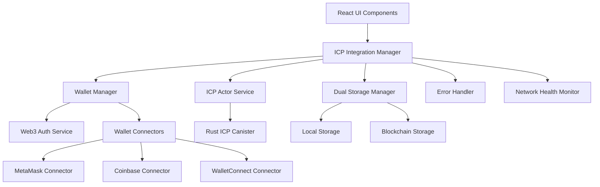

# Blockchain Integration Documentation

## Table of Contents

- [Overview](#overview)
- [Architecture](#architecture)
- [ICP Integration](#icp-integration)
- [Wallet Integration](#wallet-integration)
- [Authentication System](#authentication-system)
- [Storage Management](#storage-management)
- [Error Handling](#error-handling)
- [Security Considerations](#security-considerations)
- [Development Guide](#development-guide)
- [Testing and Debugging](#testing-and-debugging)

## Overview

The Dhaniverse blockchain integration provides seamless Web3 functionality through Internet Computer Protocol (ICP) canisters and traditional Web3 wallet connections. The system enables secure financial transactions, decentralized data storage, and blockchain-based achievement tracking while maintaining compatibility with traditional web technologies.

## Architecture

The blockchain integration follows a layered architecture with multiple fallback mechanisms:



## Core Services

### ICP Integration Manager (`src/services/ICPIntegrationManager.ts`)

The central orchestrator for all blockchain operations:

#### Singleton Pattern Implementation

```typescript
export class ICPIntegrationManager {
  private static instance: ICPIntegrationManager | null = null;
  
  public static getInstance(): ICPIntegrationManager {
    if (!ICPIntegrationManager.instance) {
      ICPIntegrationManager.instance = new ICPIntegrationManager();
    }
    return ICPIntegrationManager.instance;
  }
}
```

#### Core Responsibilities

- **Service Coordination**: Manages wallet, ICP, and storage services
- **Connection Management**: Handles wallet connection state changes
- **Transaction Processing**: Coordinates blockchain transactions
- **Error Handling**: Implements retry logic and fallback mechanisms
- **Health Monitoring**: Monitors network and service health

#### Key Methods

```typescript
// Initialize all blockchain services
public async initialize(): Promise<void>

// Connect to Web3 wallet
public async connectWallet(): Promise<boolean>

// Record trading transactions on blockchain
public async recordTrade(profit: number, stockSymbol: string): Promise<boolean>

// Get balance from dual storage system
public async getBalance(): Promise<number>

// Deposit funds with blockchain sync
public async deposit(amount: number): Promise<boolean>

// Withdraw funds with blockchain sync
public async withdraw(amount: number): Promise<boolean>

// Sync local data to blockchain
public async syncToBlockchain(): Promise<{ success: boolean; message: string }>
```

### ICP Actor Service (`src/services/ICPActorService.ts`)

Manages direct communication with ICP canisters:

#### Canister Communication

- **Actor Creation**: Establishes connection to ICP canister
- **Method Invocation**: Calls canister methods with proper error handling
- **Identity Management**: Handles user identity and authentication
- **Response Processing**: Processes canister responses and errors

#### Core Functionality

```typescript
// Connect to canister with identity
public async connect(identity: Identity): Promise<boolean>

// Check canister health
public async getHealth(): Promise<HealthStatus>

// Record trade transaction
public async recordTrade(profit: number, symbol: string): Promise<TradeResult>

// Get user balance from canister
public async getBalance(): Promise<number>

// Process deposit transaction
public async deposit(amount: number): Promise<TransactionResult>

// Process withdrawal transaction
public async withdraw(amount: number): Promise<TransactionResult>
```

### Wallet Manager (`src/services/WalletManager.ts`)

Handles Web3 wallet connections and management:

#### Multi-Wallet Support

- **Wallet Detection**: Automatically detects available wallets
- **Connection Management**: Handles connection lifecycle
- **Event Handling**: Processes wallet events (account changes, disconnections)
- **Identity Provision**: Provides identity for ICP authentication

#### Supported Wallets

- **MetaMask**: Most popular Ethereum wallet
- **Coinbase Wallet**: Coinbase's native wallet solution
- **WalletConnect**: Protocol for connecting various wallets
- **Internet Identity**: ICP's native identity solution

### Dual Storage Manager (`src/services/DualStorageManager.ts`)

Implements hybrid storage strategy with blockchain and local fallbacks:

#### Storage Modes

- **Local Mode**: Uses browser localStorage for offline functionality
- **Blockchain Mode**: Direct blockchain storage for maximum security
- **Hybrid Mode**: Combines both with intelligent synchronization

#### Synchronization Strategy

```typescript
// Sync local transactions to blockchain
public async syncToBlockchain(): Promise<SyncResult>

// Resolve conflicts between local and blockchain data
private async resolveConflicts(localData: any, blockchainData: any): Promise<any>

// Fallback to local storage on blockchain failure
private async fallbackToLocal(operation: string, data: any): Promise<boolean>
```

## Web3 Authentication

### Web3 Auth Service (`src/services/web3/Web3AuthService.ts`)

Comprehensive Web3 authentication system:

#### Authentication Flow

1. **Wallet Detection**: Scan for available Web3 wallets
2. **Connection Request**: Initiate wallet connection
3. **Message Signing**: Generate and sign authentication message
4. **Signature Verification**: Verify signed message on backend
5. **Session Management**: Maintain authenticated session

#### Key Features

```typescript
// Detect available wallets
async detectWallets(): Promise<WalletInfo[]>

// Connect to specific wallet type
async connectWallet(walletType: WalletType): Promise<WalletConnection>

// Generate authentication message
async signAuthenticationMessage(address: string): Promise<string>

// Authenticate with signature
async authenticateWithSignature(address: string, signature: string): Promise<AuthResult>

// Restore previous session
async restoreSession(): Promise<boolean>
```

#### Session Management

- **Automatic Reconnection**: Restore sessions on page reload
- **Session Timeout**: Configurable session expiration
- **Security Measures**: Message nonce and timestamp validation
- **Cross-tab Synchronization**: Consistent state across browser tabs

### Wallet Connectors

#### Base Connector Architecture

All wallet connectors extend the `BaseWalletConnector`:

```typescript
export abstract class BaseWalletConnector {
  abstract connect(): Promise<WalletConnection>
  abstract disconnect(): Promise<void>
  abstract getWalletInfo(): WalletInfo
  abstract isInstalled(): boolean
  
  // Event handling
  registerEventHandlers(handlers: WalletEventHandlers): void
}
```

#### MetaMask Connector (`src/services/web3/connectors/MetaMaskConnector.ts`)

- **Installation Detection**: Checks for MetaMask availability
- **Account Management**: Handles account switching
- **Network Management**: Manages network changes
- **Permission Handling**: Requests necessary permissions

#### Coinbase Wallet Connector

- **SDK Integration**: Uses Coinbase Wallet SDK
- **Mobile Support**: Enhanced mobile wallet experience
- **QR Code Connection**: QR code-based connection for mobile
- **Deep Linking**: Direct app integration

#### WalletConnect Connector

- **Protocol Implementation**: WalletConnect v2 protocol
- **Multi-Wallet Support**: Connects to various mobile wallets
- **Bridge Communication**: Secure bridge-based communication
- **Session Persistence**: Maintains connection across sessions

## Error Handling and Resilience

### ICP Error Handler (`src/services/ICPErrorHandler.ts`)

Comprehensive error handling system:

#### Retry Mechanisms

```typescript
// Retry with exponential backoff
public static async withRetryAndFallback<T>(
  operation: () => Promise<T>,
  fallback: () => T,
  operationName: string
): Promise<T>
```

#### Error Categories

- **Network Errors**: Connection timeouts and network failures
- **Canister Errors**: ICP canister-specific errors
- **Authentication Errors**: Identity and permission issues
- **Transaction Errors**: Blockchain transaction failures

#### Fallback Strategies

- **Local Storage Fallback**: Continue with local data when blockchain fails
- **Retry Logic**: Automatic retry with exponential backoff
- **Graceful Degradation**: Maintain functionality with reduced features
- **User Notification**: Clear error messages and recovery instructions

### Network Health Monitor

Continuous monitoring of blockchain and backend services:

#### Health Checks

- **ICP Canister Health**: Regular canister availability checks
- **Backend API Health**: MongoDB and API server monitoring
- **Wallet Connection Health**: Web3 wallet connection status
- **Network Latency**: Response time monitoring

#### Automatic Recovery

- **Service Restart**: Automatic service reconnection
- **Connection Pooling**: Efficient connection management
- **Circuit Breaker**: Prevent cascade failures
- **Health Reporting**: Real-time health status reporting

## Transaction Processing

### Banking Transactions

Integration with the banking system for secure financial operations:

#### Deposit Process

1. **Validation**: Verify sufficient wallet balance
2. **Local Update**: Update local balance immediately
3. **Blockchain Sync**: Record transaction on blockchain
4. **Backend Sync**: Update backend database
5. **Confirmation**: Provide user confirmation

#### Withdrawal Process

1. **Authorization**: Verify user permissions
2. **Balance Check**: Ensure sufficient bank balance
3. **Blockchain Record**: Record withdrawal on blockchain
4. **Local Update**: Update local balance
5. **Backend Sync**: Synchronize with backend

### Stock Market Integration

Blockchain recording of trading activities:

#### Trade Recording

```typescript
// Record profitable trade on blockchain
public async recordTrade(profit: number, stockSymbol: string): Promise<boolean> {
  try {
    const result = await ICPErrorHandler.withRetryAndFallback(
      async () => {
        const tradeResult = await this.icpService.recordTrade(profit, stockSymbol);
        return tradeResult.success;
      },
      () => {
        console.log('Trade recorded locally (blockchain unavailable)');
        return true; // Record locally as fallback
      },
      'Record Trade'
    );
    return result;
  } catch (error) {
    console.error('Failed to record trade:', error);
    return false;
  }
}
```

#### Achievement Tracking

- **Milestone Recording**: Record trading milestones on blockchain
- **Performance Metrics**: Track trading performance over time
- **Leaderboard Data**: Contribute to decentralized leaderboards
- **Reward Distribution**: Automatic reward distribution for achievements

## Data Synchronization

### Hybrid Storage Strategy

The dual storage system provides optimal performance and reliability:

#### Synchronization Process

1. **Local First**: All operations update local storage immediately
2. **Background Sync**: Blockchain sync happens asynchronously
3. **Conflict Resolution**: Intelligent conflict resolution algorithms
4. **Consistency Checks**: Regular consistency verification
5. **Recovery Procedures**: Data recovery from blockchain when needed

#### Conflict Resolution

```typescript
private async resolveConflicts(localData: any, blockchainData: any): Promise<any> {
  // Timestamp-based resolution
  if (localData.timestamp > blockchainData.timestamp) {
    return localData;
  }
  
  // Amount-based validation
  if (localData.amount !== blockchainData.amount) {
    // Use blockchain as source of truth for financial data
    return blockchainData;
  }
  
  return blockchainData; // Default to blockchain data
}
```

### Performance Optimization

#### Caching Strategies

- **Memory Caching**: In-memory cache for frequently accessed data
- **Local Storage**: Persistent local cache for offline functionality
- **Blockchain Cache**: Cache blockchain responses to reduce calls
- **Intelligent Prefetching**: Preload likely-needed data

#### Batch Operations

- **Transaction Batching**: Group multiple operations for efficiency
- **Bulk Synchronization**: Sync multiple records in single operation
- **Optimistic Updates**: Update UI immediately, sync later
- **Background Processing**: Non-blocking background operations

## Security Measures

### Authentication Security

- **Message Signing**: Cryptographic signature verification
- **Nonce Protection**: Prevent replay attacks
- **Timestamp Validation**: Time-bound authentication messages
- **Session Security**: Secure session token management

### Transaction Security

- **Input Validation**: Comprehensive input sanitization
- **Amount Verification**: Double-check transaction amounts
- **Permission Checks**: Verify user permissions for operations
- **Audit Logging**: Complete transaction audit trail

### Data Protection

- **Encryption**: Sensitive data encryption at rest and in transit
- **Access Control**: Role-based access control
- **Privacy Protection**: User data privacy compliance
- **Secure Communication**: HTTPS and WSS for all communications

## Development and Testing

### Testing Strategy

#### Unit Testing

- **Service Testing**: Individual service functionality
- **Integration Testing**: Cross-service interaction testing
- **Mock Testing**: Blockchain interaction mocking
- **Error Testing**: Error handling and recovery testing

#### End-to-End Testing

- **Wallet Connection**: Complete wallet connection flow
- **Transaction Processing**: Full transaction lifecycle testing
- **Synchronization**: Data sync accuracy testing
- **Error Recovery**: Failure scenario testing

### Development Tools

#### Debugging Utilities

```typescript
// Global debug object for blockchain operations
window.dhaniverse.blockchain = {
  getWalletStatus: () => walletManager.getConnectionStatus(),
  connectWallet: (type) => icpIntegration.connectWallet(type),
  syncToBlockchain: () => icpIntegration.syncToBlockchain(),
  getNetworkStatus: () => icpIntegration.getNetworkStatus()
}
```

#### Monitoring Tools

- **Transaction Monitoring**: Real-time transaction tracking
- **Performance Metrics**: Blockchain operation performance
- **Error Tracking**: Comprehensive error logging
- **Health Dashboards**: Service health visualization

## Configuration

### Environment Configuration

```typescript
// ICP Canister Configuration
const CANISTER_ID = import.meta.env.VITE_DHANIVERSE_CANISTER_ID || 
                   import.meta.env.REACT_APP_CANISTER_ID || 
                   'rdmx6-jaaaa-aaaah-qcaiq-cai'

// Network Configuration
const SUPPORTED_CHAINS = ['0x1', '0x5', '0x89'] // Ethereum, Goerli, Polygon
const SESSION_TIMEOUT = 24 * 60 * 60 * 1000 // 24 hours
```

### Wallet Configuration

```typescript
const DEFAULT_CONFIG: Web3AuthConfig = {
  supportedChains: ['0x1', '0x5', '0x89'],
  sessionTimeout: 24 * 60 * 60 * 1000,
  messageExpirationTime: 5 * 60 * 1000,
  enableAutoReconnect: true
}
```

## Future Enhancements

### Planned Features

- **Multi-Chain Support**: Support for additional blockchain networks
- **Advanced DeFi**: Integration with DeFi protocols
- **NFT Integration**: Non-fungible token support for game assets
- **Cross-Chain Bridges**: Inter-blockchain asset transfers
- **Smart Contract Automation**: Automated contract interactions

### Scalability Improvements

- **Layer 2 Integration**: Scaling solutions for reduced fees
- **Batch Processing**: Enhanced batch operation support
- **Caching Optimization**: Advanced caching strategies
- **Performance Monitoring**: Real-time performance analytics

### Security Enhancements

- **Multi-Signature Support**: Enhanced security for high-value transactions
- **Hardware Wallet Support**: Integration with hardware wallets
- **Advanced Encryption**: Enhanced data protection measures
- **Audit Integration**: Automated security audit tools## Re
lated Documentation

- [ICP Canister API](../api/icp-canister.md) - Complete canister API reference
- [Frontend APIs](../api/frontend-apis.md) - Frontend Web3 service APIs
- [UI Components](./ui-components.md) - Web3 UI components and patterns
- [Security Architecture](../architecture/security-architecture.md) - Security design and considerations
- [Configuration Guide](../setup/configuration.md#web3-configuration) - Web3 setup and configuration

## External Resources

- [Internet Computer Documentation](https://internetcomputer.org/docs/current/developer-docs/)
- [Web3.js Documentation](https://web3js.readthedocs.io/)
- [MetaMask Developer Documentation](https://docs.metamask.io/)
- [WalletConnect Documentation](https://docs.walletconnect.com/)
- [Coinbase Wallet SDK](https://docs.cloud.coinbase.com/wallet-sdk/docs)

---

**Navigation**: [← Game Engine](./game-engine.md) | [Components Index](./index.md) | [UI Components →](./ui-components.md)