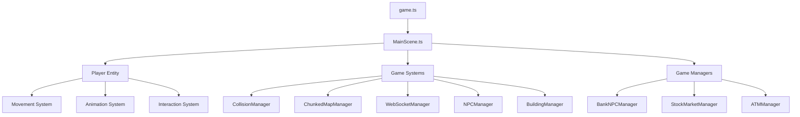

# Game Engine Documentation

## Table of Contents

- [Overview](#overview)
- [Architecture](#architecture)
- [Core Components](#core-components)
- [Game Systems](#game-systems)
- [Scene Management](#scene-management)
- [Player System](#player-system)
- [Multiplayer Integration](#multiplayer-integration)
- [Performance Optimization](#performance-optimization)
- [Development Guide](#development-guide)
- [API Reference](#api-reference)

## Overview

The Dhaniverse game engine is built on top of Phaser.js 3, providing a robust 2D game framework for the multiplayer web3 gaming experience. The engine manages scene lifecycle, player interactions, real-time multiplayer communication, and integration with various game systems including banking, stock market, and map management.

## Architecture

The game engine follows a modular architecture with clear separation of concerns:



## Core Components

### Game Entry Point (`src/game/game.ts`)

The main game controller responsible for:

- **Game Lifecycle Management**: Starting, stopping, and managing game instances
- **Configuration**: Setting up Phaser.js configuration with optimized rendering settings
- **Scene Management**: Initializing and managing the MainScene
- **HUD Integration**: Connecting React-based UI components with the game
- **Player State Synchronization**: Loading and syncing player data from backend

#### Key Functions

```typescript
// Start game with username
export function startGame(username: string): void

// Stop and cleanup game instance
export function stopGame(): void

// Update HUD with current rupees
export function updateGameHUD(rupees: number): void

// Get current game instance for debugging
export function getCurrentGame(): Phaser.Game | null

// Refresh player state from backend
export async function refreshPlayerState(): Promise<void>
```

#### Configuration Features

- **Responsive Scaling**: Automatic resize handling with debounced events
- **Performance Optimization**: High-performance rendering with antialiasing
- **Input Management**: Support for keyboard, mouse, touch, and gamepad inputs
- **Physics Configuration**: Arcade physics with configurable gravity and debug options

### Main Scene (`src/game/scenes/MainScene.ts`)

The primary game scene that orchestrates all game elements:

#### Scene Responsibilities

- **Player Management**: Creating and updating the player entity
- **System Coordination**: Managing all game systems and their interactions
- **Event Handling**: Processing user input and game events
- **UI Integration**: Bridging game events with React UI components
- **Backend Synchronization**: Periodic sync with backend services

#### Key Systems Integration

```typescript
// Core systems
private collisionManager: CollisionManager
mapManager: ChunkedMapManager
private webSocketManager: WebSocketManager
private npcManager: NPCManager
private buildingManager: BuildingManager

// Specialized managers
bankNPCManager: BankNPCManager
stockMarketManager: StockMarketManager
atmManager: ATMManager
```

#### Player State Management

```typescript
// Initialize player rupees from database
public initializePlayerRupees(rupees: number): void

// Update rupees and sync with backend
updateRupees(amount: number): void

// Add/deduct rupees with UI updates
addPlayerRupees(amount: number): void
deductPlayerRupees(amount: number): void
```

## Game Systems

### Collision Management

The `CollisionManager` handles:

- **Static Collision Detection**: Building and environment collisions
- **Dynamic Collision Processing**: Player-environment interactions
- **Collision Box Management**: Efficient collision boundary management

### Map Management

The `ChunkedMapManager` provides:

- **Dynamic Loading**: Loads map chunks based on player position
- **Memory Optimization**: Unloads distant chunks to conserve memory
- **Smooth Transitions**: Seamless chunk loading without interruption
- **Camera Integration**: Proper camera bounds and following

### Multiplayer Communication

The `WebSocketManager` enables:

- **Real-time Communication**: Player position and chat synchronization
- **Connection Management**: Automatic reconnection and error handling
- **Event Broadcasting**: Game events to other players
- **Chat System**: In-game messaging functionality

### NPC and Building Systems

- **NPCManager**: Handles non-player character interactions and behaviors
- **BuildingManager**: Manages building interactions and interior transitions
- **BankNPCManager**: Specialized banking interactions and UI triggers
- **StockMarketManager**: Stock market building interactions
- **ATMManager**: Outdoor ATM interactions and transactions

## Player Entity

### Player Class (`src/game/entities/Player.ts`)

The player entity manages:

- **Movement System**: WASD and arrow key movement with smooth interpolation
- **Animation System**: Character sprite animations for different movement states
- **Interaction System**: Proximity-based interactions with NPCs and buildings
- **Visual Representation**: Sprite rendering and name display

### Movement Mechanics

- **Input Processing**: Multi-input support (WASD, arrows, touch)
- **Physics Integration**: Collision-aware movement with Phaser physics
- **Smooth Movement**: Delta-time based movement for consistent speed
- **Boundary Checking**: Map boundary enforcement

### Animation States

- **Idle Animation**: Stationary character animation
- **Walking Animation**: Directional movement animations
- **Interaction Feedback**: Visual feedback for interactions

## Event System

### Game Events

The engine uses a comprehensive event system for communication:

```typescript
// UI Events
window.dispatchEvent(new CustomEvent('rupee-update', { detail: { rupees } }))
window.dispatchEvent(new CustomEvent('openBankingUI', { detail: bankData }))
window.dispatchEvent(new CustomEvent('openStockMarketUI', { detail: stockData }))

// Game Events
window.addEventListener('updatePlayerRupees', handleRupeeUpdate)
window.addEventListener('send-chat', handleSendChat)
window.addEventListener('typing-start', handleTypingStart)
```

### Event Categories

- **Financial Events**: Rupee updates, banking transactions
- **UI Events**: Opening/closing game interfaces
- **Communication Events**: Chat messages and typing states
- **System Events**: Game lifecycle and connection status

## Performance Optimization

### Rendering Optimization

- **Pixel Art Rendering**: Optimized for pixel-perfect rendering
- **Efficient Culling**: Only render visible elements
- **Texture Management**: Efficient sprite and texture loading
- **Frame Rate Control**: Consistent 60 FPS with fallback handling

### Memory Management

- **Asset Cleanup**: Proper disposal of unused assets
- **Event Listener Cleanup**: Preventing memory leaks from event handlers
- **Scene Lifecycle**: Proper scene initialization and destruction
- **Garbage Collection**: Minimizing object creation in update loops

### Network Optimization

- **Connection Pooling**: Efficient WebSocket connection management
- **Data Compression**: Optimized message formats for multiplayer
- **Retry Logic**: Robust error handling and reconnection
- **Offline Support**: Graceful degradation when backend is unavailable

## Integration Points

### React UI Integration

The game engine seamlessly integrates with React components:

- **HUD Updates**: Real-time rupee and status updates
- **Modal Interfaces**: Banking and stock market UIs
- **Chat System**: In-game chat with React components
- **Settings and Controls**: Game configuration through React UI

### Backend Integration

- **Player State Sync**: Periodic synchronization with backend database
- **Transaction Processing**: Real-time financial transaction handling
- **Authentication**: User session management and validation
- **Data Persistence**: Automatic saving of game progress

### Web3 Integration

- **Wallet Connection**: Integration with Web3 wallet services
- **Blockchain Transactions**: Recording game achievements on blockchain
- **Token Management**: Handling cryptocurrency transactions
- **Smart Contract Interaction**: Direct interaction with ICP canisters

## Development Workflow

### Adding New Features

1. **System Design**: Plan the system architecture and dependencies
2. **Manager Creation**: Create specialized managers for complex features
3. **Event Integration**: Define events for UI and system communication
4. **Testing**: Implement comprehensive testing for new systems
5. **Documentation**: Update documentation with new features

### Debugging Tools

The engine provides extensive debugging capabilities:

```typescript
// Global debug object
window.dhaniverse = {
  getRupees: () => number,
  setRupees: (amount: number) => void,
  refreshPlayerState: () => Promise<void>,
  getBankingStatus: () => object,
  getStockMarketStatus: () => object
}
```

### Performance Monitoring

- **Frame Rate Monitoring**: Real-time FPS tracking
- **Memory Usage**: Memory consumption monitoring
- **Network Latency**: WebSocket connection quality metrics
- **Load Time Tracking**: Asset loading performance metrics

## Configuration

### Game Configuration

```typescript
const config: Phaser.Types.Core.GameConfig = {
  type: Phaser.AUTO,
  width: "100%",
  height: "100%",
  physics: {
    default: "arcade",
    arcade: {
      gravity: { x: 0, y: 0 },
      debug: Constants.SHOW_DEBUG_VISUALS
    }
  },
  scale: {
    mode: Phaser.Scale.RESIZE,
    autoCenter: Phaser.Scale.CENTER_BOTH
  },
  render: {
    pixelArt: false,
    antialias: true,
    powerPreference: "high-performance"
  }
}
```

### Constants Configuration

Key game constants are defined in `src/game/utils/Constants.ts`:

- **Debug Settings**: Visual debugging toggles
- **Performance Settings**: Frame rate and quality settings
- **Game Balance**: Movement speed, interaction distances
- **UI Settings**: Font sizes, colors, and layout parameters

## Error Handling

### Graceful Degradation

The engine implements comprehensive error handling:

- **Asset Loading Failures**: Fallback assets and retry mechanisms
- **Network Disconnections**: Offline mode with local state management
- **Performance Issues**: Dynamic quality adjustment
- **Memory Constraints**: Automatic cleanup and optimization

### Error Recovery

- **Automatic Reconnection**: WebSocket reconnection with exponential backoff
- **State Recovery**: Restoring game state after errors
- **User Feedback**: Clear error messages and recovery instructions
- **Logging**: Comprehensive error logging for debugging

## Testing Strategy

### Unit Testing

- **System Testing**: Individual system functionality testing
- **Integration Testing**: Cross-system interaction testing
- **Performance Testing**: Frame rate and memory usage testing
- **Network Testing**: Multiplayer functionality testing

### Manual Testing

- **Gameplay Testing**: User experience and game flow testing
- **Cross-browser Testing**: Compatibility across different browsers
- **Mobile Testing**: Touch input and responsive design testing
- **Accessibility Testing**: Keyboard navigation and screen reader support

## Future Enhancements

### Planned Features

- **Advanced Physics**: More sophisticated physics interactions
- **Enhanced Graphics**: Particle effects and advanced rendering
- **Audio System**: Comprehensive sound and music integration
- **Mobile Optimization**: Enhanced mobile performance and controls
- **VR Support**: Virtual reality integration capabilities

### Scalability Improvements

- **Server-side Validation**: Enhanced security for multiplayer interactions
- **Load Balancing**: Distributed server architecture support
- **Caching Optimization**: Advanced caching strategies for better performance
- **Analytics Integration**: Comprehensive game analytics and metrics## R
elated Documentation

- [Map Optimizer](./map-optimizer.md) - Map chunking and optimization system
- [UI Components](./ui-components.md) - React UI integration with game
- [WebSocket API](../api/websocket.md) - Real-time multiplayer communication
- [Game Server API](../api/game-server.md) - Server integration patterns
- [System Architecture](../architecture/system-architecture.md#frontend-architecture) - Game engine architecture

## External Resources

- [Phaser.js Documentation](https://phaser.io/phaser3/documentation)
- [Phaser.js Examples](https://phaser.io/examples)
- [TypeScript Game Development](https://www.typescriptlang.org/docs/handbook/typescript-in-5-minutes.html)
- [2D Game Development Patterns](https://gameprogrammingpatterns.com/)

---

**Navigation**: [← Components Index](./index.md) | [Main Documentation](../README.md) | [Blockchain Integration →](./blockchain-integration.md)