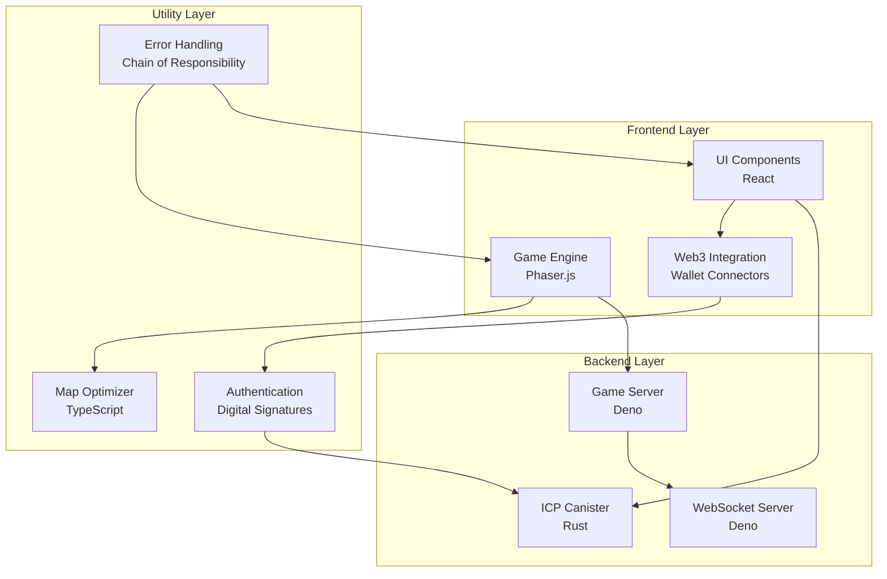

# Components Documentation

This section provides detailed documentation for individual system components, including their architecture, APIs, and integration patterns.

## Table of Contents

- [Game Engine](./game-engine.md) - Phaser.js integration and game systems
- [Blockchain Integration](./blockchain-integration.md) - ICP and Web3 functionality
- [UI Components](./ui-components.md) - React component library documentation
- [Map Optimizer](./map-optimizer.md) - Map optimization package architecture

## Component Overview

### Frontend Components
- **Game Engine** - Phaser.js-based 2D game engine with custom systems
- **UI Components** - React-based user interface components
- **Web3 Integration** - Blockchain connectivity and wallet management

### Backend Components
- **ICP Canister** - Rust-based blockchain backend
- **Game Server** - Deno-powered REST API server
- **WebSocket Server** - Real-time communication server

### Utility Components
- **Map Optimizer** - High-performance map chunking and optimization
- **Error Handling** - Centralized error management system
- **Authentication** - Web3 wallet-based authentication

## Component Architecture

## Integration Patterns

### Component Communication
- **Frontend to Backend** - REST API calls and WebSocket connections
- **Blockchain Integration** - Direct canister calls via Candid interface
- **Real-time Updates** - WebSocket-based event broadcasting
- **State Management** - Centralized state with React Context and game state

### Data Flow Patterns
- **User Actions** - UI → Game Engine → Backend Services
- **Blockchain Operations** - Frontend → ICP Canister → Internet Computer
- **Real-time Events** - WebSocket Server → All Connected Clients
- **Game State** - Game Engine ↔ Game Server ↔ Database

## Component Dependencies

### External Dependencies
- **Phaser.js** - Game engine framework
- **React** - UI framework
- **Internet Computer** - Blockchain platform
- **MongoDB** - Database system

### Internal Dependencies
- **Shared Types** - TypeScript interfaces and types
- **Utility Functions** - Common helper functions
- **Configuration** - Environment-specific settings
- **Error Handling** - Centralized error management

## Quick Navigation

### Related Documentation
- [Architecture](../architecture/) - High-level system design
- [API Documentation](../api/) - Component APIs and endpoints
- [Development](../development/) - Development workflows and standards
- [Setup & Configuration](../setup/) - Component setup and configuration

### Component-Specific Guides
- [Game Development](./game-engine.md#development-guide) - Building game features
- [UI Development](./ui-components.md#development-guide) - Creating UI components
- [Blockchain Development](./blockchain-integration.md#development-guide) - Web3 integration
- [Performance Optimization](./map-optimizer.md#optimization-guide) - Performance tuning

### Integration Examples
- [Frontend Integration](../api/frontend-apis.md#integration-examples)
- [Backend Integration](../api/game-server.md#integration-examples)
- [Blockchain Integration](../api/icp-canister.md#integration-examples)

---

[← Back to Main Documentation](../README.md)