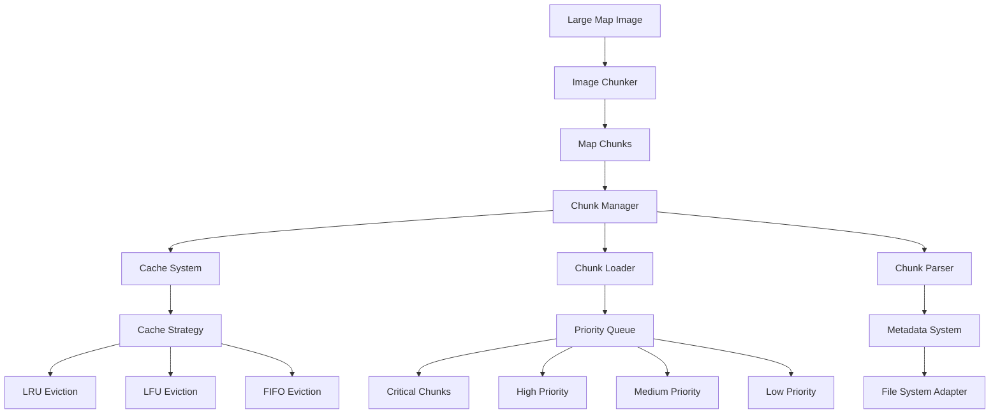

# Map Optimizer Documentation

## Overview

The Dhaniverse Map Optimizer is a specialized package designed to handle large-scale map images by breaking them into manageable chunks for efficient loading and rendering. The system provides dynamic loading, intelligent caching, and performance optimization for seamless gameplay experience with minimal memory footprint.

## Architecture

The map optimizer follows a modular architecture with clear separation of concerns:



## Core Components

### Image Chunker (`src/chunker/ImageChunker.ts`)

The primary component responsible for breaking large images into smaller, manageable chunks:

#### Core Functionality

```typescript
export class ImageChunker {
  constructor(
    config: IChunkConfig,
    fileSystem: IFileSystemAdapter = new NodeFileSystemAdapter()
  )
  
  async chunkImage(inputPath: string): Promise<ChunkedMapMetadata>
}
```

#### Chunking Process

1. **Image Loading**: Load the source image using canvas API
2. **Dimension Calculation**: Calculate optimal grid dimensions
3. **Chunk Generation**: Create individual chunks with metadata
4. **File Output**: Save chunks to the file system
5. **Metadata Generation**: Create comprehensive metadata file

#### Key Features

- **Configurable Chunk Size**: Customizable chunk dimensions for optimal performance
- **Multiple Output Formats**: Support for PNG, WebP, and JPEG formats
- **Quality Control**: Configurable compression quality settings
- **Progress Tracking**: Real-time progress reporting during chunking
- **Error Handling**: Robust error handling with detailed logging

#### Configuration Interface

```typescript
interface IChunkConfig {
  chunkSize: number;           // Size of each chunk (e.g., 512x512)
  outputDirectory: string;     // Directory for chunk output
  outputFormat: 'png' | 'webp' | 'jpg';  // Output image format
  quality: number;             // Compression quality (0-100)
  enableCompression: boolean;  // Enable/disable compression
}
```

### Chunk Manager (`src/manager/interfaces/IChunkManager.ts`)

Manages the lifecycle of map chunks including loading, caching, and unloading:

#### Interface Definition

```typescript
interface IChunkManager {
  loadChunk(chunkId: string, priority: number): Promise<ChunkLoadResult>;
  unloadChunk(chunkId: string): void;
  preloadChunks(chunkIds: string[], priority: number): Promise<void>;
  getLoadedChunks(): ChunkMetadata[];
  getCacheStatus(): CacheStatus;
  clearCache(): void;
}
```

#### Responsibilities

- **Dynamic Loading**: Load chunks based on player position and viewport
- **Memory Management**: Intelligent unloading of distant chunks
- **Preloading Strategy**: Predictive loading of likely-needed chunks
- **Cache Coordination**: Work with cache system for optimal performance
- **Performance Monitoring**: Track loading times and cache efficiency

### Cache Strategy (`src/manager/interfaces/ICacheStrategy.ts`)

Implements various caching strategies for optimal memory usage:

#### Strategy Interface

```typescript
interface ICacheStrategy {
  shouldEvict(cache: Map<string, CachedChunk>): boolean;
  selectEvictionCandidate(cache: Map<string, CachedChunk>): string | null;
  onChunkAccess(chunkId: string): void;
  onChunkLoad(chunkId: string): void;
  getStrategyName(): string;
}
```

#### Available Strategies

**LRU (Least Recently Used)**
- Evicts chunks that haven't been accessed recently
- Optimal for typical gameplay patterns
- Maintains access timestamps for all chunks

**LFU (Least Frequently Used)**
- Evicts chunks with lowest access frequency
- Good for areas with consistent traffic patterns
- Tracks access frequency counters

**FIFO (First In, First Out)**
- Simple eviction based on load order
- Predictable memory usage patterns
- Minimal overhead for tracking

### Chunk Parser (`src/parser/interfaces/IChunkParser.ts`)

Handles parsing and validation of chunk metadata:

#### Parser Interface

```typescript
interface IChunkParser {
  parseMetadata(metadataPath: string): Promise<ChunkedMapMetadata>;
  validateChunk(chunk: ChunkMetadata): boolean;
  getChunkPath(chunkId: string): string;
  calculateChunkBounds(chunk: ChunkMetadata): ChunkBounds;
}
```

#### Validation Features

- **Metadata Integrity**: Verify metadata file structure and content
- **Chunk Validation**: Ensure chunk files exist and are accessible
- **Bounds Calculation**: Calculate pixel boundaries for each chunk
- **Error Recovery**: Handle corrupted or missing chunk files

## Type System (`src/types/index.ts`)

### Core Data Structures

#### ChunkMetadata

```typescript
interface ChunkMetadata {
  id: string;           // Unique chunk identifier (e.g., "0_1")
  x: number;            // Grid X coordinate
  y: number;            // Grid Y coordinate
  pixelX: number;       // Pixel X position in original image
  pixelY: number;       // Pixel Y position in original image
  width: number;        // Chunk width in pixels
  height: number;       // Chunk height in pixels
  filename: string;     // Chunk file name
  checksum?: string;    // Optional file integrity checksum
}
```

#### ChunkedMapMetadata

```typescript
interface ChunkedMapMetadata {
  version: number;              // Metadata format version
  totalWidth: number;           // Original image width
  totalHeight: number;          // Original image height
  chunkWidth: number;           // Standard chunk width
  chunkHeight: number;          // Standard chunk height
  chunksX: number;              // Number of chunks horizontally
  chunksY: number;              // Number of chunks vertically
  chunks: ChunkMetadata[];      // Array of all chunk metadata
  compressionType?: string;     // Compression format used
}
```

#### Configuration Types

```typescript
interface ChunkConfig {
  chunkSize: number;                    // Chunk dimensions
  outputFormat: 'png' | 'webp' | 'jpg'; // Output format
  quality: number;                      // Compression quality
  enableCompression: boolean;           // Compression toggle
}

interface CacheConfig {
  maxSizeInMB: number;                  // Maximum cache size
  maxChunks: number;                    // Maximum cached chunks
  evictionStrategy: 'LRU' | 'LFU' | 'FIFO'; // Eviction strategy
  preloadRadius: number;                // Preload distance in chunks
}
```

#### Priority System

```typescript
interface LoadingPriority {
  CRITICAL: number;  // Currently visible chunks
  HIGH: number;      // Adjacent to visible area
  MEDIUM: number;    // Within preload radius
  LOW: number;       // Background preload
}

export const CHUNK_PRIORITY: LoadingPriority = {
  CRITICAL: 0,
  HIGH: 1,
  MEDIUM: 2,
  LOW: 3
} as const;
```

## File System Abstraction (`src/chunker/interfaces/IFileSystemAdapter.ts`)

### Adapter Interface

```typescript
interface IFileSystemAdapter {
  readFile(path: string): Promise<Buffer>;
  writeFile(path: string, data: Buffer): Promise<void>;
  createDirectory(path: string): Promise<void>;
  exists(path: string): Promise<boolean>;
  deleteFile(path: string): Promise<void>;
  listFiles(directory: string): Promise<string[]>;
}
```

### Node.js Implementation

```typescript
export class NodeFileSystemAdapter implements IFileSystemAdapter {
  async readFile(path: string): Promise<Buffer> {
    return fs.readFile(path);
  }
  
  async writeFile(path: string, data: Buffer): Promise<void> {
    await fs.writeFile(path, data);
  }
  
  async createDirectory(path: string): Promise<void> {
    await fs.mkdir(path, { recursive: true });
  }
  
  // Additional methods...
}
```

### Browser Implementation

For browser environments, the adapter can be implemented using:
- **IndexedDB**: For persistent storage
- **Cache API**: For efficient caching
- **Fetch API**: For network-based chunk loading
- **Web Workers**: For background processing

## Performance Optimization

### Loading Strategies

#### Viewport-Based Loading

```typescript
class ViewportBasedLoader {
  calculateVisibleChunks(
    playerX: number, 
    playerY: number, 
    viewportWidth: number, 
    viewportHeight: number
  ): string[] {
    // Calculate which chunks are currently visible
    const visibleChunks: string[] = [];
    
    // Implementation for determining visible chunks
    // based on player position and viewport size
    
    return visibleChunks;
  }
}
```

#### Predictive Preloading

```typescript
class PredictivePreloader {
  predictNextChunks(
    currentPosition: { x: number; y: number },
    velocity: { x: number; y: number },
    preloadRadius: number
  ): string[] {
    // Predict which chunks will be needed based on movement
    // and preload them with appropriate priority
  }
}
```

### Memory Management

#### Cache Size Monitoring

```typescript
class CacheMonitor {
  private currentSizeInMB: number = 0;
  private maxSizeInMB: number;
  
  checkMemoryUsage(): boolean {
    return this.currentSizeInMB < this.maxSizeInMB;
  }
  
  evictIfNecessary(): void {
    while (this.currentSizeInMB > this.maxSizeInMB) {
      const candidate = this.cacheStrategy.selectEvictionCandidate(this.cache);
      if (candidate) {
        this.evictChunk(candidate);
      } else {
        break;
      }
    }
  }
}
```

#### Garbage Collection

```typescript
class ChunkGarbageCollector {
  scheduleCleanup(intervalMs: number = 30000): void {
    setInterval(() => {
      this.cleanupUnusedChunks();
    }, intervalMs);
  }
  
  private cleanupUnusedChunks(): void {
    // Remove chunks that haven't been accessed recently
    // and are outside the active area
  }
}
```

## Integration with Game Engine

### Phaser.js Integration

The map optimizer integrates seamlessly with the Phaser.js game engine:

```typescript
// In ChunkedMapManager.ts
export class ChunkedMapManager {
  private scene: Phaser.Scene;
  private chunkManager: IChunkManager;
  private loadedChunks: Map<string, Phaser.GameObjects.Image> = new Map();
  
  update(): void {
    const player = this.scene.player;
    const visibleChunks = this.calculateVisibleChunks(player.x, player.y);
    
    // Load visible chunks
    visibleChunks.forEach(chunkId => {
      if (!this.loadedChunks.has(chunkId)) {
        this.loadChunk(chunkId, CHUNK_PRIORITY.CRITICAL);
      }
    });
    
    // Unload distant chunks
    this.unloadDistantChunks(player.x, player.y);
  }
}
```

### Camera Integration

```typescript
class CameraAwareChunkLoader {
  onCameraMove(camera: Phaser.Cameras.Scene2D.Camera): void {
    const bounds = camera.getBounds();
    const requiredChunks = this.calculateChunksInBounds(bounds);
    
    // Prioritize chunks based on camera position
    requiredChunks.forEach((chunkId, index) => {
      const priority = this.calculatePriority(chunkId, bounds);
      this.chunkManager.loadChunk(chunkId, priority);
    });
  }
}
```

## Development Tools

### Chunk Generation Tool

Command-line tool for generating chunks from source images:

```bash
# Generate chunks from a large map image
node tools/chunk-map.js --input public/maps/full-map.png --output public/maps/chunks --size 512
```

#### Tool Features

- **Batch Processing**: Process multiple images simultaneously
- **Progress Reporting**: Real-time progress updates
- **Quality Optimization**: Automatic quality optimization based on content
- **Metadata Generation**: Comprehensive metadata file creation
- **Validation**: Post-processing validation of generated chunks

### Debug Utilities

```typescript
class ChunkDebugger {
  visualizeChunkBounds(scene: Phaser.Scene): void {
    // Draw chunk boundaries for debugging
    this.loadedChunks.forEach((chunk, chunkId) => {
      const bounds = this.calculateChunkBounds(chunk);
      const graphics = scene.add.graphics();
      graphics.lineStyle(2, 0xff0000, 0.5);
      graphics.strokeRect(bounds.x, bounds.y, bounds.width, bounds.height);
    });
  }
  
  logCacheStatistics(): void {
    console.log('Cache Statistics:', {
      loadedChunks: this.loadedChunks.size,
      cacheHitRate: this.calculateHitRate(),
      memoryUsage: this.calculateMemoryUsage(),
      averageLoadTime: this.calculateAverageLoadTime()
    });
  }
}
```

## Configuration Examples

### Basic Configuration

```typescript
const basicConfig: IChunkConfig = {
  chunkSize: 512,
  outputDirectory: './public/maps/chunks',
  outputFormat: 'png',
  quality: 90,
  enableCompression: true
};
```

### Performance-Optimized Configuration

```typescript
const performanceConfig: IChunkConfig = {
  chunkSize: 256,           // Smaller chunks for faster loading
  outputDirectory: './public/maps/chunks',
  outputFormat: 'webp',     // Better compression
  quality: 80,              // Balanced quality/size
  enableCompression: true
};

const cacheConfig: CacheConfig = {
  maxSizeInMB: 100,         // Limit memory usage
  maxChunks: 50,            // Maximum cached chunks
  evictionStrategy: 'LRU',  // Least recently used
  preloadRadius: 2          // Preload 2 chunks in each direction
};
```

### High-Quality Configuration

```typescript
const highQualityConfig: IChunkConfig = {
  chunkSize: 1024,          // Larger chunks for better quality
  outputDirectory: './public/maps/chunks',
  outputFormat: 'png',      // Lossless format
  quality: 100,             // Maximum quality
  enableCompression: false  // No compression for best quality
};
```

## Performance Metrics

### Monitoring System

```typescript
interface PerformanceMetrics {
  totalLoadTime: number;      // Total time spent loading chunks
  chunksLoaded: number;       // Number of chunks loaded
  cacheHitRate: number;       // Percentage of cache hits
  memoryUsage: number;        // Current memory usage in MB
  averageLoadTime: number;    // Average time per chunk load
}

class PerformanceMonitor {
  private metrics: PerformanceMetrics = {
    totalLoadTime: 0,
    chunksLoaded: 0,
    cacheHitRate: 0,
    memoryUsage: 0,
    averageLoadTime: 0
  };
  
  recordChunkLoad(loadTime: number, fromCache: boolean): void {
    this.metrics.totalLoadTime += loadTime;
    this.metrics.chunksLoaded++;
    this.metrics.averageLoadTime = this.metrics.totalLoadTime / this.metrics.chunksLoaded;
    
    if (fromCache) {
      this.updateCacheHitRate();
    }
  }
}
```

## Error Handling

### Robust Error Recovery

```typescript
class ChunkErrorHandler {
  async handleChunkLoadError(chunkId: string, error: Error): Promise<void> {
    console.error(`Failed to load chunk ${chunkId}:`, error);
    
    // Attempt recovery strategies
    if (error.name === 'NetworkError') {
      await this.retryWithBackoff(chunkId);
    } else if (error.name === 'CorruptedChunkError') {
      await this.regenerateChunk(chunkId);
    } else {
      await this.loadFallbackChunk(chunkId);
    }
  }
  
  private async retryWithBackoff(chunkId: string, attempt: number = 1): Promise<void> {
    const delay = Math.min(1000 * Math.pow(2, attempt), 10000);
    await new Promise(resolve => setTimeout(resolve, delay));
    
    try {
      await this.chunkManager.loadChunk(chunkId, CHUNK_PRIORITY.HIGH);
    } catch (error) {
      if (attempt < 3) {
        await this.retryWithBackoff(chunkId, attempt + 1);
      } else {
        await this.loadFallbackChunk(chunkId);
      }
    }
  }
}
```

## Testing Strategy

### Unit Testing

```typescript
describe('ImageChunker', () => {
  let chunker: ImageChunker;
  let mockFileSystem: jest.Mocked<IFileSystemAdapter>;
  
  beforeEach(() => {
    mockFileSystem = createMockFileSystem();
    chunker = new ImageChunker(testConfig, mockFileSystem);
  });
  
  test('should generate correct number of chunks', async () => {
    const metadata = await chunker.chunkImage('test-image.png');
    expect(metadata.chunks).toHaveLength(expectedChunkCount);
  });
  
  test('should handle edge chunks correctly', async () => {
    const metadata = await chunker.chunkImage('irregular-size-image.png');
    const edgeChunks = metadata.chunks.filter(chunk => 
      chunk.width < testConfig.chunkSize || chunk.height < testConfig.chunkSize
    );
    expect(edgeChunks.length).toBeGreaterThan(0);
  });
});
```

### Integration Testing

```typescript
describe('ChunkManager Integration', () => {
  test('should load and cache chunks efficiently', async () => {
    const manager = new ChunkManager(testConfig);
    const startTime = performance.now();
    
    await manager.loadChunk('0_0', CHUNK_PRIORITY.CRITICAL);
    const firstLoadTime = performance.now() - startTime;
    
    const cacheStartTime = performance.now();
    await manager.loadChunk('0_0', CHUNK_PRIORITY.CRITICAL);
    const cacheLoadTime = performance.now() - cacheStartTime;
    
    expect(cacheLoadTime).toBeLessThan(firstLoadTime * 0.1);
  });
});
```

## Future Enhancements

### Planned Features

- **WebGL Acceleration**: GPU-accelerated chunk processing
- **Streaming Support**: Real-time chunk streaming from server
- **Compression Optimization**: Advanced compression algorithms
- **Multi-Resolution Support**: Multiple quality levels for different devices
- **Procedural Generation**: Dynamic chunk generation for infinite worlds

### Performance Improvements

- **Web Workers**: Background chunk processing
- **Service Worker Caching**: Offline chunk availability
- **HTTP/2 Multiplexing**: Parallel chunk downloads
- **Progressive Loading**: Gradual quality improvement
- **Adaptive Quality**: Dynamic quality adjustment based on performance

### Advanced Features

- **Chunk Versioning**: Support for chunk updates and versioning
- **Delta Compression**: Efficient updates for changed chunks
- **Collaborative Editing**: Multi-user chunk editing support
- **Analytics Integration**: Detailed usage analytics and optimization
- **Cloud Integration**: Cloud-based chunk storage and CDN support