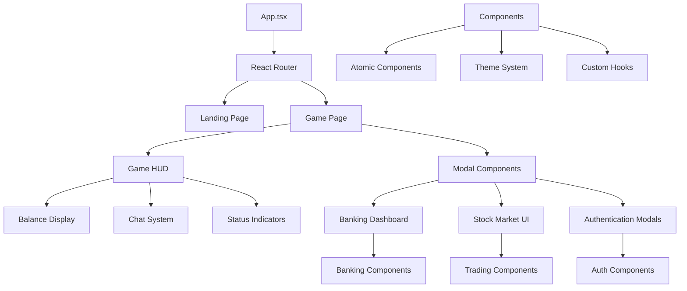

# UI Components Documentation

## Table of Contents

- [Overview](#overview)
- [Architecture](#architecture)
- [Component Categories](#component-categories)
- [Design System](#design-system)
- [Accessibility Features](#accessibility-features)
- [State Management](#state-management)
- [Integration Patterns](#integration-patterns)
- [Development Guide](#development-guide)
- [Component API Reference](#component-api-reference)
- [Testing Guidelines](#testing-guidelines)

## Overview

The Dhaniverse UI component library is built with React and TypeScript, providing a comprehensive set of reusable components for the web3 gaming experience. The components follow modern design principles with pixel-perfect styling, accessibility compliance, and seamless integration with the game engine and blockchain services.

## Architecture

The UI architecture follows a modular component-based structure with clear separation of concerns:



## Component Categories

### Atomic Components (`src/ui/components/atoms/`)

#### PixelButton (`PixelButton.tsx`)

A versatile button component with pixel-art styling:

```typescript
interface PixelButtonProps {
  children: React.ReactNode;
  onClick?: () => void;
  variant?: 'primary' | 'secondary' | 'danger' | 'success';
  size?: 'small' | 'medium' | 'large';
  disabled?: boolean;
  loading?: boolean;
  className?: string;
}
```

**Features:**
- Multiple visual variants with consistent styling
- Loading states with animated indicators
- Accessibility compliance with ARIA attributes
- Responsive design with mobile-friendly touch targets
- Pixel-perfect borders and hover effects

#### FeatureCard (`FeatureCard.tsx`)

Reusable card component for displaying features and information:

```typescript
interface FeatureCardProps {
  title: string;
  description: string;
  icon?: React.ReactNode;
  onClick?: () => void;
  className?: string;
  variant?: 'default' | 'highlighted' | 'interactive';
}
```

**Features:**
- Flexible content layout with optional icons
- Hover animations and interactive states
- Consistent spacing and typography
- Support for custom styling and variants

#### GameCard (`GameCard.tsx`)

Specialized card component for game-related content:

```typescript
interface GameCardProps {
  title: string;
  subtitle?: string;
  value: string | number;
  icon?: React.ReactNode;
  trend?: 'up' | 'down' | 'neutral';
  onClick?: () => void;
}
```

**Features:**
- Financial data display with trend indicators
- Animated value changes
- Game-themed styling with gold accents
- Responsive layout for different screen sizes

### Authentication Components (`src/ui/components/auth/`)

#### CustomSignIn (`CustomSignIn.tsx`)

Comprehensive sign-in component with multiple authentication methods:

```typescript
interface CustomSignInProps {
  onSuccess: (user: User) => void;
  onError: (error: string) => void;
  enableWeb3?: boolean;
  enableGoogle?: boolean;
  enableGuest?: boolean;
}
```

**Features:**
- Multiple authentication providers (Google, Web3, Guest)
- Form validation with real-time feedback
- Loading states and error handling
- Responsive design with mobile optimization
- Accessibility compliance with keyboard navigation

#### CustomSignUp (`CustomSignUp.tsx`)

User registration component with validation:

```typescript
interface CustomSignUpProps {
  onSuccess: (user: User) => void;
  onError: (error: string) => void;
  requireUsername?: boolean;
  enableTermsAcceptance?: boolean;
}
```

**Features:**
- Multi-step registration process
- Real-time validation with helpful error messages
- Username availability checking
- Terms and conditions acceptance
- Password strength indicators

#### GoogleSignInButton (`GoogleSignInButton.tsx`)

Specialized Google OAuth integration:

```typescript
interface GoogleSignInButtonProps {
  onSuccess: (response: GoogleAuthResponse) => void;
  onError: (error: string) => void;
  text?: string;
  disabled?: boolean;
}
```

**Features:**
- Google OAuth 2.0 integration
- Branded Google styling
- Error handling and retry mechanisms
- Loading states and user feedback

#### UsernameModal (`UsernameModal.tsx`)

Modal for username selection and validation:

```typescript
interface UsernameModalProps {
  isOpen: boolean;
  onClose: () => void;
  onSubmit: (username: string) => void;
  initialUsername?: string;
}
```

**Features:**
- Real-time username validation
- Availability checking with backend integration
- Character limit enforcement
- Accessibility-compliant modal behavior

### Banking Components (`src/ui/components/banking/`)

#### BankingDashboard (`BankingDashboard.tsx`)

Comprehensive banking interface with multiple features:

```typescript
interface BankingDashboardProps {
  onClose: () => void;
  playerRupees: number;
}
```

**Key Features:**
- **Multi-tab Interface**: Overview, Banking, Fixed Deposits, Web3 Features
- **Real-time Balance Updates**: Live synchronization with game state
- **Web3 Integration**: Wallet connection and blockchain synchronization
- **Transaction Processing**: Secure deposit and withdrawal operations
- **Fixed Deposit Management**: Create and manage fixed deposits
- **Error Handling**: Comprehensive error handling with user feedback

**Tab Structure:**
- **Overview Tab**: Account summary and portfolio overview
- **Banking Tab**: Deposit and withdrawal operations
- **Fixed Deposits Tab**: Investment management
- **Web3 Features Tab**: Blockchain integration and wallet management

#### DepositWithdrawPanel (`DepositWithdrawPanel.tsx`)

Specialized component for banking transactions:

```typescript
interface DepositWithdrawPanelProps {
  currentCash: number;
  bankBalance: number;
  onDeposit: (amount: number) => Promise<boolean>;
  onWithdraw: (amount: number) => Promise<boolean>;
}
```

**Features:**
- **Input Validation**: Amount validation with balance checking
- **Quick Amount Buttons**: Preset amounts for common transactions
- **Transaction Feedback**: Success and error notifications
- **Loading States**: Visual feedback during processing
- **Accessibility**: Screen reader support and keyboard navigation

#### FixedDepositPanel (`FixedDepositPanel.tsx`)

Investment management interface:

```typescript
interface FixedDepositPanelProps {
  bankBalance: number;
  fixedDeposits: FixedDeposit[];
  onCreateFD: (amount: number, duration: number) => Promise<boolean>;
  onClaimFD: (fdId: string) => Promise<boolean>;
}
```

**Features:**
- **Investment Calculator**: Interest calculation with duration selection
- **Maturity Tracking**: Visual indicators for deposit maturity
- **Claim Management**: Easy claiming of matured deposits
- **Portfolio Overview**: Summary of all fixed deposits

#### Web3BankingFeatures (`Web3BankingFeatures.tsx`)

Blockchain integration interface:

```typescript
interface Web3BankingFeaturesProps {
  walletStatus: WalletStatus;
  onConnectWallet: (walletType?: WalletType) => Promise<void>;
  onSyncToBlockchain: () => Promise<void>;
  syncInProgress: boolean;
}
```

**Features:**
- **Wallet Connection**: Multi-wallet support with detection
- **Blockchain Synchronization**: Data sync with visual progress
- **Transaction History**: Blockchain transaction tracking
- **Network Status**: Real-time network health monitoring

### Stock Market Components (`src/ui/components/stockmarket/`)

#### StockMarketDashboard (`StockMarketDashboard.tsx`)

Comprehensive trading interface:

```typescript
interface StockMarketDashboardProps {
  onClose: () => void;
  playerRupees: number;
  stocks: Stock[];
}
```

**Features:**
- **Real-time Stock Data**: Live price updates and market data
- **Trading Interface**: Buy and sell operations with validation
- **Portfolio Management**: Track owned stocks and performance
- **Market Analysis**: Charts and technical indicators
- **News Integration**: Market news and updates

#### StockGraph (`StockGraph.tsx`)

Interactive stock price visualization:

```typescript
interface StockGraphProps {
  stockData: StockDataPoint[];
  timeframe: '1D' | '1W' | '1M' | '3M' | '1Y';
  onTimeframeChange: (timeframe: string) => void;
}
```

**Features:**
- **Interactive Charts**: Zoom, pan, and hover interactions
- **Multiple Timeframes**: Various time period selections
- **Technical Indicators**: Moving averages and trend lines
- **Responsive Design**: Optimized for different screen sizes

#### TradeStockPopup (`TradeStockPopup.tsx`)

Modal for stock trading operations:

```typescript
interface TradeStockPopupProps {
  stock: Stock;
  playerRupees: number;
  onTrade: (action: 'buy' | 'sell', quantity: number) => Promise<boolean>;
  onClose: () => void;
}
```

**Features:**
- **Order Validation**: Quantity and balance validation
- **Price Calculation**: Real-time total calculation
- **Order Types**: Market and limit order support
- **Confirmation Flow**: Multi-step confirmation process

### HUD Components (`src/ui/components/hud/`)

#### GameHUD (`GameHUD.tsx`)

Main heads-up display for the game:

```typescript
interface GameHUDProps {
  rupees: number;
  playerName: string;
  connectionStatus: 'connected' | 'disconnected' | 'connecting';
}
```

**Features:**
- **Balance Display**: Real-time rupee balance with animations
- **Chat System**: In-game messaging with emoji support
- **Status Indicators**: Connection and system status
- **Notification System**: Toast notifications for game events
- **Responsive Layout**: Adapts to different screen sizes

### Accessibility Components (`src/ui/components/accessibility/`)

#### AccessibleComponents (`AccessibleComponents.tsx`)

Specialized components for accessibility compliance:

```typescript
interface AccessibleButtonProps extends ButtonHTMLAttributes<HTMLButtonElement> {
  ariaLabel: string;
  description?: string;
  shortcut?: string;
}
```

**Features:**
- **ARIA Compliance**: Full ARIA attribute support
- **Keyboard Navigation**: Complete keyboard accessibility
- **Screen Reader Support**: Optimized for screen readers
- **Focus Management**: Proper focus handling and indicators
- **High Contrast Support**: Enhanced visibility options

## Theme System (`src/ui/theme/`)

### PixelatedTheme (`PixelatedTheme.ts`)

Comprehensive theme system with consistent styling:

```typescript
export const PixelatedTheme = {
  colors: {
    primary: '#FFD700', // Dhani Gold
    secondary: '#1a1a1a', // Dark Background
    accent: '#00ff88', // Success Green
    danger: '#ff4444', // Error Red
    text: {
      primary: '#ffffff',
      secondary: '#cccccc',
      muted: '#888888'
    }
  },
  fonts: {
    primary: 'VCR OSD Mono, monospace',
    secondary: 'Pixeloid, Arial, sans-serif',
    display: 'Tickerbit, Arial, sans-serif'
  },
  spacing: {
    xs: '0.25rem',
    sm: '0.5rem',
    md: '1rem',
    lg: '1.5rem',
    xl: '2rem'
  },
  breakpoints: {
    mobile: '768px',
    tablet: '1024px',
    desktop: '1200px'
  }
}
```

**Features:**
- **Consistent Color Palette**: Unified color system across components
- **Typography Scale**: Hierarchical font sizing and weights
- **Spacing System**: Consistent spacing units
- **Responsive Breakpoints**: Mobile-first responsive design
- **Dark Theme Support**: Optimized for dark gaming interface

## Custom Hooks (`src/ui/hooks/`)

### useKeyboardNavigation (`useKeyboardNavigation.ts`)

Enhanced keyboard navigation for gaming interfaces:

```typescript
interface UseKeyboardNavigationOptions {
  enableArrowKeys?: boolean;
  enableTabNavigation?: boolean;
  enableEscapeKey?: boolean;
  onEscape?: () => void;
}

export function useKeyboardNavigation(options: UseKeyboardNavigationOptions) {
  // Implementation for keyboard navigation logic
}
```

**Features:**
- **Arrow Key Navigation**: Directional navigation support
- **Tab Order Management**: Proper tab sequence handling
- **Escape Key Handling**: Modal and overlay dismissal
- **Focus Trapping**: Keep focus within modals and dialogs

### usePixelatedTheme (`usePixelatedTheme.ts`)

Theme management hook:

```typescript
export function usePixelatedTheme() {
  const [theme, setTheme] = useState(PixelatedTheme);
  
  const updateTheme = (updates: Partial<Theme>) => {
    setTheme(prev => ({ ...prev, ...updates }));
  };
  
  return { theme, updateTheme };
}
```

**Features:**
- **Dynamic Theme Updates**: Runtime theme modifications
- **Persistence**: Theme preferences saved to localStorage
- **Context Integration**: Seamless integration with React Context
- **Type Safety**: Full TypeScript support for theme properties

## Animation Framework (`src/ui/utils/AnimationFramework.ts`)

### Animation Utilities

Comprehensive animation system for smooth UI transitions:

```typescript
export class AnimationFramework {
  static fadeIn(element: HTMLElement, duration: number = 300): Promise<void>
  static slideUp(element: HTMLElement, duration: number = 300): Promise<void>
  static scaleIn(element: HTMLElement, duration: number = 300): Promise<void>
  static bounceIn(element: HTMLElement, duration: number = 300): Promise<void>
}
```

**Features:**
- **CSS-in-JS Animations**: Programmatic animation control
- **Promise-based API**: Async animation handling
- **Performance Optimized**: GPU-accelerated animations
- **Customizable Easing**: Various easing functions available

## Testing Components (`src/ui/components/testing/`)

### TestingUtilities (`TestingUtilities.tsx`)

Development and testing utilities:

```typescript
interface TestingUtilitiesProps {
  enableDebugMode?: boolean;
  showPerformanceMetrics?: boolean;
  enableAccessibilityChecks?: boolean;
}
```

**Features:**
- **Debug Mode**: Visual debugging tools for development
- **Performance Monitoring**: Real-time performance metrics
- **Accessibility Testing**: Automated accessibility checks
- **Component Inspector**: Runtime component inspection tools

## Integration Patterns

### Game Engine Integration

Components seamlessly integrate with the Phaser.js game engine:

```typescript
// Event-based communication
window.addEventListener('rupee-update', (event) => {
  setRupees(event.detail.rupees);
});

// Game state synchronization
useEffect(() => {
  const handleGameEvent = (event: CustomEvent) => {
    // Handle game events in React components
  };
  
  window.addEventListener('game-event', handleGameEvent);
  return () => window.removeEventListener('game-event', handleGameEvent);
}, []);
```

### Blockchain Integration

Components integrate with Web3 services:

```typescript
// Wallet connection handling
const handleWalletConnect = async () => {
  try {
    const result = await walletManager.connectWallet();
    if (result.success) {
      setWalletConnected(true);
      showNotification('Wallet connected successfully!');
    }
  } catch (error) {
    showError('Failed to connect wallet');
  }
};
```

## Performance Optimization

### Rendering Optimization

- **React.memo**: Prevent unnecessary re-renders
- **useMemo and useCallback**: Optimize expensive calculations
- **Lazy Loading**: Code splitting for better initial load times
- **Virtual Scrolling**: Efficient rendering of large lists

### Memory Management

- **Event Cleanup**: Proper event listener cleanup
- **Component Unmounting**: Clean resource disposal
- **State Management**: Efficient state updates
- **Image Optimization**: Optimized image loading and caching

## Accessibility Compliance

### WCAG 2.1 AA Compliance

- **Keyboard Navigation**: Full keyboard accessibility
- **Screen Reader Support**: ARIA labels and descriptions
- **Color Contrast**: Sufficient contrast ratios
- **Focus Management**: Visible focus indicators
- **Alternative Text**: Comprehensive alt text for images

### Testing Strategy

- **Automated Testing**: Jest and React Testing Library
- **Accessibility Testing**: axe-core integration
- **Visual Regression Testing**: Chromatic integration
- **User Testing**: Regular accessibility user testing

## Development Workflow

### Component Development

1. **Design System**: Follow established design patterns
2. **TypeScript First**: Strong typing for all components
3. **Testing**: Comprehensive unit and integration tests
4. **Documentation**: Inline documentation and examples
5. **Accessibility**: Built-in accessibility compliance

### Code Quality

- **ESLint Configuration**: Strict linting rules
- **Prettier Integration**: Consistent code formatting
- **Type Checking**: Strict TypeScript configuration
- **Code Reviews**: Mandatory peer reviews

## Future Enhancements

### Planned Features

- **Component Library**: Standalone component library package
- **Storybook Integration**: Interactive component documentation
- **Advanced Animations**: More sophisticated animation system
- **Mobile Optimization**: Enhanced mobile component variants
- **Internationalization**: Multi-language support

### Performance Improvements

- **Bundle Optimization**: Advanced code splitting strategies
- **Caching Strategies**: Improved component caching
- **Server-Side Rendering**: SSR support for better performance
- **Progressive Web App**: PWA features for mobile experience##
 Related Documentation

- [Frontend APIs](../api/frontend-apis.md) - Frontend service integration
- [Game Engine](./game-engine.md) - Game engine UI integration
- [Blockchain Integration](./blockchain-integration.md) - Web3 UI patterns
- [Development Workflow](../development/development-workflow.md) - Component development process
- [Coding Standards](../development/coding-standards.md#react-standards) - React coding standards

## External Resources

- [React Documentation](https://react.dev/)
- [Tailwind CSS Documentation](https://tailwindcss.com/docs)
- [Framer Motion Documentation](https://www.framer.com/motion/)
- [React Accessibility Guide](https://react.dev/learn/accessibility)
- [TypeScript React Patterns](https://react-typescript-cheatsheet.netlify.app/)

---

**Navigation**: [← Blockchain Integration](./blockchain-integration.md) | [Components Index](./index.md) | [Map Optimizer →](./map-optimizer.md)