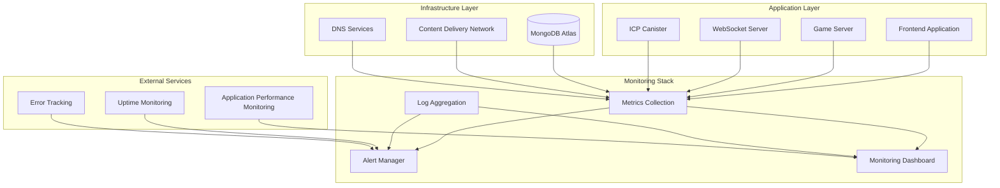

# Monitoring and Maintenance Guide

This guide covers comprehensive monitoring setup, maintenance procedures, and operational practices for the Dhaniverse platform across all environments.

## Overview

Effective monitoring and maintenance ensure system reliability, performance optimization, and proactive issue resolution. This includes:

- Real-time system monitoring and alerting
- Performance metrics collection and analysis
- Log aggregation and analysis
- Health checks and uptime monitoring
- Automated maintenance procedures
- Incident response and recovery

## Monitoring Architecture



## System Health Monitoring

### Core Health Checks

#### Frontend Application Monitoring

```javascript
// monitoring/frontend-health.js
class FrontendHealthMonitor {
  constructor() {
    this.metrics = {
      pageLoadTime: 0,
      apiResponseTime: 0,
      errorRate: 0,
      userSessions: 0
    };
  }

  // Performance monitoring
  measurePageLoad() {
    const navigation = performance.getEntriesByType('navigation')[0];
    this.metrics.pageLoadTime = navigation.loadEventEnd - navigation.loadEventStart;
    
    // Send to monitoring service
    this.sendMetric('page_load_time', this.metrics.pageLoadTime);
  }

  // API response time monitoring
  async monitorAPICall(url, options) {
    const startTime = performance.now();
    try {
      const response = await fetch(url, options);
      const endTime = performance.now();
      
      this.metrics.apiResponseTime = endTime - startTime;
      this.sendMetric('api_response_time', this.metrics.apiResponseTime, { endpoint: url });
      
      if (!response.ok) {
        this.recordError('api_error', { status: response.status, endpoint: url });
      }
      
      return response;
    } catch (error) {
      this.recordError('api_failure', { error: error.message, endpoint: url });
      throw error;
    }
  }

  // Error tracking
  recordError(type, details) {
    this.metrics.errorRate++;
    this.sendMetric('error_count', 1, { type, ...details });
  }

  // Send metrics to monitoring service
  sendMetric(name, value, tags = {}) {
    // Implementation depends on monitoring service (DataDog, New Relic, etc.)
    console.log(`Metric: ${name} = ${value}`, tags);
  }
}

// Initialize monitoring
const healthMonitor = new FrontendHealthMonitor();

// Monitor page load
window.addEventListener('load', () => {
  healthMonitor.measurePageLoad();
});

// Monitor unhandled errors
window.addEventListener('error', (event) => {
  healthMonitor.recordError('javascript_error', {
    message: event.message,
    filename: event.filename,
    lineno: event.lineno
  });
});
```#### G
ame Server Health Monitoring

```typescript
// server/game/src/monitoring/health.ts
import { Context } from "oak";

interface HealthMetrics {
  uptime: number;
  memoryUsage: Deno.MemoryUsage;
  activeConnections: number;
  requestCount: number;
  errorCount: number;
  databaseStatus: 'connected' | 'disconnected' | 'error';
}

class GameServerHealthMonitor {
  private metrics: HealthMetrics;
  private startTime: number;

  constructor() {
    this.startTime = Date.now();
    this.metrics = {
      uptime: 0,
      memoryUsage: Deno.memoryUsage(),
      activeConnections: 0,
      requestCount: 0,
      errorCount: 0,
      databaseStatus: 'disconnected'
    };

    // Update metrics every 30 seconds
    setInterval(() => this.updateMetrics(), 30000);
  }

  updateMetrics() {
    this.metrics.uptime = Date.now() - this.startTime;
    this.metrics.memoryUsage = Deno.memoryUsage();
    
    // Send metrics to monitoring service
    this.sendMetrics();
  }

  async healthCheck(ctx: Context) {
    const health = {
      status: 'healthy',
      timestamp: new Date().toISOString(),
      uptime: this.metrics.uptime,
      memory: {
        rss: Math.round(this.metrics.memoryUsage.rss / 1024 / 1024),
        heapUsed: Math.round(this.metrics.memoryUsage.heapUsed / 1024 / 1024),
        heapTotal: Math.round(this.metrics.memoryUsage.heapTotal / 1024 / 1024)
      },
      database: this.metrics.databaseStatus,
      activeConnections: this.metrics.activeConnections,
      requestCount: this.metrics.requestCount,
      errorRate: this.metrics.errorCount / this.metrics.requestCount || 0
    };

    // Check if system is healthy
    if (this.metrics.databaseStatus !== 'connected') {
      health.status = 'unhealthy';
    }

    if (this.metrics.memoryUsage.rss > 500 * 1024 * 1024) { // 500MB
      health.status = 'degraded';
    }

    ctx.response.status = health.status === 'healthy' ? 200 : 503;
    ctx.response.body = health;
  }

  recordRequest() {
    this.metrics.requestCount++;
  }

  recordError() {
    this.metrics.errorCount++;
  }

  setDatabaseStatus(status: 'connected' | 'disconnected' | 'error') {
    this.metrics.databaseStatus = status;
  }

  setActiveConnections(count: number) {
    this.metrics.activeConnections = count;
  }

  private sendMetrics() {
    // Send to monitoring service (Prometheus, DataDog, etc.)
    console.log('Health metrics:', this.metrics);
  }
}

export const healthMonitor = new GameServerHealthMonitor();
```

#### ICP Canister Monitoring

```rust
// packages/icp-canister/src/monitoring.rs
use ic_cdk::api::time;
use std::collections::HashMap;

#[derive(Clone, Debug)]
pub struct CanisterMetrics {
    pub start_time: u64,
    pub request_count: u64,
    pub error_count: u64,
    pub cycles_balance: u64,
    pub memory_usage: u64,
    pub stable_memory_usage: u64,
}

impl Default for CanisterMetrics {
    fn default() -> Self {
        Self {
            start_time: time(),
            request_count: 0,
            error_count: 0,
            cycles_balance: 0,
            memory_usage: 0,
            stable_memory_usage: 0,
        }
    }
}

thread_local! {
    static METRICS: std::cell::RefCell<CanisterMetrics> = std::cell::RefCell::new(CanisterMetrics::default());
}

pub fn record_request() {
    METRICS.with(|m| {
        m.borrow_mut().request_count += 1;
    });
}

pub fn record_error() {
    METRICS.with(|m| {
        m.borrow_mut().error_count += 1;
    });
}

pub fn update_cycles_balance() {
    let balance = ic_cdk::api::canister_balance();
    METRICS.with(|m| {
        m.borrow_mut().cycles_balance = balance;
    });
}

#[ic_cdk::query]
pub fn get_metrics() -> CanisterMetrics {
    update_cycles_balance();
    
    METRICS.with(|m| {
        let mut metrics = m.borrow().clone();
        metrics.memory_usage = (ic_cdk::api::stable::stable64_size() * 65536) as u64;
        metrics.stable_memory_usage = ic_cdk::api::stable::stable64_size();
        metrics
    })
}

#[ic_cdk::query]
pub fn health_check() -> HashMap<String, String> {
    let metrics = get_metrics();
    let uptime = time() - metrics.start_time;
    
    let mut health = HashMap::new();
    health.insert("status".to_string(), "healthy".to_string());
    health.insert("uptime".to_string(), uptime.to_string());
    health.insert("cycles_balance".to_string(), metrics.cycles_balance.to_string());
    health.insert("memory_usage_mb".to_string(), (metrics.memory_usage / 1024 / 1024).to_string());
    health.insert("request_count".to_string(), metrics.request_count.to_string());
    health.insert("error_rate".to_string(), 
        if metrics.request_count > 0 {
            format!("{:.2}", metrics.error_count as f64 / metrics.request_count as f64)
        } else {
            "0.00".to_string()
        }
    );
    
    // Check health conditions
    if metrics.cycles_balance < 1_000_000_000_000 { // Less than 1T cycles
        health.insert("status".to_string(), "warning".to_string());
        health.insert("warning".to_string(), "Low cycles balance".to_string());
    }
    
    if metrics.memory_usage > 1_000_000_000 { // More than 1GB
        health.insert("status".to_string(), "warning".to_string());
        health.insert("warning".to_string(), "High memory usage".to_string());
    }
    
    health
}
```

## Automated Maintenance Tasks

```bash
#!/bin/bash
# maintenance/automated-maintenance.sh

LOG_FILE="/var/log/dhaniverse-maintenance.log"
DATE=$(date '+%Y-%m-%d %H:%M:%S')

log() {
    echo "[$DATE] $1" | tee -a "$LOG_FILE"
}

log "Starting automated maintenance tasks"

# 1. Clean up old log files
cleanup_logs() {
    log "Cleaning up old log files..."
    find logs/ -name "*.log" -mtime +30 -delete
    find logs/ -name "*.log.*" -mtime +7 -delete
    log "Log cleanup completed"
}

# 2. Database maintenance
database_maintenance() {
    log "Starting database maintenance..."
    
    # Compact collections
    mongosh "$MONGODB_URI" --eval "
        db.users.compact();
        db.sessions.compact();
        db.transactions.compact();
    "
    
    # Remove expired sessions
    mongosh "$MONGODB_URI" --eval "
        db.sessions.deleteMany({
            createdAt: { \$lt: new Date(Date.now() - 24*60*60*1000) }
        });
    "
    
    log "Database maintenance completed"
}

# 3. Check and top up canister cycles
canister_maintenance() {
    log "Checking canister cycles..."
    
    CYCLES=$(dfx canister status dhaniverse_backend --network ic | grep "Balance:" | awk '{print $2}')
    MIN_CYCLES=5000000000000  # 5T cycles
    
    if [ "$CYCLES" -lt "$MIN_CYCLES" ]; then
        log "Cycles low ($CYCLES), topping up..."
        dfx cycles top-up dhaniverse_backend 10000000000000 --network ic
        log "Cycles topped up successfully"
    else
        log "Cycles balance sufficient: $CYCLES"
    fi
}

# Execute all maintenance tasks
cleanup_logs
database_maintenance
canister_maintenance

log "Automated maintenance completed successfully"
```

## Health Check Scripts

### Production Health Monitoring

```bash
#!/bin/bash
# monitoring/production-health-check.sh

echo "Checking production services health..."

# Check frontend
curl -f https://dhaniverse.com && echo "✓ Frontend healthy" || echo "✗ Frontend down"

# Check game server
curl -f https://api.dhaniverse.com/health && echo "✓ Game server healthy" || echo "✗ Game server down"

# Check WebSocket server
curl -f https://ws.dhaniverse.com/health && echo "✓ WebSocket server healthy" || echo "✗ WebSocket server down"

# Check ICP canister
dfx canister call $PROD_CANISTER_ID healthCheck --network ic && echo "✓ Canister healthy" || echo "✗ Canister not responding"

# Check database connectivity
mongosh "$PROD_MONGODB_URI" --eval "db.adminCommand('ping')" && echo "✓ Database healthy" || echo "✗ Database connection failed"
```

### Uptime Monitoring

```javascript
// monitoring/uptime-monitor.js
class UptimeMonitor {
  constructor(endpoints) {
    this.endpoints = endpoints;
    this.results = new Map();
    this.alertThreshold = 3; // Alert after 3 consecutive failures
  }

  async checkEndpoint(endpoint) {
    const startTime = Date.now();
    
    try {
      const response = await fetch(endpoint.url, {
        method: endpoint.method || 'GET',
        timeout: endpoint.timeout || 10000,
        headers: endpoint.headers || {}
      });

      const responseTime = Date.now() - startTime;
      const isHealthy = response.status >= 200 && response.status < 400;

      const result = {
        url: endpoint.url,
        status: response.status,
        responseTime,
        isHealthy,
        timestamp: Date.now(),
        error: null
      };

      this.recordResult(endpoint.name, result);
      return result;

    } catch (error) {
      const result = {
        url: endpoint.url,
        status: 0,
        responseTime: Date.now() - startTime,
        isHealthy: false,
        timestamp: Date.now(),
        error: error.message
      };

      this.recordResult(endpoint.name, result);
      return result;
    }
  }

  recordResult(endpointName, result) {
    if (!this.results.has(endpointName)) {
      this.results.set(endpointName, []);
    }

    const results = this.results.get(endpointName);
    results.push(result);

    // Keep only last 100 results
    if (results.length > 100) {
      results.shift();
    }

    // Check for consecutive failures
    const recentResults = results.slice(-this.alertThreshold);
    const allFailed = recentResults.length === this.alertThreshold && 
                     recentResults.every(r => !r.isHealthy);

    if (allFailed) {
      this.sendDownAlert(endpointName, result);
    }

    // Check for recovery
    if (result.isHealthy && results.length > 1 && !results[results.length - 2].isHealthy) {
      this.sendRecoveryAlert(endpointName, result);
    }

    // Send metrics
    this.sendMetric('uptime_check', result.isHealthy ? 1 : 0, {
      endpoint: endpointName,
      status: result.status
    });
    this.sendMetric('response_time', result.responseTime, {
      endpoint: endpointName
    });
  }

  async checkAllEndpoints() {
    const promises = this.endpoints.map(endpoint => 
      this.checkEndpoint(endpoint).catch(error => ({
        url: endpoint.url,
        error: error.message,
        isHealthy: false
      }))
    );

    const results = await Promise.all(promises);
    return results;
  }

  startMonitoring(interval = 60000) { // Default: 1 minute
    console.log(`Starting uptime monitoring with ${interval}ms interval`);
    
    setInterval(async () => {
      await this.checkAllEndpoints();
    }, interval);

    // Initial check
    this.checkAllEndpoints();
  }

  getUptimeStats(endpointName, hours = 24) {
    const results = this.results.get(endpointName) || [];
    const cutoff = Date.now() - (hours * 60 * 60 * 1000);
    const recentResults = results.filter(r => r.timestamp > cutoff);

    if (recentResults.length === 0) {
      return { uptime: 0, avgResponseTime: 0, totalChecks: 0 };
    }

    const successfulChecks = recentResults.filter(r => r.isHealthy).length;
    const uptime = (successfulChecks / recentResults.length) * 100;
    const avgResponseTime = recentResults.reduce((sum, r) => sum + r.responseTime, 0) / recentResults.length;

    return {
      uptime: Math.round(uptime * 100) / 100,
      avgResponseTime: Math.round(avgResponseTime),
      totalChecks: recentResults.length,
      successfulChecks
    };
  }

  sendDownAlert(endpointName, result) {
    console.error(`🚨 ENDPOINT DOWN: ${endpointName} - ${result.error || result.status}`);
    // Send to alerting system
  }

  sendRecoveryAlert(endpointName, result) {
    console.log(`✅ ENDPOINT RECOVERED: ${endpointName} - Response time: ${result.responseTime}ms`);
    // Send to alerting system
  }

  sendMetric(name, value, tags = {}) {
    // Send to monitoring service
    console.log(`Uptime Metric: ${name} = ${value}`, tags);
  }
}

// Configuration
const endpoints = [
  {
    name: 'frontend',
    url: 'https://dhaniverse.com',
    method: 'GET',
    timeout: 10000
  },
  {
    name: 'game_server',
    url: 'https://api.dhaniverse.com/health',
    method: 'GET',
    timeout: 5000
  },
  {
    name: 'websocket_server',
    url: 'https://ws.dhaniverse.com/health',
    method: 'GET',
    timeout: 5000
  }
];

const uptimeMonitor = new UptimeMonitor(endpoints);
export default uptimeMonitor;
```

## Next Steps

After implementing comprehensive monitoring:

1. Set up [Scaling Strategies](scaling.md) based on monitoring insights
2. Establish incident response procedures
3. Create runbooks for common operational tasks
4. Implement automated remediation for known issues
5. Regular review and optimization of monitoring setup

## Additional Resources

- [Prometheus Monitoring Guide](https://prometheus.io/docs/introduction/overview/)
- [Grafana Dashboard Creation](https://grafana.com/docs/grafana/latest/dashboards/)
- [MongoDB Monitoring Best Practices](https://docs.mongodb.com/manual/administration/monitoring/)
- [Internet Computer Monitoring](https://internetcomputer.org/docs/current/developer-docs/deploy/monitoring)