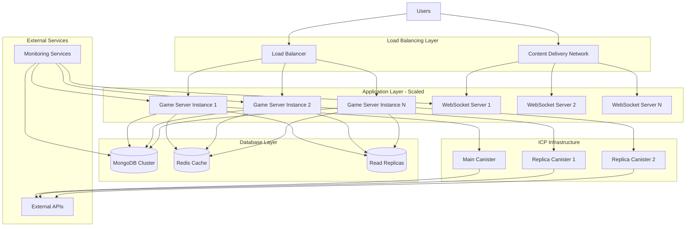

# Scaling and Performance Guide

This guide covers scaling strategies, performance optimization, and capacity planning for the Dhaniverse platform to handle growth and increased user demand.

## Overview

Scaling the Dhaniverse platform involves optimizing performance across multiple layers and implementing strategies to handle increased load. This includes:

- Horizontal and vertical scaling strategies
- Performance optimization techniques
- Capacity planning and resource allocation
- Load balancing and distribution
- Caching strategies
- Database optimization for scale

## Scaling Architecture



## Performance Optimization

### Frontend Performance Optimization

#### Code Splitting and Lazy Loading

```typescript
// src/utils/LazyLoading.ts
import { lazy, Suspense } from 'react';

// Lazy load heavy components
export const GamePage = lazy(() => import('../components/GamePage'));
export const BankingDashboard = lazy(() => import('../components/banking/BankingDashboard'));
export const StockMarketDashboard = lazy(() => import('../components/stockmarket/StockMarketDashboard'));

// Lazy loading wrapper with loading fallback
export const LazyWrapper = ({ children }: { children: React.ReactNode }) => (
  <Suspense fallback={
    <div className="flex items-center justify-center h-64">
      <div className="animate-spin rounded-full h-32 w-32 border-b-2 border-blue-500"></div>
    </div>
  }>
    {children}
  </Suspense>
);

// Route-based code splitting
export const AppRoutes = () => (
  <Routes>
    <Route path="/" element={<LandingPage />} />
    <Route path="/game" element={
      <LazyWrapper>
        <GamePage />
      </LazyWrapper>
    } />
    <Route path="/banking" element={
      <LazyWrapper>
        <BankingDashboard />
      </LazyWrapper>
    } />
    <Route path="/stocks" element={
      <LazyWrapper>
        <StockMarketDashboard />
      </LazyWrapper>
    } />
  </Routes>
);
```

#### Asset Optimization

```javascript
// vite.config.ts - Production optimizations
import { defineConfig } from 'vite';
import react from '@vitejs/plugin-react';

export default defineConfig({
  plugins: [react()],
  build: {
    // Enable code splitting
    rollupOptions: {
      output: {
        manualChunks: {
          vendor: ['react', 'react-dom'],
          phaser: ['phaser'],
          web3: ['ethers', '@dfinity/agent'],
          ui: ['motion/react', 'lucide-react']
        }
      }
    },
    // Optimize chunk size
    chunkSizeWarningLimit: 1000,
    // Enable minification
    minify: 'terser',
    terserOptions: {
      compress: {
        drop_console: true,
        drop_debugger: true
      }
    }
  },
  // Enable compression
  server: {
    compress: true
  }
});
```

#### Image and Asset Optimization

```typescript
// src/utils/AssetOptimization.ts
class AssetOptimizer {
  private imageCache = new Map<string, HTMLImageElement>();
  private loadingPromises = new Map<string, Promise<HTMLImageElement>>();

  async loadOptimizedImage(src: string, options: {
    width?: number;
    height?: number;
    quality?: number;
    format?: 'webp' | 'avif' | 'jpeg';
  } = {}): Promise<HTMLImageElement> {
    const cacheKey = `${src}_${JSON.stringify(options)}`;
    
    // Return cached image if available
    if (this.imageCache.has(cacheKey)) {
      return this.imageCache.get(cacheKey)!;
    }

    // Return existing loading promise if in progress
    if (this.loadingPromises.has(cacheKey)) {
      return this.loadingPromises.get(cacheKey)!;
    }

    // Create optimized image URL
    const optimizedSrc = this.createOptimizedUrl(src, options);
    
    const loadPromise = new Promise<HTMLImageElement>((resolve, reject) => {
      const img = new Image();
      img.onload = () => {
        this.imageCache.set(cacheKey, img);
        this.loadingPromises.delete(cacheKey);
        resolve(img);
      };
      img.onerror = () => {
        this.loadingPromises.delete(cacheKey);
        reject(new Error(`Failed to load image: ${optimizedSrc}`));
      };
      img.src = optimizedSrc;
    });

    this.loadingPromises.set(cacheKey, loadPromise);
    return loadPromise;
  }

  private createOptimizedUrl(src: string, options: any): string {
    // Use image optimization service (e.g., Cloudinary, ImageKit)
    const params = new URLSearchParams();
    
    if (options.width) params.set('w', options.width.toString());
    if (options.height) params.set('h', options.height.toString());
    if (options.quality) params.set('q', options.quality.toString());
    if (options.format) params.set('f', options.format);
    
    // Auto-format based on browser support
    params.set('f', 'auto');
    params.set('q', 'auto');
    
    return `${src}?${params.toString()}`;
  }

  preloadCriticalAssets(assets: string[]) {
    assets.forEach(asset => {
      const link = document.createElement('link');
      link.rel = 'preload';
      link.href = asset;
      link.as = asset.endsWith('.css') ? 'style' : 'script';
      document.head.appendChild(link);
    });
  }
}

export const assetOptimizer = new AssetOptimizer();
```

### Game Engine Performance Optimization

#### Phaser.js Optimization

```typescript
// src/game/optimization/GameOptimizer.ts
export class GameOptimizer {
  private scene: Phaser.Scene;
  private performanceMonitor: PerformanceMonitor;

  constructor(scene: Phaser.Scene) {
    this.scene = scene;
    this.performanceMonitor = new PerformanceMonitor();
  }

  optimizeRendering() {
    // Enable WebGL renderer optimizations
    this.scene.renderer.setPixelRatio(Math.min(window.devicePixelRatio, 2));
    
    // Optimize sprite batching
    this.scene.add.group({
      maxSize: 1000,
      createCallback: (sprite: Phaser.GameObjects.Sprite) => {
        sprite.setOrigin(0.5);
        sprite.setDepth(1);
      }
    });

    // Use object pooling for frequently created/destroyed objects
    this.setupObjectPools();
  }

  private setupObjectPools() {
    // Pool for bullets/projectiles
    const bulletPool = this.scene.add.group({
      maxSize: 100,
      createCallback: (bullet: Phaser.GameObjects.Sprite) => {
        bullet.setActive(false);
        bullet.setVisible(false);
      }
    });

    // Pool for UI elements
    const uiElementPool = this.scene.add.group({
      maxSize: 50,
      createCallback: (element: Phaser.GameObjects.Container) => {
        element.setActive(false);
        element.setVisible(false);
      }
    });
  }

  optimizePhysics() {
    // Reduce physics world bounds to visible area
    this.scene.physics.world.setBounds(0, 0, 1920, 1080);
    
    // Optimize collision detection
    this.scene.physics.world.setFPS(30); // Reduce physics FPS if needed
    
    // Use spatial partitioning for collision detection
    this.scene.physics.world.useTree = true;
  }

  optimizeAudio() {
    // Preload critical audio files
    const criticalSounds = ['click', 'notification', 'error'];
    criticalSounds.forEach(sound => {
      this.scene.sound.add(sound, { volume: 0.5 });
    });

    // Use audio sprites for multiple small sounds
    this.scene.sound.addAudioSprite('ui-sounds', {
      spritemap: {
        click: { start: 0, end: 0.5 },
        hover: { start: 1, end: 1.3 },
        success: { start: 2, end: 2.8 }
      }
    });
  }

  enablePerformanceMonitoring() {
    this.scene.time.addEvent({
      delay: 1000,
      callback: () => {
        const fps = this.scene.game.loop.actualFps;
        const memoryUsage = (performance as any).memory?.usedJSHeapSize || 0;
        
        this.performanceMonitor.recordMetric('game_fps', fps);
        this.performanceMonitor.recordMetric('game_memory', memoryUsage);
        
        // Adjust quality based on performance
        if (fps < 30) {
          this.reduceQuality();
        } else if (fps > 55) {
          this.increaseQuality();
        }
      },
      loop: true
    });
  }

  private reduceQuality() {
    // Reduce particle effects
    this.scene.children.list.forEach(child => {
      if (child instanceof Phaser.GameObjects.Particles.ParticleEmitter) {
        child.setQuantity(Math.max(1, child.quantity.propertyValue / 2));
      }
    });

    // Reduce texture quality
    this.scene.textures.list.forEach(texture => {
      if (texture.source[0].scaleMode !== Phaser.ScaleModes.NEAREST) {
        texture.source[0].scaleMode = Phaser.ScaleModes.NEAREST;
      }
    });
  }

  private increaseQuality() {
    // Restore particle effects
    this.scene.children.list.forEach(child => {
      if (child instanceof Phaser.GameObjects.Particles.ParticleEmitter) {
        child.setQuantity(Math.min(100, child.quantity.propertyValue * 1.5));
      }
    });
  }
}

class PerformanceMonitor {
  recordMetric(name: string, value: number) {
    // Send to monitoring service
    console.log(`Game Performance: ${name} = ${value}`);
  }
}
```

### Server-Side Performance Optimization

#### Game Server Optimization

```typescript
// server/game/src/optimization/ServerOptimizer.ts
import { LRUCache } from 'lru-cache';

export class ServerOptimizer {
  private responseCache: LRUCache<string, any>;
  private connectionPool: Map<string, any>;
  private rateLimiter: Map<string, number[]>;

  constructor() {
    // Initialize response cache
    this.responseCache = new LRUCache({
      max: 1000,
      ttl: 1000 * 60 * 5 // 5 minutes
    });

    this.connectionPool = new Map();
    this.rateLimiter = new Map();
  }

  // Implement response caching
  cacheResponse(key: string, data: any, ttl: number = 300000) {
    this.responseCache.set(key, {
      data,
      timestamp: Date.now(),
      ttl
    });
  }

  getCachedResponse(key: string): any | null {
    const cached = this.responseCache.get(key);
    if (!cached) return null;

    if (Date.now() - cached.timestamp > cached.ttl) {
      this.responseCache.delete(key);
      return null;
    }

    return cached.data;
  }

  // Implement connection pooling
  async getConnection(type: 'database' | 'external_api'): Promise<any> {
    const poolKey = `${type}_pool`;
    
    if (!this.connectionPool.has(poolKey)) {
      this.connectionPool.set(poolKey, this.createConnectionPool(type));
    }

    return this.connectionPool.get(poolKey);
  }

  private createConnectionPool(type: string) {
    switch (type) {
      case 'database':
        return {
          maxConnections: 10,
          currentConnections: 0,
          queue: []
        };
      case 'external_api':
        return {
          maxConnections: 5,
          currentConnections: 0,
          queue: []
        };
      default:
        throw new Error(`Unknown connection type: ${type}`);
    }
  }

  // Implement rate limiting
  checkRateLimit(clientId: string, maxRequests: number = 100, windowMs: number = 60000): boolean {
    const now = Date.now();
    const windowStart = now - windowMs;

    if (!this.rateLimiter.has(clientId)) {
      this.rateLimiter.set(clientId, []);
    }

    const requests = this.rateLimiter.get(clientId)!;
    
    // Remove old requests outside the window
    const validRequests = requests.filter(timestamp => timestamp > windowStart);
    
    if (validRequests.length >= maxRequests) {
      return false; // Rate limit exceeded
    }

    // Add current request
    validRequests.push(now);
    this.rateLimiter.set(clientId, validRequests);
    
    return true;
  }

  // Optimize database queries
  optimizeQuery(query: any): any {
    // Add indexes hint
    if (query.collection === 'users' && query.filter.email) {
      query.hint = { email: 1 };
    }

    if (query.collection === 'transactions' && query.filter.userId) {
      query.hint = { userId: 1, createdAt: -1 };
    }

    // Add projection to limit returned fields
    if (!query.projection) {
      query.projection = this.getOptimalProjection(query.collection);
    }

    return query;
  }

  private getOptimalProjection(collection: string): any {
    const projections = {
      users: { password: 0, __v: 0 },
      sessions: { __v: 0 },
      transactions: { __v: 0 }
    };

    return projections[collection] || {};
  }

  // Memory optimization
  optimizeMemoryUsage() {
    // Clear old cache entries
    setInterval(() => {
      this.responseCache.clear();
    }, 1000 * 60 * 30); // Every 30 minutes

    // Clear old rate limit entries
    setInterval(() => {
      const now = Date.now();
      const oneHourAgo = now - (60 * 60 * 1000);

      for (const [clientId, requests] of this.rateLimiter.entries()) {
        const validRequests = requests.filter(timestamp => timestamp > oneHourAgo);
        if (validRequests.length === 0) {
          this.rateLimiter.delete(clientId);
        } else {
          this.rateLimiter.set(clientId, validRequests);
        }
      }
    }, 1000 * 60 * 60); // Every hour
  }
}

export const serverOptimizer = new ServerOptimizer();
```

#### WebSocket Optimization

```typescript
// server/ws/src/optimization/WebSocketOptimizer.ts
export class WebSocketOptimizer {
  private connections: Map<string, WebSocket>;
  private rooms: Map<string, Set<string>>;
  private messageQueue: Map<string, any[]>;
  private compressionEnabled: boolean;

  constructor() {
    this.connections = new Map();
    this.rooms = new Map();
    this.messageQueue = new Map();
    this.compressionEnabled = true;
  }

  // Optimize message broadcasting
  broadcastToRoom(roomId: string, message: any, excludeUserId?: string) {
    const room = this.rooms.get(roomId);
    if (!room) return;

    const serializedMessage = this.optimizeMessage(message);
    const batch: { userId: string; message: any }[] = [];

    for (const userId of room) {
      if (userId !== excludeUserId) {
        batch.push({ userId, message: serializedMessage });
      }
    }

    // Send messages in batches to reduce overhead
    this.sendBatchMessages(batch);
  }

  private optimizeMessage(message: any): any {
    // Remove unnecessary fields
    const optimized = { ...message };
    delete optimized.debug;
    delete optimized.internal;

    // Compress large messages
    if (JSON.stringify(optimized).length > 1000 && this.compressionEnabled) {
      return this.compressMessage(optimized);
    }

    return optimized;
  }

  private compressMessage(message: any): any {
    // Simple compression by removing redundant data
    if (message.type === 'player_update' && message.data) {
      // Only send changed fields
      const compressed = {
        type: message.type,
        id: message.id,
        changes: this.getChangedFields(message.data)
      };
      return compressed;
    }

    return message;
  }

  private getChangedFields(data: any): any {
    // Implementation would track previous state and return only changes
    // For now, return all data
    return data;
  }

  private sendBatchMessages(batch: { userId: string; message: any }[]) {
    // Group messages by connection to reduce WebSocket calls
    const connectionBatches = new Map<WebSocket, any[]>();

    for (const { userId, message } of batch) {
      const connection = this.connections.get(userId);
      if (connection && connection.readyState === WebSocket.OPEN) {
        if (!connectionBatches.has(connection)) {
          connectionBatches.set(connection, []);
        }
        connectionBatches.get(connection)!.push(message);
      }
    }

    // Send batched messages
    for (const [connection, messages] of connectionBatches) {
      try {
        connection.send(JSON.stringify({
          type: 'batch',
          messages
        }));
      } catch (error) {
        console.error('Failed to send batch message:', error);
      }
    }
  }

  // Implement message queuing for offline users
  queueMessage(userId: string, message: any) {
    if (!this.messageQueue.has(userId)) {
      this.messageQueue.set(userId, []);
    }

    const queue = this.messageQueue.get(userId)!;
    queue.push({
      ...message,
      timestamp: Date.now()
    });

    // Limit queue size
    if (queue.length > 100) {
      queue.shift(); // Remove oldest message
    }
  }

  // Send queued messages when user reconnects
  sendQueuedMessages(userId: string) {
    const queue = this.messageQueue.get(userId);
    if (!queue || queue.length === 0) return;

    const connection = this.connections.get(userId);
    if (!connection || connection.readyState !== WebSocket.OPEN) return;

    try {
      connection.send(JSON.stringify({
        type: 'queued_messages',
        messages: queue
      }));

      // Clear queue after sending
      this.messageQueue.delete(userId);
    } catch (error) {
      console.error('Failed to send queued messages:', error);
    }
  }

  // Connection management optimization
  addConnection(userId: string, connection: WebSocket) {
    // Remove old connection if exists
    this.removeConnection(userId);

    this.connections.set(userId, connection);

    // Send queued messages
    this.sendQueuedMessages(userId);

    // Set up connection monitoring
    this.setupConnectionMonitoring(userId, connection);
  }

  private setupConnectionMonitoring(userId: string, connection: WebSocket) {
    // Heartbeat to detect dead connections
    const heartbeatInterval = setInterval(() => {
      if (connection.readyState === WebSocket.OPEN) {
        connection.ping();
      } else {
        clearInterval(heartbeatInterval);
        this.removeConnection(userId);
      }
    }, 30000); // 30 seconds

    connection.on('pong', () => {
      // Connection is alive
    });

    connection.on('close', () => {
      clearInterval(heartbeatInterval);
      this.removeConnection(userId);
    });
  }

  removeConnection(userId: string) {
    this.connections.delete(userId);
    
    // Remove from all rooms
    for (const [roomId, room] of this.rooms) {
      room.delete(userId);
      if (room.size === 0) {
        this.rooms.delete(roomId);
      }
    }
  }

  // Room management optimization
  joinRoom(userId: string, roomId: string) {
    if (!this.rooms.has(roomId)) {
      this.rooms.set(roomId, new Set());
    }
    this.rooms.get(roomId)!.add(userId);
  }

  leaveRoom(userId: string, roomId: string) {
    const room = this.rooms.get(roomId);
    if (room) {
      room.delete(userId);
      if (room.size === 0) {
        this.rooms.delete(roomId);
      }
    }
  }

  // Performance monitoring
  getConnectionStats() {
    return {
      totalConnections: this.connections.size,
      totalRooms: this.rooms.size,
      queuedMessages: Array.from(this.messageQueue.values()).reduce((sum, queue) => sum + queue.length, 0),
      averageRoomSize: this.rooms.size > 0 ? 
        Array.from(this.rooms.values()).reduce((sum, room) => sum + room.size, 0) / this.rooms.size : 0
    };
  }
}

export const wsOptimizer = new WebSocketOptimizer();
```

## Database Scaling Strategies

### MongoDB Optimization

#### Indexing Strategy

```javascript
// database/optimization/indexing.js
const optimizeIndexes = async (db) => {
  console.log('Optimizing database indexes...');

  // Users collection indexes
  await db.collection('users').createIndexes([
    { key: { email: 1 }, unique: true, background: true },
    { key: { username: 1 }, unique: true, background: true },
    { key: { createdAt: 1 }, background: true },
    { key: { lastLogin: 1 }, background: true },
    { key: { 'profile.level': 1 }, background: true }
  ]);

  // Sessions collection indexes
  await db.collection('sessions').createIndexes([
    { key: { userId: 1 }, background: true },
    { key: { createdAt: 1 }, expireAfterSeconds: 86400, background: true }, // 24 hours
    { key: { sessionToken: 1 }, unique: true, background: true }
  ]);

  // Transactions collection indexes
  await db.collection('transactions').createIndexes([
    { key: { userId: 1, createdAt: -1 }, background: true },
    { key: { type: 1, createdAt: -1 }, background: true },
    { key: { status: 1 }, background: true },
    { key: { amount: 1 }, background: true },
    // Compound index for common queries
    { key: { userId: 1, type: 1, status: 1 }, background: true }
  ]);

  // Game data collection indexes
  await db.collection('gamedata').createIndexes([
    { key: { userId: 1 }, background: true },
    { key: { gameType: 1, userId: 1 }, background: true },
    { key: { updatedAt: 1 }, background: true }
  ]);

  // Stock data collection indexes
  await db.collection('stocks').createIndexes([
    { key: { symbol: 1 }, unique: true, background: true },
    { key: { lastUpdated: -1 }, background: true },
    { key: { price: 1 }, background: true }
  ]);

  console.log('Database indexes optimized successfully');
};

// Query optimization
const optimizeQueries = {
  // Use projection to limit returned fields
  getUserProfile: (userId) => ({
    filter: { _id: userId },
    projection: { password: 0, __v: 0 }
  }),

  // Use indexes effectively
  getUserTransactions: (userId, limit = 50) => ({
    filter: { userId },
    sort: { createdAt: -1 },
    limit,
    hint: { userId: 1, createdAt: -1 }
  }),

  // Aggregate for complex queries
  getUserStats: (userId) => [
    { $match: { userId } },
    { $group: {
      _id: '$type',
      total: { $sum: '$amount' },
      count: { $sum: 1 },
      avgAmount: { $avg: '$amount' }
    }},
    { $sort: { total: -1 } }
  ]
};

export { optimizeIndexes, optimizeQueries };
```

#### Connection Pooling and Caching

```typescript
// database/optimization/ConnectionManager.ts
import { MongoClient, Db } from 'mongodb';
import { LRUCache } from 'lru-cache';

export class DatabaseConnectionManager {
  private client: MongoClient;
  private db: Db;
  private queryCache: LRUCache<string, any>;
  private connectionPool: {
    maxPoolSize: number;
    minPoolSize: number;
    maxIdleTimeMS: number;
    waitQueueTimeoutMS: number;
  };

  constructor(connectionString: string) {
    this.queryCache = new LRUCache({
      max: 1000,
      ttl: 1000 * 60 * 5 // 5 minutes
    });

    this.connectionPool = {
      maxPoolSize: 50,
      minPoolSize: 5,
      maxIdleTimeMS: 30000,
      waitQueueTimeoutMS: 5000
    };

    this.client = new MongoClient(connectionString, {
      ...this.connectionPool,
      retryWrites: true,
      w: 'majority',
      readPreference: 'secondaryPreferred',
      compressors: ['zlib'],
      zlibCompressionLevel: 6
    });
  }

  async connect(): Promise<void> {
    await this.client.connect();
    this.db = this.client.db('dhaniverse');
    console.log('Database connection established with optimized pool');
  }

  // Cached query execution
  async executeQuery(
    collection: string,
    operation: string,
    query: any,
    options: { cache?: boolean; ttl?: number } = {}
  ): Promise<any> {
    const cacheKey = `${collection}_${operation}_${JSON.stringify(query)}`;
    
    // Check cache first
    if (options.cache !== false) {
      const cached = this.queryCache.get(cacheKey);
      if (cached) {
        return cached;
      }
    }

    // Execute query
    const coll = this.db.collection(collection);
    let result;

    switch (operation) {
      case 'find':
        result = await coll.find(query.filter, query.options).toArray();
        break;
      case 'findOne':
        result = await coll.findOne(query.filter, query.options);
        break;
      case 'aggregate':
        result = await coll.aggregate(query.pipeline, query.options).toArray();
        break;
      case 'countDocuments':
        result = await coll.countDocuments(query.filter);
        break;
      default:
        throw new Error(`Unsupported operation: ${operation}`);
    }

    // Cache result if enabled
    if (options.cache !== false && result) {
      this.queryCache.set(cacheKey, result);
    }

    return result;
  }

  // Batch operations for better performance
  async executeBatch(operations: Array<{
    collection: string;
    operation: string;
    data: any;
  }>): Promise<any[]> {
    const results = [];
    
    // Group operations by collection
    const groupedOps = new Map<string, any[]>();
    
    for (const op of operations) {
      if (!groupedOps.has(op.collection)) {
        groupedOps.set(op.collection, []);
      }
      groupedOps.get(op.collection)!.push(op);
    }

    // Execute batch operations per collection
    for (const [collectionName, ops] of groupedOps) {
      const collection = this.db.collection(collectionName);
      
      // Separate different operation types
      const inserts = ops.filter(op => op.operation === 'insertOne').map(op => op.data);
      const updates = ops.filter(op => op.operation === 'updateOne');
      const deletes = ops.filter(op => op.operation === 'deleteOne');

      // Execute bulk operations
      if (inserts.length > 0) {
        const result = await collection.insertMany(inserts);
        results.push(result);
      }

      if (updates.length > 0) {
        const bulkOps = updates.map(op => ({
          updateOne: {
            filter: op.data.filter,
            update: op.data.update,
            upsert: op.data.upsert || false
          }
        }));
        const result = await collection.bulkWrite(bulkOps);
        results.push(result);
      }

      if (deletes.length > 0) {
        const bulkOps = deletes.map(op => ({
          deleteOne: { filter: op.data.filter }
        }));
        const result = await collection.bulkWrite(bulkOps);
        results.push(result);
      }
    }

    return results;
  }

  // Connection health monitoring
  async getConnectionStats(): Promise<any> {
    const adminDb = this.client.db().admin();
    const serverStatus = await adminDb.serverStatus();
    
    return {
      connections: serverStatus.connections,
      network: serverStatus.network,
      opcounters: serverStatus.opcounters,
      mem: serverStatus.mem
    };
  }

  // Cleanup and optimization
  async cleanup(): Promise<void> {
    // Clear expired cache entries
    this.queryCache.clear();
    
    // Close idle connections
    await this.client.close();
  }
}

export const dbManager = new DatabaseConnectionManager(process.env.MONGODB_URI!);
```

## ICP Canister Scaling

### Canister Optimization

```rust
// packages/icp-canister/src/scaling/optimization.rs
use ic_cdk::api::management_canister::main::CanisterSettings;
use std::collections::HashMap;

pub struct CanisterOptimizer {
    request_cache: HashMap<String, (Vec<u8>, u64)>, // (response, timestamp)
    rate_limits: HashMap<String, Vec<u64>>, // principal -> timestamps
}

impl CanisterOptimizer {
    pub fn new() -> Self {
        Self {
            request_cache: HashMap::new(),
            rate_limits: HashMap::new(),
        }
    }

    // Implement response caching
    pub fn cache_response(&mut self, key: String, response: Vec<u8>) {
        let timestamp = ic_cdk::api::time();
        self.request_cache.insert(key, (response, timestamp));
        
        // Clean old cache entries (older than 5 minutes)
        let cutoff = timestamp - (5 * 60 * 1_000_000_000); // 5 minutes in nanoseconds
        self.request_cache.retain(|_, (_, ts)| *ts > cutoff);
    }

    pub fn get_cached_response(&self, key: &str) -> Option<Vec<u8>> {
        if let Some((response, timestamp)) = self.request_cache.get(key) {
            let now = ic_cdk::api::time();
            let ttl = 5 * 60 * 1_000_000_000; // 5 minutes
            
            if now - timestamp < ttl {
                return Some(response.clone());
            }
        }
        None
    }

    // Implement rate limiting
    pub fn check_rate_limit(&mut self, principal: String, max_requests: usize, window_ns: u64) -> bool {
        let now = ic_cdk::api::time();
        let window_start = now - window_ns;

        let requests = self.rate_limits.entry(principal).or_insert_with(Vec::new);
        
        // Remove old requests
        requests.retain(|&timestamp| timestamp > window_start);
        
        if requests.len() >= max_requests {
            return false; // Rate limit exceeded
        }

        requests.push(now);
        true
    }

    // Optimize memory usage
    pub fn optimize_memory(&mut self) {
        // Clear old cache entries
        let now = ic_cdk::api::time();
        let cutoff = now - (10 * 60 * 1_000_000_000); // 10 minutes
        
        self.request_cache.retain(|_, (_, timestamp)| *timestamp > cutoff);
        
        // Clear old rate limit entries
        for requests in self.rate_limits.values_mut() {
            requests.retain(|&timestamp| timestamp > cutoff);
        }
        
        // Remove empty rate limit entries
        self.rate_limits.retain(|_, requests| !requests.is_empty());
    }

    // Batch processing for efficiency
    pub fn process_batch<T, R, F>(&self, items: Vec<T>, processor: F) -> Vec<R>
    where
        F: Fn(T) -> R,
    {
        items.into_iter().map(processor).collect()
    }
}

// Global optimizer instance
thread_local! {
    static OPTIMIZER: std::cell::RefCell<CanisterOptimizer> = std::cell::RefCell::new(CanisterOptimizer::new());
}

// Optimized canister methods
#[ic_cdk::update]
pub async fn optimized_batch_operation(operations: Vec<String>) -> Vec<String> {
    OPTIMIZER.with(|opt| {
        let optimizer = opt.borrow();
        optimizer.process_batch(operations, |op| {
            // Process each operation
            format!("Processed: {}", op)
        })
    })
}

#[ic_cdk::query]
pub fn cached_query(key: String) -> Option<Vec<u8>> {
    OPTIMIZER.with(|opt| {
        let optimizer = opt.borrow();
        optimizer.get_cached_response(&key)
    })
}

// Periodic cleanup
#[ic_cdk::init]
fn init() {
    // Set up periodic cleanup
    ic_cdk_timers::set_timer_interval(
        std::time::Duration::from_secs(300), // 5 minutes
        || {
            OPTIMIZER.with(|opt| {
                opt.borrow_mut().optimize_memory();
            });
        }
    );
}

// Canister settings optimization
pub async fn optimize_canister_settings() -> Result<(), String> {
    let settings = CanisterSettings {
        controllers: None,
        compute_allocation: Some(20.into()), // 20% compute allocation
        memory_allocation: Some(2_147_483_648u64.into()), // 2GB memory
        freezing_threshold: Some(2_592_000u64.into()), // 30 days
    };

    ic_cdk::api::management_canister::main::update_settings(
        ic_cdk::api::management_canister::main::UpdateSettingsArgument {
            canister_id: ic_cdk::api::id(),
            settings,
        }
    ).await.map_err(|e| format!("Failed to update settings: {:?}", e))?;

    Ok(())
}
```

## Load Balancing and Distribution

### Application Load Balancing

```yaml
# infrastructure/load-balancer.yml
# Example configuration for load balancing setup

# Nginx Load Balancer Configuration
upstream game_servers {
    least_conn;
    server game-server-1.dhaniverse.com:8000 weight=3 max_fails=3 fail_timeout=30s;
    server game-server-2.dhaniverse.com:8000 weight=3 max_fails=3 fail_timeout=30s;
    server game-server-3.dhaniverse.com:8000 weight=2 max_fails=3 fail_timeout=30s;
    
    # Health check
    keepalive 32;
}

upstream websocket_servers {
    ip_hash; # Sticky sessions for WebSocket connections
    server ws-server-1.dhaniverse.com:8001 weight=1 max_fails=2 fail_timeout=30s;
    server ws-server-2.dhaniverse.com:8001 weight=1 max_fails=2 fail_timeout=30s;
    server ws-server-3.dhaniverse.com:8001 weight=1 max_fails=2 fail_timeout=30s;
}

server {
    listen 443 ssl http2;
    server_name api.dhaniverse.com;
    
    # SSL configuration
    ssl_certificate /etc/ssl/certs/dhaniverse.crt;
    ssl_certificate_key /etc/ssl/private/dhaniverse.key;
    
    # Load balancing for API requests
    location /api/ {
        proxy_pass http://game_servers;
        proxy_set_header Host $host;
        proxy_set_header X-Real-IP $remote_addr;
        proxy_set_header X-Forwarded-For $proxy_add_x_forwarded_for;
        proxy_set_header X-Forwarded-Proto $scheme;
        
        # Connection pooling
        proxy_http_version 1.1;
        proxy_set_header Connection "";
        
        # Timeouts
        proxy_connect_timeout 5s;
        proxy_send_timeout 60s;
        proxy_read_timeout 60s;
        
        # Health check
        proxy_next_upstream error timeout invalid_header http_500 http_502 http_503;
    }
    
    # WebSocket load balancing
    location /ws/ {
        proxy_pass http://websocket_servers;
        proxy_http_version 1.1;
        proxy_set_header Upgrade $http_upgrade;
        proxy_set_header Connection "upgrade";
        proxy_set_header Host $host;
        proxy_set_header X-Real-IP $remote_addr;
        proxy_set_header X-Forwarded-For $proxy_add_x_forwarded_for;
        proxy_set_header X-Forwarded-Proto $scheme;
        
        # WebSocket specific timeouts
        proxy_connect_timeout 7s;
        proxy_send_timeout 300s;
        proxy_read_timeout 300s;
    }
    
    # Health check endpoint
    location /health {
        access_log off;
        return 200 "healthy\n";
        add_header Content-Type text/plain;
    }
}
```

### Auto-Scaling Configuration

```typescript
// infrastructure/auto-scaling/AutoScaler.ts
export class AutoScaler {
  private metrics: Map<string, number[]>;
  private thresholds: {
    cpu: { scaleUp: number; scaleDown: number };
    memory: { scaleUp: number; scaleDown: number };
    connections: { scaleUp: number; scaleDown: number };
  };

  constructor() {
    this.metrics = new Map();
    this.thresholds = {
      cpu: { scaleUp: 70, scaleDown: 30 },
      memory: { scaleUp: 80, scaleDown: 40 },
      connections: { scaleUp: 1000, scaleDown: 200 }
    };
  }

  // Monitor system metrics
  recordMetric(service: string, metric: string, value: number) {
    const key = `${service}_${metric}`;
    
    if (!this.metrics.has(key)) {
      this.metrics.set(key, []);
    }

    const values = this.metrics.get(key)!;
    values.push(value);

    // Keep only last 10 values for moving average
    if (values.length > 10) {
      values.shift();
    }

    // Check if scaling is needed
    this.checkScalingNeeds(service, metric, values);
  }

  private checkScalingNeeds(service: string, metric: string, values: number[]) {
    if (values.length < 5) return; // Need at least 5 data points

    const average = values.reduce((sum, val) => sum + val, 0) / values.length;
    const threshold = this.thresholds[metric as keyof typeof this.thresholds];

    if (!threshold) return;

    if (average > threshold.scaleUp) {
      this.scaleUp(service, metric, average);
    } else if (average < threshold.scaleDown) {
      this.scaleDown(service, metric, average);
    }
  }

  private async scaleUp(service: string, metric: string, currentValue: number) {
    console.log(`Scaling up ${service} due to high ${metric}: ${currentValue}`);
    
    try {
      switch (service) {
        case 'game-server':
          await this.scaleGameServer('up');
          break;
        case 'websocket-server':
          await this.scaleWebSocketServer('up');
          break;
        case 'database':
          await this.scaleDatabaseConnections('up');
          break;
      }
    } catch (error) {
      console.error(`Failed to scale up ${service}:`, error);
    }
  }

  private async scaleDown(service: string, metric: string, currentValue: number) {
    console.log(`Scaling down ${service} due to low ${metric}: ${currentValue}`);
    
    try {
      switch (service) {
        case 'game-server':
          await this.scaleGameServer('down');
          break;
        case 'websocket-server':
          await this.scaleWebSocketServer('down');
          break;
        case 'database':
          await this.scaleDatabaseConnections('down');
          break;
      }
    } catch (error) {
      console.error(`Failed to scale down ${service}:`, error);
    }
  }

  private async scaleGameServer(direction: 'up' | 'down') {
    // Implementation would depend on deployment platform
    // For Deno Deploy, this might involve creating new deployments
    // For containerized deployments, this would scale container instances
    
    if (direction === 'up') {
      // Add new game server instance
      console.log('Adding new game server instance');
    } else {
      // Remove game server instance
      console.log('Removing game server instance');
    }
  }

  private async scaleWebSocketServer(direction: 'up' | 'down') {
    if (direction === 'up') {
      console.log('Adding new WebSocket server instance');
    } else {
      console.log('Removing WebSocket server instance');
    }
  }

  private async scaleDatabaseConnections(direction: 'up' | 'down') {
    // Adjust database connection pool size
    const currentSize = 50; // Get from connection manager
    const newSize = direction === 'up' ? currentSize + 10 : Math.max(5, currentSize - 10);
    
    console.log(`Adjusting database connection pool from ${currentSize} to ${newSize}`);
    // Update connection pool configuration
  }

  // Predictive scaling based on historical patterns
  predictiveScale() {
    const now = new Date();
    const hour = now.getHours();
    const dayOfWeek = now.getDay();

    // Scale up during peak hours (example: 6 PM - 10 PM)
    if (hour >= 18 && hour <= 22) {
      this.preemptiveScale('up', 'peak_hours');
    }

    // Scale up on weekends
    if (dayOfWeek === 0 || dayOfWeek === 6) {
      this.preemptiveScale('up', 'weekend');
    }

    // Scale down during low activity hours (example: 2 AM - 6 AM)
    if (hour >= 2 && hour <= 6) {
      this.preemptiveScale('down', 'low_activity');
    }
  }

  private preemptiveScale(direction: 'up' | 'down', reason: string) {
    console.log(`Preemptive scaling ${direction} due to ${reason}`);
    
    // Implement preemptive scaling logic
    if (direction === 'up') {
      // Gradually increase capacity before demand hits
    } else {
      // Gradually decrease capacity during low demand
    }
  }

  // Cost optimization
  optimizeCosts() {
    // Analyze usage patterns and optimize resource allocation
    const costMetrics = this.calculateCostMetrics();
    
    if (costMetrics.efficiency < 0.7) { // Less than 70% efficiency
      console.log('Optimizing resource allocation for cost efficiency');
      this.implementCostOptimizations();
    }
  }

  private calculateCostMetrics() {
    // Calculate cost efficiency metrics
    return {
      efficiency: 0.75, // Example value
      wastedResources: 0.25,
      peakUtilization: 0.85
    };
  }

  private implementCostOptimizations() {
    // Implement cost optimization strategies
    console.log('Implementing cost optimizations');
  }
}

export const autoScaler = new AutoScaler();

// Start monitoring and auto-scaling
setInterval(() => {
  autoScaler.predictiveScale();
  autoScaler.optimizeCosts();
}, 1000 * 60 * 15); // Every 15 minutes
```

## Capacity Planning

### Resource Planning Calculator

```typescript
// planning/CapacityPlanner.ts
export class CapacityPlanner {
  private historicalData: Map<string, number[]>;
  private growthRate: number;
  private seasonalFactors: Map<number, number>; // month -> factor

  constructor() {
    this.historicalData = new Map();
    this.growthRate = 0.15; // 15% monthly growth
    this.seasonalFactors = new Map([
      [11, 1.5], // November - holiday season
      [12, 1.8], // December - peak holiday
      [1, 1.2],  // January - new year
      [6, 1.3],  // June - summer
      [7, 1.4],  // July - summer peak
      [8, 1.3]   // August - summer
    ]);
  }

  // Predict future resource needs
  predictResourceNeeds(months: number): {
    users: number;
    servers: number;
    database: { connections: number; storage: number };
    bandwidth: number;
    costs: number;
  } {
    const currentUsers = this.getCurrentUserCount();
    const currentMonth = new Date().getMonth() + 1;
    
    let predictedUsers = currentUsers;
    
    // Apply growth rate and seasonal factors
    for (let i = 1; i <= months; i++) {
      const month = ((currentMonth + i - 1) % 12) + 1;
      const seasonalFactor = this.seasonalFactors.get(month) || 1.0;
      const monthlyGrowth = this.growthRate * seasonalFactor;
      
      predictedUsers *= (1 + monthlyGrowth);
    }

    // Calculate resource requirements
    const serversNeeded = Math.ceil(predictedUsers / 1000); // 1000 users per server
    const dbConnections = Math.ceil(predictedUsers / 50); // 50 users per connection
    const storageGB = Math.ceil(predictedUsers * 0.1); // 100MB per user
    const bandwidthGbps = Math.ceil(predictedUsers / 10000); // 10k users per Gbps
    
    // Estimate costs
    const serverCost = serversNeeded * 100; // $100 per server per month
    const dbCost = Math.ceil(dbConnections / 100) * 500; // $500 per 100 connections
    const storageCost = storageGB * 0.1; // $0.10 per GB
    const bandwidthCost = bandwidthGbps * 50; // $50 per Gbps
    const totalCosts = serverCost + dbCost + storageCost + bandwidthCost;

    return {
      users: Math.round(predictedUsers),
      servers: serversNeeded,
      database: {
        connections: dbConnections,
        storage: storageGB
      },
      bandwidth: bandwidthGbps,
      costs: totalCosts
    };
  }

  // Analyze current performance bottlenecks
  analyzeBottlenecks(): {
    cpu: { current: number; threshold: number; risk: string };
    memory: { current: number; threshold: number; risk: string };
    database: { current: number; threshold: number; risk: string };
    network: { current: number; threshold: number; risk: string };
  } {
    // Get current metrics (would be from monitoring system)
    const currentMetrics = this.getCurrentMetrics();
    
    return {
      cpu: {
        current: currentMetrics.cpu,
        threshold: 70,
        risk: currentMetrics.cpu > 70 ? 'HIGH' : currentMetrics.cpu > 50 ? 'MEDIUM' : 'LOW'
      },
      memory: {
        current: currentMetrics.memory,
        threshold: 80,
        risk: currentMetrics.memory > 80 ? 'HIGH' : currentMetrics.memory > 60 ? 'MEDIUM' : 'LOW'
      },
      database: {
        current: currentMetrics.dbConnections,
        threshold: 80,
        risk: currentMetrics.dbConnections > 80 ? 'HIGH' : currentMetrics.dbConnections > 60 ? 'MEDIUM' : 'LOW'
      },
      network: {
        current: currentMetrics.networkUtilization,
        threshold: 75,
        risk: currentMetrics.networkUtilization > 75 ? 'HIGH' : currentMetrics.networkUtilization > 50 ? 'MEDIUM' : 'LOW'
      }
    };
  }

  // Generate scaling recommendations
  generateRecommendations(): string[] {
    const bottlenecks = this.analyzeBottlenecks();
    const predictions = this.predictResourceNeeds(3); // 3 months ahead
    const recommendations: string[] = [];

    // CPU recommendations
    if (bottlenecks.cpu.risk === 'HIGH') {
      recommendations.push('URGENT: Scale up server instances immediately - CPU usage critical');
    } else if (bottlenecks.cpu.risk === 'MEDIUM') {
      recommendations.push('Consider adding server instances - CPU usage approaching limits');
    }

    // Memory recommendations
    if (bottlenecks.memory.risk === 'HIGH') {
      recommendations.push('URGENT: Increase memory allocation or scale horizontally');
    } else if (bottlenecks.memory.risk === 'MEDIUM') {
      recommendations.push('Monitor memory usage closely - consider optimization');
    }

    // Database recommendations
    if (bottlenecks.database.risk === 'HIGH') {
      recommendations.push('URGENT: Increase database connection pool or add read replicas');
    } else if (bottlenecks.database.risk === 'MEDIUM') {
      recommendations.push('Consider database optimization and connection pooling');
    }

    // Future capacity recommendations
    if (predictions.servers > this.getCurrentServerCount() * 1.5) {
      recommendations.push(`Plan to scale to ${predictions.servers} servers within 3 months`);
    }

    if (predictions.database.connections > this.getCurrentDbConnections() * 1.5) {
      recommendations.push(`Increase database capacity to handle ${predictions.database.connections} connections`);
    }

    // Cost optimization recommendations
    const currentCosts = this.getCurrentMonthlyCosts();
    if (predictions.costs > currentCosts * 2) {
      recommendations.push(`Budget for increased costs: $${predictions.costs}/month (current: $${currentCosts}/month)`);
    }

    return recommendations;
  }

  private getCurrentUserCount(): number {
    // Would get from analytics/monitoring
    return 10000; // Example
  }

  private getCurrentServerCount(): number {
    // Would get from infrastructure monitoring
    return 5; // Example
  }

  private getCurrentDbConnections(): number {
    // Would get from database monitoring
    return 200; // Example
  }

  private getCurrentMonthlyCosts(): number {
    // Would get from billing/cost monitoring
    return 2000; // Example
  }

  private getCurrentMetrics() {
    // Would get from monitoring system
    return {
      cpu: 65,
      memory: 70,
      dbConnections: 75,
      networkUtilization: 45
    };
  }

  // Generate capacity planning report
  generateReport(): string {
    const bottlenecks = this.analyzeBottlenecks();
    const predictions = this.predictResourceNeeds(6);
    const recommendations = this.generateRecommendations();

    return `
# Dhaniverse Capacity Planning Report
Generated: ${new Date().toISOString()}

## Current Status
- Users: ${this.getCurrentUserCount().toLocaleString()}
- Servers: ${this.getCurrentServerCount()}
- Database Connections: ${this.getCurrentDbConnections()}
- Monthly Costs: $${this.getCurrentMonthlyCosts().toLocaleString()}

## Performance Analysis
- CPU Usage: ${bottlenecks.cpu.current}% (Risk: ${bottlenecks.cpu.risk})
- Memory Usage: ${bottlenecks.memory.current}% (Risk: ${bottlenecks.memory.risk})
- Database Load: ${bottlenecks.database.current}% (Risk: ${bottlenecks.database.risk})
- Network Usage: ${bottlenecks.network.current}% (Risk: ${bottlenecks.network.risk})

## 6-Month Projections
- Predicted Users: ${predictions.users.toLocaleString()}
- Required Servers: ${predictions.servers}
- Database Connections: ${predictions.database.connections}
- Storage Needs: ${predictions.database.storage}GB
- Bandwidth: ${predictions.bandwidth}Gbps
- Estimated Costs: $${predictions.costs.toLocaleString()}/month

## Recommendations
${recommendations.map(rec => `- ${rec}`).join('\n')}

## Action Items
1. Monitor high-risk metrics closely
2. Plan infrastructure scaling for projected growth
3. Budget for increased operational costs
4. Implement performance optimizations
5. Review and update capacity planning monthly
    `.trim();
  }
}

export const capacityPlanner = new CapacityPlanner();
```

## Next Steps

After implementing scaling strategies:

1. Continuously monitor performance metrics and adjust scaling parameters
2. Regularly review and update capacity planning projections
3. Implement cost optimization strategies based on usage patterns
4. Test scaling procedures in staging environments
5. Document scaling procedures and create runbooks for operations team
6. Set up automated alerts for scaling events and performance thresholds

## Additional Resources

- [MongoDB Scaling Guide](https://docs.mongodb.com/manual/sharding/)
- [Internet Computer Scaling Best Practices](https://internetcomputer.org/docs/current/developer-docs/deploy/larger-wasm)
- [Deno Deploy Scaling Documentation](https://deno.com/deploy/docs/scaling)
- [Load Balancing Best Practices](https://nginx.org/en/docs/http/load_balancing.html)