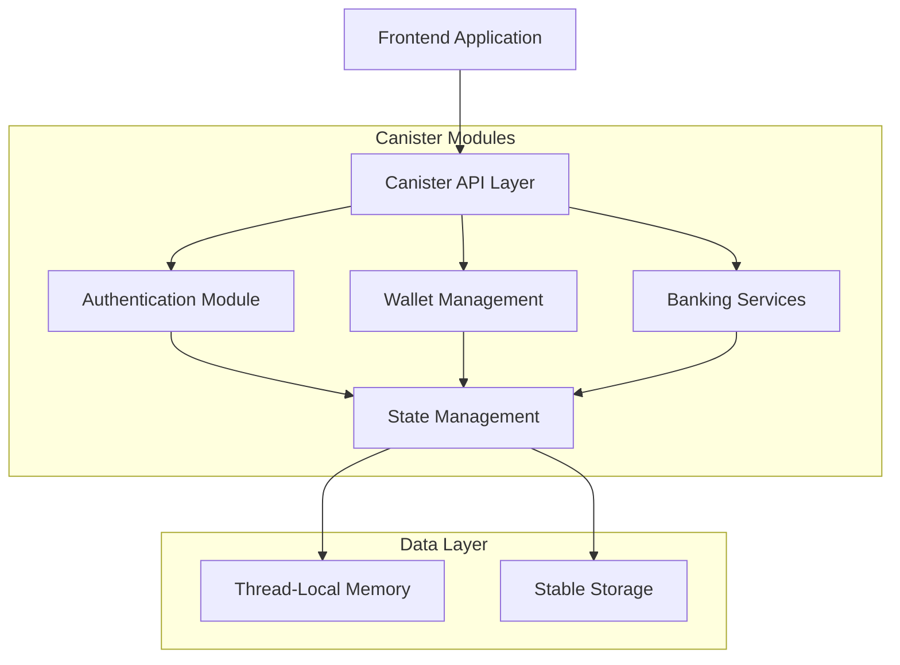
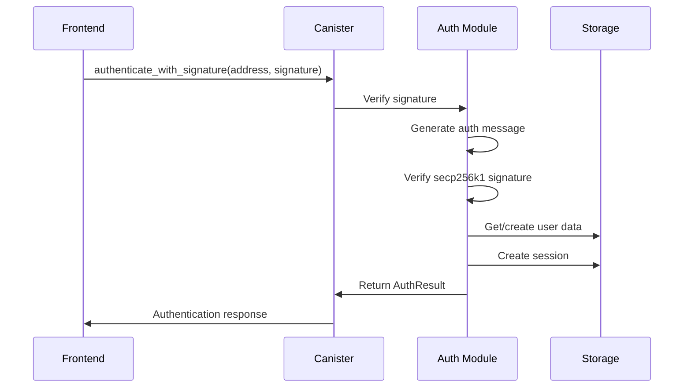
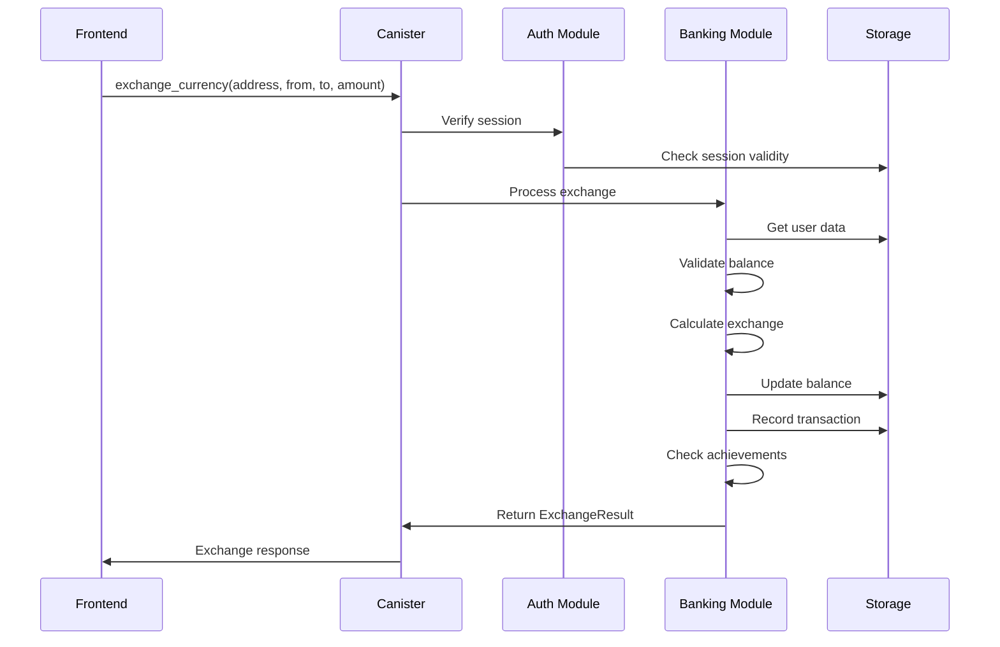
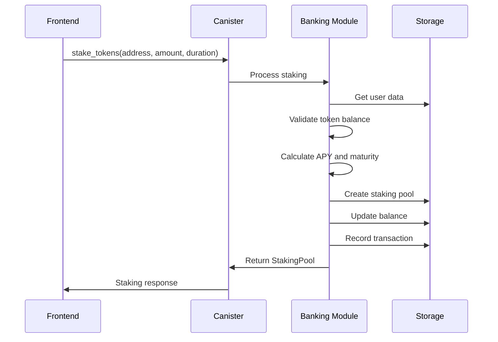

# Architecture Documentation

This document provides a comprehensive overview of the Dhaniverse Rust ICP Canister architecture, design decisions, and implementation details.

## Table of Contents

- [System Overview](#system-overview)
- [Module Architecture](#module-architecture)
- [Data Flow](#data-flow)
- [State Management](#state-management)
- [Security Architecture](#security-architecture)
- [Performance Considerations](#performance-considerations)
- [Design Patterns](#design-patterns)

## System Overview

The Dhaniverse Rust ICP Canister is a Web3-enabled backend service that provides:

- **Authentication**: Signature-based Web3 authentication
- **Wallet Management**: Multi-wallet support (MetaMask, Phantom, Coinbase, WalletConnect)
- **Banking System**: Dual currency (Rupees ↔ Tokens) with exchange functionality
- **Staking Platform**: Token staking with APY rewards
- **Achievement System**: Gamified achievements with rewards
- **DeFi Simulations**: Liquidity pools and yield farming

### High-Level Architecture



## Module Architecture

### Core Modules

#### 1. `lib.rs` - Main Entry Point
- Canister initialization and lifecycle hooks
- Public API method definitions
- Error handling and response formatting
- Candid interface exports

```rust
// Key responsibilities:
- #[ic_cdk::init] - Initialize canister state
- #[ic_cdk::pre_upgrade] - Save state before upgrade
- #[ic_cdk::post_upgrade] - Restore state after upgrade
- Public API methods with error handling
```

#### 2. `types.rs` - Type Definitions
- All data structures and enums
- Candid serialization support
- Type conversions and utilities

```rust
// Key types:
- WalletType, WalletConnection, WalletInfo
- DualBalance, StakingPool, Achievement
- Web3Transaction, Web3Session
- CanisterState, UserData, GlobalSettings
```

#### 3. `error.rs` - Error Management
- Comprehensive error type definitions
- User-friendly error messages
- Error categorization and handling

```rust
// Error categories:
- Authentication errors (1000-1099)
- Wallet errors (1100-1199)
- Banking errors (1200-1299)
- Achievement errors (1300-1399)
- Transaction errors (1400-1499)
- General errors (1500-1599)
```

#### 4. `storage.rs` - State Management
- Thread-local state management
- Stable storage integration
- User data operations
- Session management

```rust
// Storage layers:
- Thread-local: Active state during execution
- Stable storage: Persistence across upgrades
- Memory management: Efficient data access
```

#### 5. `auth.rs` - Authentication
- Signature verification (secp256k1)
- Session management
- User registration and login
- Security validation

```rust
// Authentication flow:
1. Generate authentication message
2. Verify wallet signature
3. Create/update user session
4. Manage session lifecycle
```

#### 6. `wallet.rs` - Wallet Management
- Multi-wallet support
- Connection management
- Balance simulation
- Network information

```rust
// Supported wallets:
- MetaMask (Ethereum)
- Phantom (Solana)
- Coinbase Wallet (Ethereum)
- WalletConnect (Multi-chain)
```

#### 7. `banking.rs` - Financial Operations
- Dual currency system
- Exchange calculations
- Staking mechanisms
- Achievement tracking
- DeFi simulations

```rust
// Banking features:
- Currency exchange (Rupees ↔ Tokens)
- Token staking (30/90/180 days)
- Achievement system
- Transaction history
- DeFi simulations
```

#### 8. `utils.rs` - Utility Functions
- Input validation
- Cryptographic utilities
- Mathematical calculations
- Helper functions

```rust
// Utility categories:
- Address validation
- Amount validation
- Safe arithmetic
- ID generation
- Time conversions
```

## Data Flow

### Authentication Flow



### Banking Operation Flow



### Staking Flow



## State Management

### State Architecture

```rust
// Canister State Structure
pub struct CanisterState {
    pub users: HashMap<String, UserData>,           // User data by wallet address
    pub sessions: HashMap<String, Web3Session>,     // Active sessions
    pub wallet_connections: HashMap<String, WalletConnection>, // Wallet connections
    pub global_settings: GlobalSettings,           // System configuration
}

// User Data Structure
pub struct UserData {
    pub wallet_address: String,
    pub dual_balance: DualBalance,                  // Rupees and tokens
    pub staking_pools: Vec<StakingPool>,           // Active staking pools
    pub achievements: Vec<Achievement>,             // User achievements
    pub transactions: Vec<Web3Transaction>,        // Transaction history
    pub created_at: u64,
    pub last_activity: u64,
}
```

### Storage Layers

#### 1. Thread-Local Storage
- Fast access during execution
- Temporary state management
- Session data caching

#### 2. Stable Storage
- Persistent across upgrades
- User data preservation
- Configuration storage

#### 3. Memory Management
- Lazy loading of user data
- Efficient data structures
- Memory optimization

### State Persistence

```rust
// Pre-upgrade: Save state to stable storage
#[ic_cdk::pre_upgrade]
fn pre_upgrade() {
    storage::save_state();
}

// Post-upgrade: Restore state from stable storage
#[ic_cdk::post_upgrade]
fn post_upgrade() {
    storage::restore_state();
}
```

## Security Architecture

### Authentication Security

1. **Signature Verification**
   - secp256k1 signature validation
   - Ethereum message format compliance
   - Address recovery and verification

2. **Session Management**
   - Time-based session expiration
   - Activity tracking
   - Secure session tokens

3. **Input Validation**
   - Wallet address validation
   - Amount range checking
   - Currency type validation

### Access Control

```rust
// Session verification for protected operations
pub fn verify_session(wallet_address: &str) -> CanisterResult<()> {
    if !storage::is_session_valid(wallet_address) {
        return Err(CanisterError::SessionExpired);
    }
    storage::update_session_activity(wallet_address)?;
    Ok(())
}
```

### Data Security

1. **Data Isolation**
   - Users can only access their own data
   - Wallet address-based data segregation
   - Session-based access control

2. **Input Sanitization**
   - String sanitization
   - Numerical validation
   - Type safety enforcement

3. **Error Handling**
   - No sensitive data in error messages
   - Consistent error responses
   - Audit logging capabilities

## Performance Considerations

### Optimization Strategies

1. **Memory Efficiency**
   - Lazy loading of user data
   - Efficient data structures (HashMap)
   - Memory pooling for frequent operations

2. **Computation Optimization**
   - Cached calculations
   - Batch operations
   - Minimal state updates

3. **Storage Optimization**
   - Selective state persistence
   - Compressed data structures
   - Efficient serialization

### Scalability Design

```rust
// Efficient user data access
pub fn get_or_create_user_data(wallet_address: &str) -> UserData {
    match get_user_data(wallet_address) {
        Some(user_data) => user_data,
        None => create_user_data(wallet_address.to_string()),
    }
}
```

### Performance Monitoring

- Cycles consumption tracking
- Memory usage monitoring
- Response time optimization
- Concurrent operation handling

## Design Patterns

### 1. Result Pattern
```rust
// Consistent error handling
pub type CanisterResult<T> = Result<T, CanisterError>;

pub fn exchange_currency(...) -> CanisterResult<ExchangeResult> {
    // Implementation with proper error handling
}
```

### 2. Builder Pattern
```rust
// User data construction
impl UserData {
    pub fn new(wallet_address: String) -> Self {
        Self {
            wallet_address,
            dual_balance: DualBalance::default(),
            // ... other fields
        }
    }
}
```

### 3. Strategy Pattern
```rust
// Different wallet types with common interface
pub enum WalletType {
    MetaMask,
    Phantom,
    Coinbase,
    WalletConnect,
}

// Wallet-specific operations
impl WalletType {
    pub fn get_supported_chains(&self) -> Vec<String> {
        match self {
            WalletType::MetaMask => vec!["1", "137"],
            WalletType::Phantom => vec!["solana-mainnet"],
            // ...
        }
    }
}
```

### 4. Factory Pattern
```rust
// Transaction creation
pub fn create_transaction(
    wallet_address: String,
    transaction_type: TransactionType,
    amount: f64,
) -> Web3Transaction {
    Web3Transaction {
        id: utils::generate_transaction_id(),
        from: wallet_address,
        amount,
        transaction_type,
        timestamp: ic_cdk::api::time(),
        status: TransactionStatus::Pending,
        hash: Some(utils::generate_transaction_hash()),
    }
}
```

### 5. Observer Pattern
```rust
// Achievement checking after operations
fn check_exchange_achievements(user_data: &mut UserData, amount: f64) {
    // Check and unlock achievements based on user actions
}
```

## API Design

### RESTful Principles
- Clear method naming
- Consistent parameter patterns
- Proper HTTP-like status codes
- Resource-based organization

### Error Handling Strategy
```rust
// Consistent error response format
#[ic_cdk::update]
async fn exchange_currency(...) -> Result<ExchangeResult, String> {
    banking::exchange_currency(wallet_address, from_currency, to_currency, amount).await
        .map_err(|e| e.to_string())
}
```

### Versioning Strategy
- Backward compatibility maintenance
- Gradual feature deprecation
- Clear migration paths

## Testing Architecture

### Test Pyramid
1. **Unit Tests** (70%)
   - Individual function testing
   - Logic validation
   - Edge case coverage

2. **Integration Tests** (20%)
   - PocketIC canister testing
   - End-to-end workflows
   - State consistency

3. **Manual Tests** (10%)
   - User journey validation
   - Performance testing
   - Security validation

### Test Organization
```
src/
├── tests.rs              # Unit tests
tests/
├── integration_tests.rs  # PocketIC tests
benches/
├── performance.rs        # Benchmarks
```

## Deployment Architecture

### Environment Strategy
- **Local**: Development and testing
- **IC Testnet**: Pre-production validation
- **IC Mainnet**: Production deployment

### Upgrade Strategy
- State preservation during upgrades
- Backward compatibility
- Rollback capabilities
- Zero-downtime deployments

## Monitoring and Observability

### Metrics Collection
- Cycles consumption
- Memory usage
- Response times
- Error rates

### Logging Strategy
- Structured logging
- Error tracking
- Performance monitoring
- Security audit trails

## Future Considerations

### Scalability Improvements
- Canister splitting for large datasets
- Cross-canister communication
- Load balancing strategies

### Feature Extensions
- Multi-signature wallet support
- Cross-chain bridge integration
- Advanced DeFi protocols
- NFT marketplace integration

### Security Enhancements
- Multi-factor authentication
- Advanced signature schemes
- Formal verification
- Security audits

---

This architecture is designed to be maintainable, scalable, and secure while providing a solid foundation for Web3 functionality in the Dhaniverse ecosystem.